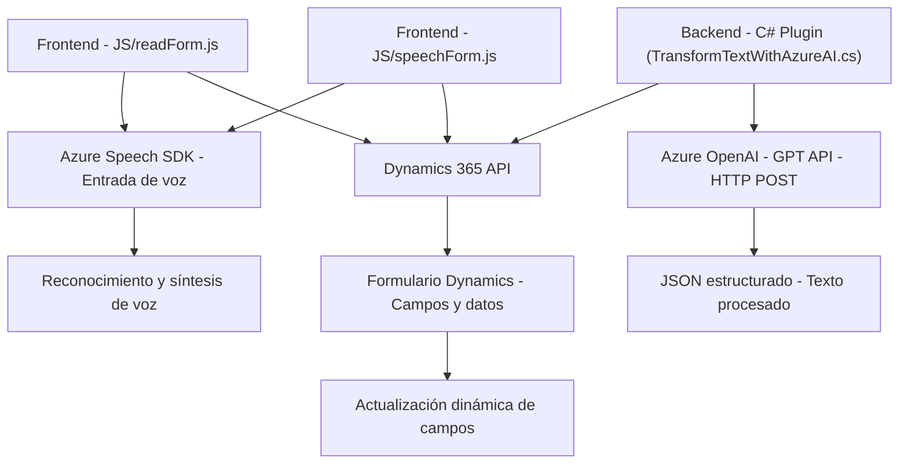

### Breve resumen técnico:
El repositorio implementa funcionalidades centradas en la integración entre formularios de **Dynamics 365**, reconocimiento de voz mediante **Azure Speech SDK**, e inteligencia artificial utilizando el servicio **Azure OpenAI (GPT)**. Su objetivo principal es simplificar la interacción del usuario con formularios, permitiendo entrada y salida de voz, junto con la transformación de texto en formatos estructurados (JSON).

### Descripción de arquitectura:
La solución sigue una **arquitectura orientada a servicios (SOA)** combinada con elementos de **n capas**. Por un lado, los módulos frontend trabajan con funciones independientes para entrada/salida de voz y manipulación de formularios utilizando el **Azure Speech SDK** y APIs de Dynamics 365. Por otro lado, los plugins (.NET) extienden la funcionalidad del backend de Dynamics, aprovechando el modelo de eventos (plugin pattern) y peticiones HTTP hacia **Azure OpenAI**. Esta separación implica una clara división entre las capas de presentación, lógica de negocios y servicios externos.

### Tecnologías usadas:
1. **Frontend**:
   - **JavaScript**:
     - Modularización por funciones (`speechForm.js`, `readForm.js`).
     - Dependencia de **Azure Speech SDK** (`SpeechConfig`, `SpeechSynthesizer`, etc.).
   - **Dynamics 365 API**:
     - Extracción y manipulación dinámica de campos del formulario.
2. **Backend**:
   - **C# Plugins**:
     - Extensión del CRM mediante la interfaz `IPlugin` y contexto de ejecución (`IPluginExecutionContext`).
     - Consumo de servicios REST hacia **Azure OpenAI**.
   - **Azure OpenAI (GPT)**:
     - Comunicación vía HTTP REST API usando JSON para inteligencias artificiales.
   - Frameworks y bibliotecas:
     - `Microsoft.Xrm.Sdk` para operaciones de CRM.
     - `System.Text.Json` y `Newtonsoft.Json` para manejar datos.
   
### Dependencias o componentes externos:
1. **Azure Speech SDK**:
   - Reconocimiento de voz y síntesis de texto en audio.
   - Configurable con `azureKey`, `azureRegion`.
2. **Azure OpenAI (GPT)**:
   - Chatbot/IA para transformación de texto.
   - Generación de JSON estructurado.
3. **Dynamics 365 Web APIs**:
   - Manipulación de datos mediante `Xrm.WebApi.online.execute`.
   - Custom APIs registradas en Dynamics.
4. **Microsoft CRM Plugins**:
   - Integración de servicios externos y lógica personalizada.

### Diagrama **Mermaid** válido para **GitHub Markdown**:
El siguiente diagrama representa las interacciones clave entre los componentes: frontend, backend (plugins), y servicios externos.

### Conclusión final:
La solución presenta una arquitectura híbrida orientada a servicios con división clara entre capas frontend y backend. Utiliza patrones como modularización de funciones en frontend y plugin pattern en el backend, destacándose por su integración con servicios avanzados de Azure (Speech y OpenAI). Esto la hace adecuada para escenarios corporativos que requieren automatización y simplificación de labores manuales en formularios CRM. El diagrama expone correctamente los principales puntos de interacción entre los módulos involucrados.