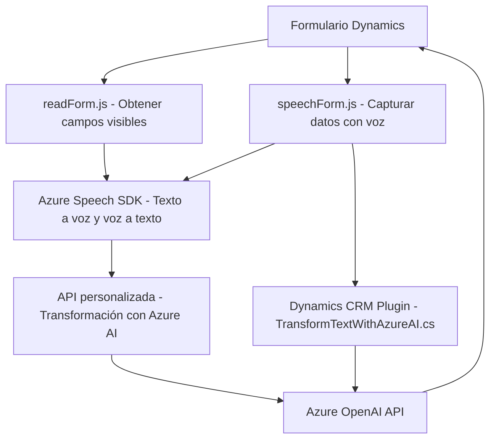

## Breve resumen técnico
El repositorio contiene módulos que interactúan con formularios en un sistema CRM (Dynamics 365) utilizando funcionalidades avanzadas como reconocimiento de voz, síntesis de texto y conexión con servicios externos como Azure Speech SDK y Azure OpenAI. Los archivos analizados implementan componentes para:
1. Procesar entrada de voz y convertirla en información manejable (para llenar formularios).
2. Usar un plugin de Dynamics CRM para transformar texto con reglas predefinidas mediante Azure OpenAI y devolver un JSON estructurado.

---

## Descripción de arquitectura
La arquitectura del sistema es **mixta**, teniendo componentes frontend (JavaScript) y un plugin backend (C# en Dynamics CRM). 

El backend está basado en **Plugin Architecture** de Dynamics CRM, donde los plugins implementan la interfaz `IPlugin` y el sistema es responsable de su invocación en eventos específicos. Además, se observa integración directa con Azure OpenAI mediante servicios HTTP de terceros, lo que también marca un enfoque de **microservicio** en esta sección.

Por otro lado, el frontend utiliza una arquitectura de **n-capas**, con una capa de presentación (formularios de Dynamics), lógica (código JavaScript para entrada y síntesis), e integración (Azure Speech SDK y APIs externas).

---

## Tecnologías usadas
1. **Front-end**:
   - Lenguaje: JavaScript.
   - Contexto: Dynamics 365 Form APIs.
   - Integración externa: Azure Speech SDK.
   - Servicios adicionales: Comunicación con una API personalizada para manejo de datos con IA.

2. **Back-end**:
   - Lenguaje: C#.
   - Framework: Dynamics SDK (`Microsoft.Xrm.Sdk`).
   - Integración externa: Azure OpenAI API, .NET HttpClient.

3. **Servicios nube**:
   - Azure Speech SDK: Para síntesis de texto y reconocimiento de voz.
   - Azure OpenAI API: Para transformar texto con IA avanzada.

---

## Diagrama Mermaid válido para GitHub Markdown

---

## Conclusión final
El repositorio analiza un sistema que integra funcionalidades modernas de reconocimiento de voz, síntesis de texto y uso de inteligencia artificial con Azure. La solución está dividida en módulos frontend y backend; el primero utiliza APIs de Dynamics 365 con integración al SDK de Azure Speech para interactuar con formularios, mientras el segundo usa un plugin (Dynamics CRM) para transformar datos mediante OpenAI. 

La arquitectura híbrida equilibra **plugin architecture** y principios de **microservicio**, aprovechando servicios cloud (Azure) y APIs en paralelo. Aunque funcional, el manejo directo de claves (`azureKey`, `azureRegion`) en el código podría presentar un riesgo de seguridad si no se almacena adecuadamente.