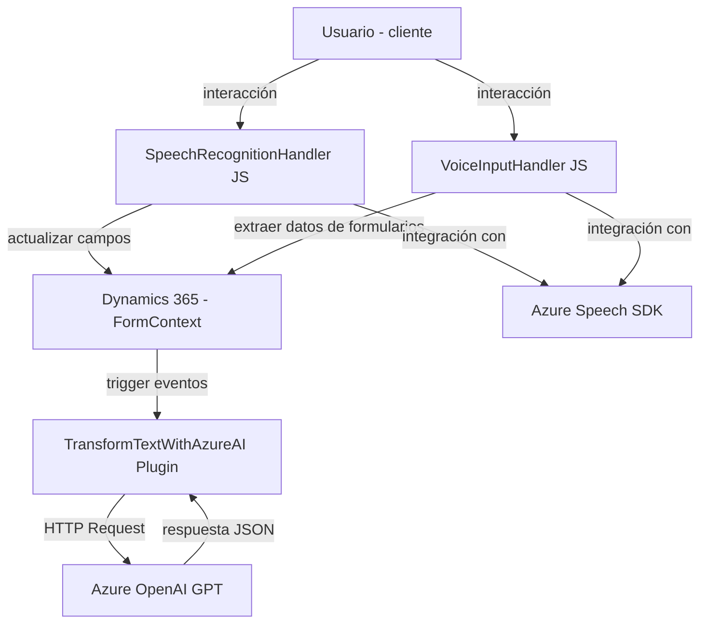

## Análisis Técnico

### **Breve Resumen Técnico**
El repositorio combina diferentes componentes que interactúan con Microsoft Dynamics 365 y servicios de Azure para ofrecer funcionalidades de síntesis de voz, reconocimiento de voz, y procesamiento de texto mediante inteligencia artificial. 

- **`readForm.js`:** Generación de audio a través de síntesis de voz utilizando el Azure Speech SDK.
- **`speechForm.js`:** Implementación de reconocimiento de voz y procesamiento de comandos hablados para formularios.
- **`TransformTextWithAzureAI.cs`:** Plugin de Dynamics CRM que crea un flujo dinámico entre los eventos del sistema CRM y Azure OpenAI GPT para la transformación de texto.

---

### **Descripción de la Arquitectura**
1. **Tipo de Solución:** Backend en forma de plugins (Dynamics CRM) combinado con un frontend especializado para la capa cliente de Dynamics (mezcla de una microfrontend con componentes dinámicos).
2. **Arquitectura General:** Modelo **mixto**:
   - Un plugin basado en Microsoft Dynamics CRM, que sigue el patrón de **"plugin pattern"**.
   - Módulos JavaScript que actúan como **microfrontends** para integrar servicios de voz y APIs en Dynamics 365.
   - Desacople evidente a través de microservicios en la nube (Azure Speech SDK y Azure OpenAI GPT).

---

### **Tecnologías, Frameworks y Patrones Usados**
#### **Frontend (JavaScript - `readForm.js`, `speechForm.js`)**
- **Tecnologías:**
  - Vanilla JavaScript con interacción directa con la API de Dynamics.
  - Azure Speech SDK para síntesis y reconocimiento de voz.
  - Web API de Dynamics 365 (`Xrm.WebApi`) para acceder y manipular datos del sistema.
- **Patrones arquitectónicos:**
  - **Facade Pattern:** Simplificación de entrada del flujo principal a través de funciones encapsuladas como puntos de entrada.
  - **Strategy Pattern:** Selección dinámica de estrategias de procesamiento de voz/texto (IA versus comandos manuales).
  - **Singleton:** Uso de una única instancia del Azure Speech SDK mediante la función `ensureSpeechSDKLoaded`.
  - **Microfrontend:** Los archivos JavaScript son módulos integrados pero funcionalmente independientes.

#### **Backend (C# - `TransformTextWithAzureAI.cs`)**
- **Tecnologías:**
  - Microsoft Dynamics CRM SDK (`Microsoft.Xrm.Sdk`).
  - C# con la integración de librerías estándar para procesamiento JSON (`System.Text.Json`, `Newtonsoft.Json.Linq`).
  - Azure OpenAI GPT para transformación de datos (POST al endpoint).
- **Patrones arquitectónicos:**
  - **Plugin Pattern:** Adopción del diseño de integración basada en eventos para personalizar Dynamics CRM.
  - **External API Integration:** Uso de clientes HTTP para conectar con servicios de Azure.
  - **Abstraction Pattern:** El contexto del servicio CRM se abstrae mediante `IOrganizationService`.

---

### **Dependencias o Componentes Externos**
1. **Azure Speech SDK:**
   - Suministra funcionalidad de síntesis y reconocimiento de voz.
   - Descargado dinámicamente desde la CDN.
2. **Azure OpenAI GPT:**
   - Servicio para transformar texto en base a reglas específicas (inteligencia artificial).
3. **Microsoft Dynamics CRM SDK:**
   - Interactúa con la base de datos organizacional de Dynamics para el backend.
4. **Dynamics Web API:**
   - Utilizada en los scripts del frontend para recuperar y manipular campos del formulario.
5. **JavasScript Execution Context:** 
   - Manipulación del estado de formularios de Dynamics en tiempo real.

---

### **Diagrama Mermaid**

---

### **Conclusión Final**
La solución implementa una arquitectura híbrida centrada en aplicaciones empresariales vinculadas a Dynamics 365. El frontend se compone de microfrontends (JavaScript) que integran servicios de voz de Azure y reconocimiento de comandos hablados. El backend utiliza plugins extendidos para potenciar procesos CRM mediante inteligencia artificial. El diseño es adecuado para casos de uso de accesibilidad y optimización de workflows interactivos, destacando la modularización y potencia de integraciones con servicios externos. 

Sin embargo, algunas áreas de mejora incluyen el manejo seguro de claves API y una mejor estructura para desacoplar dependencias críticas.