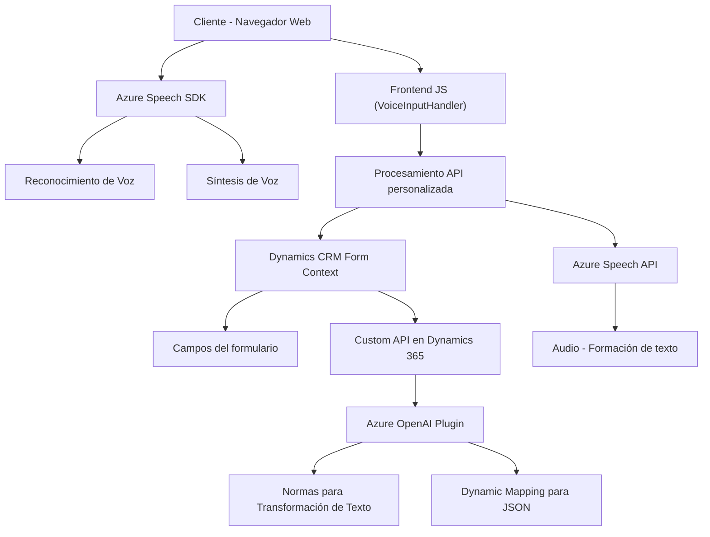

### Breve resumen técnico:
El repositorio presentado parece ser un sistema que integra funcionalidades de interacción con formularios web y procesamiento de voz mediante Azure Speech SDK, junto con un plugin que extiende las capacidades de Microsoft Dynamics CRM utilizando Azure OpenAI. Está compuesto por tres módulos principales: **Frontend**, **Speech Integration** y **CRM Plugin**, cada uno cumpliendo un rol específico para capturar, procesar y transformar datos, optimizando la interacción del usuario con un CRM.

---

### Descripción de arquitectura:
La arquitectura parece ser **Modular**, aplicada en el contexto de un **sistema de tres capas** (Frontend, lógica de negocio y backend). La integración y comunicación con otros sistemas (Azure Speech SDK y Azure OpenAI API) apunta a un diseño orientado al consumo de servicios externos. Su enfoque está en la extensión de un sistema CRM existente (Dynamics 365) mediante plugins y scripts personalizados.

- **Frontend Layer**: Implementa funcionalidades del cliente (JavaScript) para interactuar con formularios y manejar la entrada/salida de voz vía Azure Speech SDK.
- **Business Logic Layer**: Procesa datos del frontend y CRM, y ejecuta llamados a servicios externos de reconocimiento/síntesis de voz y procesamiento de texto.
- **Persistence Layer (Backend)**: Usa Dynamics 365 como fuente de datos, con implementaciones específicas de plugins que interactúan con su SDK.

---

### Tecnologías usadas:
1. **Frontend**:
   - **JavaScript**.
   - **Azure Speech SDK**: Reconocimiento de voz y síntesis de texto a voz.
   - Patrones: Modularidad, Event-driven (uso de callbacks en funciones como `ensureSpeechSDKLoaded()`).

2. **Backend / Plugins**:
   - **C#**:
     - .NET Framework utilizado para construir extensiones del CRM.
     - Consumo de APIs externas (HTTP cliente para OpenAI).
   - Dependencias:
     - **Azure OpenAI**: Para procesamiento de texto basado en normas específicas.
     - **Dynamics CRM SDK**: Para interacción y modificación de formularios en CRM.
   - Patrones: Plugin Architecture (Extendiendo Dynamics CRM).

3. **General**:
   - **JSON**: Usado ampliamente en las comunicaciones API (Azure Speech y OpenAI).

---

### Diagrama **Mermaid** válido para GitHub:

---

### Conclusión final:
Este repositorio está diseñado para integrar funcionalidades avanzadas de reconocimiento de voz, procesamiento de texto con inteligencia artificial y extensión de capacidades en un entorno CRM de Dynamics 365. La arquitectura modular del sistema junto con una separación clara de responsabilidades permite mantener escalabilidad y flexibilidad en el desarrollo.

El uso de servicios externos como Azure Speech SDK y Azure OpenAI API refleja un enfoque moderno orientado al consumo de servicios Cloud, reduciendo la carga computacional en la parte cliente y delegando tareas intensivas a servicios distribuidos. Además, la implementación del plugin en C# para Dynamics CRM sigue buenas prácticas de encapsulación y adaptabilidad.

Este sistema, con una arquitectura de 3 capas y modularidad basada en servicios, puede escalar y adaptarse a otros entornos CRM u casos donde se necesite combinar inputs y outputs de forma dinámica, potenciados con IA y tecnología de reconocimiento de voz.