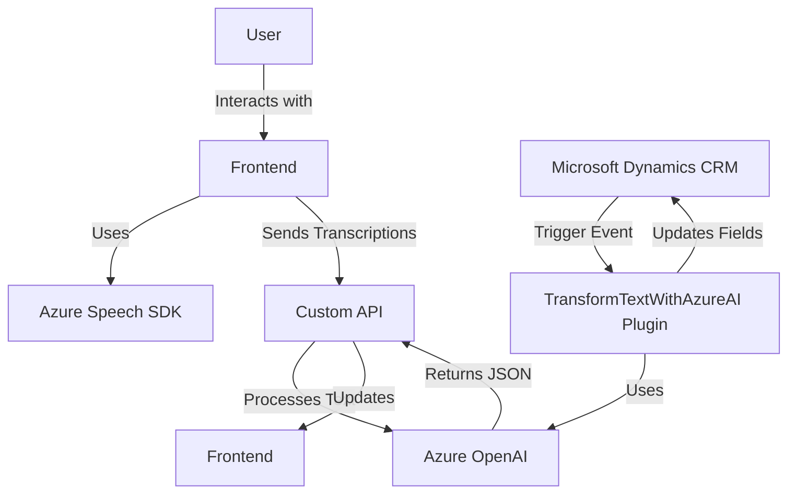

### Análisis técnico del repositorio GitHub

#### Breve resumen técnico
El repositorio contiene tres niveles de implementación:
1. **Frontend:** Código JavaScript (`readForm.js` y `speechForm.js`) que interactúa con formularios, procesa reconocimiento de voz y síntesis de texto a voz en aplicaciones web (posiblemente integradas con Dynamics CRM).
2. **Backend:** Plugin (`TransformTextWithAzureAI.cs`) desarrollado para Microsoft Dynamics CRM que realiza transformaciones de texto mediante Azure OpenAI y actualiza datos en el sistema CRM.
3. **Dependencias externas clave:** Azure Speech SDK y Azure OpenAI Service.

---

#### Descripción de arquitectura
La solución utiliza una arquitectura basada en **n capas** que combina:
1. **Capa de presentación (Frontend)**: Funcionalidades de reconocimiento de voz y síntesis de texto hacia voz (integración con formularios).
2. **Capa de negocio (Plugins)**: Plugin de Dynamics CRM que actúa como middleware para transformar texto mediante Azure OpenAI y actualizar datos en el sistema CRM.
3. **Capa de datos (CRM + API adjunta)**: Manejo de datos estructurados y actualización de atributos, con soporte para peticiones a APIs personalizadas.

A pesar de mostrar características híbridas orientadas a servicios, el sistema en sí no cumple con los principios de una **arquitectura de microservicios**, ya que el plugin funciona como un componente dentro de Dynamics CRM y no como un servicio independiente.

---

#### Tecnologías usadas
1. **Microsoft Dynamics CRM SDK:** Para desarrollo de plugins y manejo de contexto en el lado del servidor.
2. **Azure Speech SDK:** Integración con servicios de reconocimiento de voz y síntesis de voz para aplicaciones frontend.
3. **Azure OpenAI Service:** Procesamiento avanzado de lenguaje (transformaciones de texto dinámicas).
4. **JavaScript:** Implementación de funcionalidades del lado del cliente.
5. **HTTP (REST):** Comunicación entre el plugin y Azure OpenAI mediante solicitudes HTTP dinámicas.
6. **Newtonsoft.Json y System.Text.Json:** Manipulación de datos JSON en la capa de integración.

---

#### Dependencias o componentes externos
1. **Azure Speech SDK**: Para reconocimiento y síntesis de voz.
2. **Azure OpenAI Service**: Procesamiento de texto con inteligencia artificial.
3. **API personalizada**: Llamadas desde el frontend (`callCustomApi`) para procesamiento mediante transformaciones específicas.
4. **Dynamics CRM WebAPI**: Comunicación con datos y servicios del sistema CRM.

---

#### Diagrama **Mermaid** válido para GitHub

---

#### Conclusión final
Esta solución está orientada a la integración de Microsoft Dynamics CRM con servicios avanzados de voz y procesamiento de lenguaje AI mediante Azure. Aunque muestra modularidad y separación por capas, sigue un enfoque **n-capas** más tradicional, donde la lógica de negocio y la lógica de integración se centran en un único sistema CRM. La propuesta puede fortalecerse con buenas prácticas de seguridad (externalización de claves API) y mejora en la documentación de dependencias críticas. La arquitectura es adecuada para aplicaciones empresariales basadas en formularios dinámicos e interacción de usuario basada en IA, aunque no cumple con las características de escalabilidad propias de microservicios.