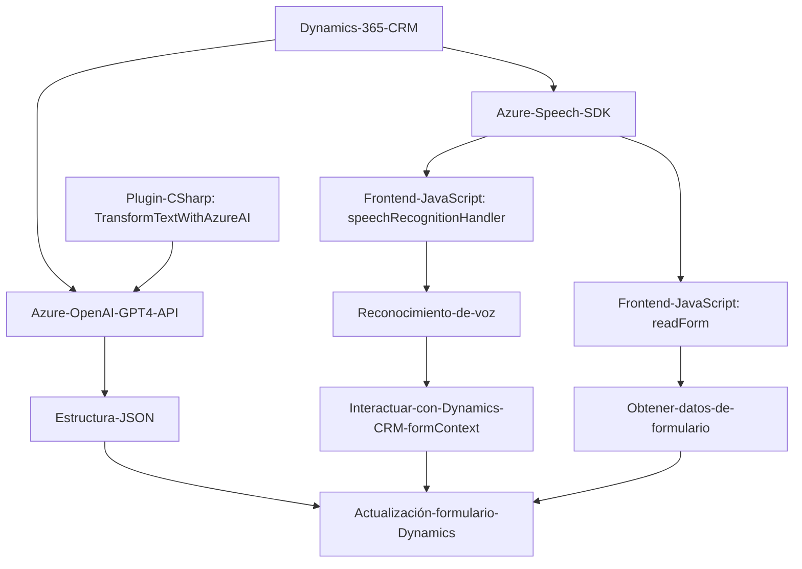

### Breve Resumen Técnico
El repositorio describe una solución que integra funcionalidades de entrada/salida de voz y procesamiento de lenguaje natural mediante servicios de Azure, con una base funcional orientada a formularios de aplicaciones Dynamics CRM. La solución incluye elementos JavaScript para el frontend y un plugin implementado en C# para extender Dynamics 365 CRM con capacidades inteligentes de análisis de texto mediante Azure OpenAI.

---

### Descripción de Arquitectura
La arquitectura del proyecto parece basarse en los principios de **arquitectura n capas**, dividiendo la solución en tres grandes niveles:
1. **Capa de Presentación (Frontend)**: Compuesta por la lógica requerida para la interacción usuario-sistema vía voz (JavaScript). Aquí se incluyen módulos como `readForm.js` y `speechRecognitionHandler.js` para funcionalidades de entrada y salida de voz.
2. **Capa de Aplicación (Backend - Plugin)**: Representada por el archivo `TransformTextWithAzureAI.cs`, implementa extensiones para Dynamics CRM y utiliza APIs externas (Azure OpenAI y Azure Speech SDK) para procesar datos generados a partir de la interacción en la capa de presentación.
3. **Capa de Datos**: No visible en el repositorio, pero dado el contexto en Dynamics CRM, es probable que se integre con la capa de datos de CRM para almacenaje, consulta y actualización del contenido del formulario, entre otras funciones.

---

### Tecnologías Usadas
1. **Frontend**:
   - **JavaScript**: Utilizado para la implementación de lógica de interacción y consumo de servicios externos.
   - **Azure Speech SDK**: Herramienta para convertir texto en audio mediante síntesis de voz (text-to-speech) y para reconocimiento de voz.
   - **Dynamics 365 CRM Frontend API (`formContext`)**: Utilizado para acceder y manipular los datos de los formularios dinámicos.

2. **Backend**:
   - **C#**: Lenguaje utilizado para el desarrollo de plugins en Dynamics CRM.
   - **Microsoft.Xrm.Sdk**: Framework para interacción con la plataforma Dynamics CRM.
   - **Azure OpenAI GPT-4 API**: Implementación de lenguaje natural generativo para transformar texto en estructura JSON basada en reglas.

3. **Patrones de Diseño**:
   - **Facade Pattern**: Varios puntos de entrada únicos en funciones como `startVoiceInput` y `Execute` encapsulan lógica más compleja.
   - **Modular Design**: Cada funcionalidad central se implementa en funciones independientes con propósitos claros, lo que favorece la reutilización.
   - **Service Gateway Pattern**: Abstracción de las interacciones con servicios externos como Azure Speech SDK y Azure OpenAI en métodos específicos.

---

### Diagrama Mermaid compatible con GitHub Markdown

---

### Conclusión Final
La solución parece estar destinada a mejorar la interacción entre usuarios y formularios dinámicos en aplicaciones basadas en **Microsoft Dynamics 365 CRM**, agregando soporte para entrada de voz y procesamiento de texto avanzado. Usa servicios en la nube de **Azure** (Speech SDK y GPT-4 de OpenAI) para proporcionar capacidades avanzadas de accesibilidad y transformación de datos, mientras sigue una arquitectura de n capas separada por frontend, backend/presentación y servicios externos. Los patrones de diseño y la modularidad del código hacen de esta solución flexible y ampliable, adecuada para escenarios empresariales donde se requieran integraciones profundas con formularios dinámicos y procesamiento sobre inteligencia artificial.