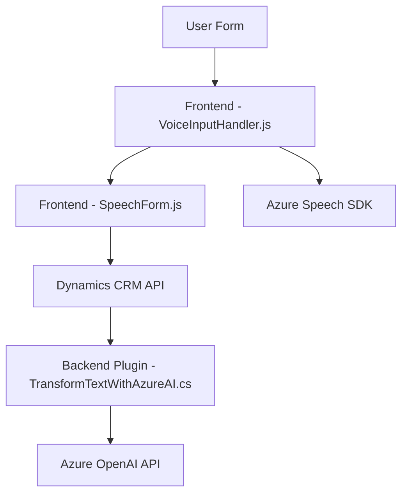

### Breve resumen técnico
El repositorio contiene componentes destinados a la integración de tecnologías de voz, procesamiento de formularios y uso de inteligencia artificial en aplicaciones basadas en Microsoft Dynamics 365. Parece ser un sistema híbrido que conjunta frontend (formulario dinámico basado en JavaScript), backend (Dynamics plugin en C#) y servicios externos avanzados como Azure Speech SDK y Azure OpenAI para interactuar con datos mediante voz y sistemas de IA.

### Descripción de arquitectura
La solución parece centrarse en una arquitectura **n capas**, donde la interfaz de usuario (JavaScript en el frontend) comunica con un backend (plugin TransformTextWithAzureAI en C#) y depende de múltiples servicios externos para ofrecer funcionalidades enriquecidas (Azure Speech SDK y Azure AI). A nivel del frontend, se observa un enfoque basado en funciones modulares con propagación controlada de eventos entre los componentes. El backend sigue principios de extensibilidad estándar dentro del sistema Dynamics 365 mediante el uso de plugins y comunicación vía servicios API.

### Tecnologías usadas
1. **Frontend**: 
   - JavaScript (gestión de formulario interactivo y voz).
   - Azure Speech SDK (para voz y reconocimiento).
   - Manipulación de DOM para interacción con formularios de Dynamics 365.
2. **Backend**:
   - Microsoft Dynamics Plugin Framework (C#).
   - Interfaz `IPlugin` de Dynamics 365.
   - HTTP client (`System.Net.Http`) para solicitudes externas.
   - JSON processing (Newtonsoft y System.Text.Json).
   - Azure OpenAI Service (procesamiento de texto e IA).
3. **Integración API**:
   - Consumo de Azure Speech SDK (navegador) y Azure AI (servidor C#).
   - Uso de APIs nativas de Dynamics CRM (`Xrm.WebApi`, formularios, etc.).

### Diagrama Mermaid válido

### Conclusión final
El repositorio contiene un sistema dinámico que combina capacidades de voz, procesamiento de formulaciones y análisis de texto mediante IA. Con una arquitectura basada en capas, permite la interacción fluida entre frontend (formularios), backend (plugins) y servicios externos como Azure Speech SDK y Azure OpenAI. Su diseño modular, extensible y centrado en API garantiza adaptabilidad para escenarios de accesibilidad e inteligencia avanzada.