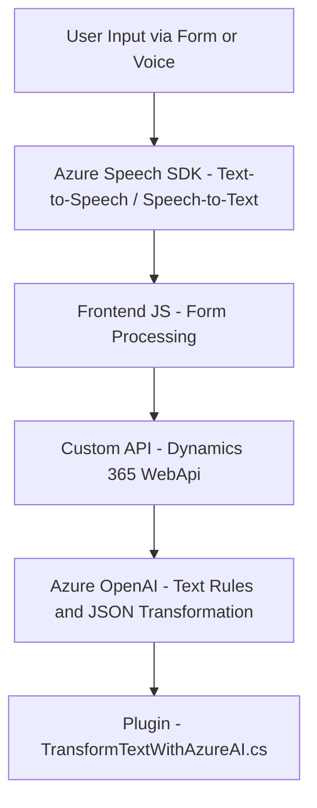

### Breve resumen técnico:
El repositorio presenta una solución basada en múltiples módulos, incluyendo componentes frontend en JavaScript y un plugin en C#. Está orientada a transformar interacción humana (voz, texto) con formularios de Dynamics CRM mediante inteligencia artificial (Azure Speech SDK y Azure OpenAI). Los archivos forman parte de una solución más amplia cuyo objetivo incluye captura de datos, transcripción, síntesis de voz y procesamiento de reglas específicas.

---

### Descripción de arquitectura:
La arquitectura general es **modular** con integración a APIs externas y plugin para **Dynamics CRM**, lo que sugiere una aproximación de **n-capas**:
1. **Capa de presentación**: Componentes frontend en `readForm.js` y `speechForm.js` para interacción con voz y formulario visual.
2. **Capa de integración de servicios**: Integración con Azure Speech SDK para síntesis y transcripción de voz.
3. **Capa de lógica de negocio**: Implementación de reglas específicas para correlación entre voz y datos del formulario.
4. **Capa backend**: Plugin en C# personalizado que recrea reglas dinámicas usando Azure OpenAI.

---

### Tecnologías usadas:
1. **Frontend**:
   - **JavaScript**: Implementación principal.
   - **Azure Speech SDK**: Procesamiento de voz (síntesis y transcripción).
   - **Dynamics 365 WebApi**: Manipulación de formularios en Dynamics CRM.

2. **Backend Plugin**:
   - **C# con .NET Framework**: Desarrolla lógica para Dynamics CRM.
   - **Azure OpenAI**: Transformación de texto en JSON basado en reglas.
   - **Newtonsoft.Json y System.Text.Json**: Serialización y manipulación de JSON.
   - **Microsoft.Xrm.Sdk**: Extendiendo funcionalidades de Dynamics CRM.
   - **System.Net.Http**: Processa interacciones HTTP con APIs externas.

3. **Arquitectura**:
   - **Modularidad** y división de responsabilidades: Siguiendo principios SOLID.
   - **Patrones de diseño**:
     - **Event-driven programming**: Manejo de eventos como captura de voz.
     - **SRP (Single Responsibility Principle)**: Cada función o método realiza una tarea específica.
     - **Integración de APIs externas**: Para voz y procesamiento inteligente.

---

### Diagrama Mermaid:

---

### Conclusión final:
El repositorio parece ser parte de una solución híbrida **frontend-backend** orientada a simplificar la interacción de usuarios con formularios en Dynamics CRM mediante voz. Aprovecha APIs de Azure (Speech y OpenAI) para tareas de síntesis de voz y transformación inteligente de datos. La arquitectura modular permite una integración clara y extensible, con sólidas bases en patrones de diseño como SRP y event-driven programming. Es técnicamente adecuada para soluciones que requieren alta capacidad de respuesta y adaptación a contextos dinámicos mediante inteligencia artificial.