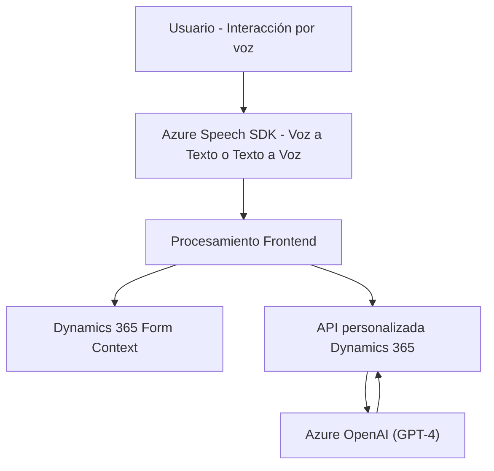

### Breve resumen técnico
El repositorio organiza una solución híbrida que integra reconocimiento y síntesis de voz, procesamiento mediante Intelligent APIs (Azure OpenAI) y manipulación de datos empresariales en formularios de **Dynamics 365 CRM**. Utiliza tecnologías modernas como Azure Speech SDK y plugins dentro de un ecosistema modular combinado con diseño de servicios.

---

### Descripción de arquitectura
#### Tipo de solución:
La solución principal es un **Conjunto de servicios y módulos** que incluye:
1. **Frontend**: Scripts para manipulación de datos mediante reconocimiento y síntesis de voz (voz a texto y texto a voz) en formularios.
2. **Backend (Plugin)**: Intermediario entre Dynamics 365 y Azure OpenAI para realizar transformaciones inteligentes de texto.

#### Arquitectura usada:
La solución presenta una **arquitectura de aplicaciones n-capas** con integración de servicios. Los componentes están organizados en:
- **Frontend (Cliente)**: Scripts JS que actúan como controladores/enlaces para manipulación del formulario y voz en Dynamics 365.
- **Backend (Plugin)**: Interfaz directa en Dynamics CRM organizada como middleware de interacción entre Dynamics 365 y Azure OpenAI.

Explícitamente, se usan patrones como:
- **Modularidad**: Separación funcional en módulos específicos.
- **Asynchronous callbacks**: Para operaciones del frontend con el SDK Azure Speech y funciones del plugin.
- **Middleware**: El plugin gestiona la interfaz de comunicación con la API externa (Azure OpenAI).

---

### Tecnologías usadas
#### Principal:
1. **Frontend**:
   - JavaScript.
   - **Azure Speech SDK** (Reconocimiento y síntesis de voz).
   - Integración con Dynamics 365 Form context (`executionContext`).
2. **Backend**:
   - **Microsoft Dynamics 365 SDK** (Extensión de acciones de CRM).
   - **Azure OpenAI Service** (GPT-4).
   - C# como lenguaje de desarrollo de plugins.

#### Dependencias y servicios externos:
- Azure Speech SDK (`SpeechConfig`, `AudioConfig`, etc.).
- Azure OpenAI/GPT APIs para IA avanzada.
- API personalizada de Dynamics 365.

---

### Diagrama Mermaid

---

### Conclusión final
Este repositorio implementa una arquitectura modular y funcional centrada en **mejorar la experiencia del usuario y la productividad en sistemas empresariales CRM** mediante el uso de capacidades de Inteligencia Artificial (IA) en **Azure**, como síntesis y reconocimiento de voz, junto con APIs de procesamiento de texto dinámico. La combinación de **Dynamics 365**, **Azure OpenAI** y **Azure Speech SDK** muestra un enfoque moderno en la utilización de tecnologías para la automatización empresarial.