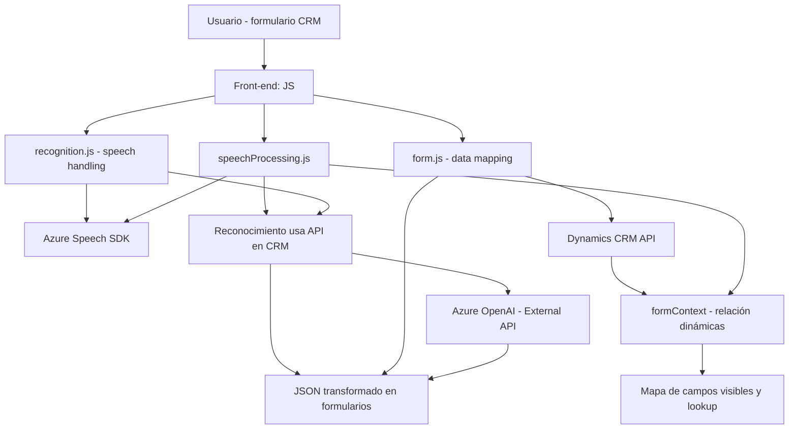

### Análisis técnico

**Breve resumen técnico**  
El repositorio contiene tres archivos principales diseñados para operar con formularios en Microsoft Dynamics CRM, empleando tecnologías como reconocimiento de voz (Azure Speech SDK) y procesamiento de texto mediante inteligencia artificial (Azure OpenAI). La funcionalidad general incluye síntesis y reconocimiento de voz, manipulación de datos en formularios y transformación de texto a JSON mediante plugins en un back-end.

---

### Descripción de arquitectura

1. **Tipo de solución**  
   - La solución integra:
     - **Front-end** de interacción con usuarios para reconocimiento y síntesis de voz (JS).
     - **Back-end** como un plugin en Dynamics CRM para procesamiento avanzado de texto.
     - **Dependencias externas**, como Azure OpenAI para IA y Azure Speech SDK para entrada/salida de voz.

2. **Tipo de arquitectura**  
   - Aunque el código tiene aspectos de arquitectura distribuida, se puede clasificar como **multicapa**:
     - **Capa de presentación:** Gestión de voz y manipulación de formularios en el front-end.
     - **Capa de lógica empresarial:** Plug-in ejecutando operaciones externas (transformación de texto).
     - **Capa de servicios:** Integración con APIs y SDK externos (Azure Speech y Azure OpenAI).

3. **Patrones aplicados**  
   - **Event-driven architecture**: Uso de eventos (scenarios como entrada de voz) para activar funcionalidades asíncronas.
   - **Service-oriented architecture**: Integración de servicios externos (Azure APIs) para extender capacidades.
   - **Single Responsibility Principle (SRP)**: Métodos enfocados en tareas específicas (e.g., cargar SDK, manejar datos).
   - **Factory Pattern**: Uso de factories (`IOrganizationServiceFactory`) en el plugin.
   - **Modularization**: Dividir funciones lógicas en bloques aislados en los archivos de JS.
   - **API Gateway**: Uso de APIs externas integradas desde diferentes capas.

---

### Tecnologías usadas
1. **Front-end (JavaScript)**
   - **Vanilla JavaScript**: Uso de funciones separadas y manipulación de DOM.
   - **Azure Speech SDK**: Reconocimiento de voz, síntesis y configuración dinámica.
   - **Dynamics CRM Context API**: Accede a datos del formulario.
2. **Back-end (C# Plugin)**:
   - **Microsoft Dynamics SDK**: Para interactuar con el contexto del sistema CRM.
   - **Azure OpenAI API**: Implementación del asistente de IA para transformar el texto.
   - **System.Net.Http**: Realiza solicitudes REST a las APIs de Azure.
   - **JSON libraries (System.Text.Json)**: Manejo de datos en formato JSON.
3. **Servicios y dependencias externas**
   - **Azure Speech SDK**: Procesa entrada/salida de voz.
   - **Azure OpenAI API**: Realiza transformaciones de texto a JSON.

---

### Dependencias o componentes externos presentes
1. **Azure Speech SDK**: Servicios de reconocimiento y síntesis de voz.
2. **Azure OpenAI API**: Transformación avanzada de texto usando IA.
3. **Microsoft Dynamics Context and SDK APIs**: Manipulación de datos y contextos en formularios de CRM.
4. **Browser and DOM APIs**: Scripts de carga dinámica, manipulación HTML.
5. **Custom APIs (Dynamics CRM)**: Para transformar texto o buscar datos directamente.

---

### Diagrama Mermaid (estructurado para GitHub)

---

### Conclusión final  
Este repositorio representa un sistema integrado con enfoque en la interacción de voz, la manipulación de formularios dinámicos y la transformación de datos mediante inteligencia artificial. La arquitectura es **orientada a servicios y multicapa**, con un enfoque modular que permite interacción entre componentes front-end y back-end. Las tecnologías, como Azure Speech SDK para reconocimiento de voz y Azure OpenAI para la generación de estructuras JSON, hacen el diseño extensible y adecuado para aplicaciones empresariales distribuidas. Sin embargo, algunas optimizaciones, como asegurar un manejo más robusto de errores y utilizar pipelines para agregar nuevas funcionalidades, podrían consolidar aún más esta solución.