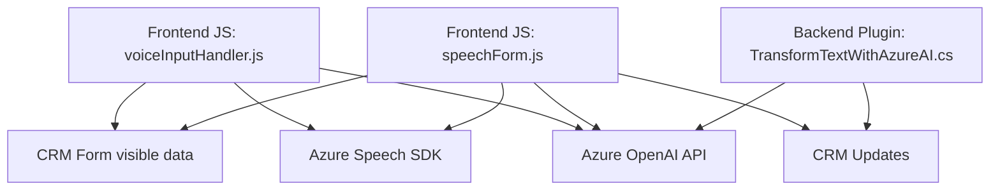

### Breve resumen técnico
El repositorio contiene tres principales componentes:
1. **Frontend**: Implementa la funcionalidad de entrada de voz y procesamiento utilizando el Azure Speech SDK, enfocándose en manipular formularios CRM y mejorar la interacción mediante asistencia por voz y sintaxis IA.
2. **Backend**: Incluye un plugin (`TransformTextWithAzureAI.cs`) desarrollado para Dynamics CRM que interactúa directamente con la API de Azure OpenAI para transformar texto según normas predefinidas y actualizar los datos en el sistema CRM.
3. **Integración**: Reúne frontend y backend para extender las capacidades de Dynamics CRM con funcionalidades avanzadas (voz y lenguaje natural) mediante dependencias como Azure Speech SDK y OpenAI.

---

### Descripción de arquitectura
La solución tiene una arquitectura **híbrida client-server**:
1. **Frontend**:
   - Modular, basada en *JavaScript*, orientada a la lógica en el navegador interactuando con formularios CRM.
   - Patrones observados: Modularidad y helpers para funcionalidades específicas (entrada de voz, procesamiento de campos visibles, síntesis de voz).
2. **Backend**:
   - Plugin para Dynamics CRM siguiendo el modelo de **extensibilidad de Dynamics**, implementando `IPlugin` y conectándose con Azure OpenAI API.
   - Patrones observados: Plugin (cuya lógica puede ser referida como *External Service Adapter* para la API Azure).

La arquitectura general puede describirse como basada en **microcomponentes**, con módulos altamente dependientes de servicios externos (SDKs y APIs) y siguiendo principios como **separación de responsabilidades**.

---

### Tecnologías usadas
1. **Frontend**:
   - **JavaScript**: Lenguaje principal del desarrollo del cliente.
   - **Azure Speech SDK**: Para entrada/salida de voz (procesamiento en tiempo real).
   - **Dynamic CRM SDK**: Integración con formularios, acceso a entidades y controles visibles.
   - **Custom APIs** (posiblemente basadas en REST): Invocaciones externas para transformar datos con IA.
   
2. **Backend**:
   - **C#** y **Dynamics CRM SDK**: Para el desarrollo del plugin del sistema Dynamics CRM.
   - **Azure OpenAI**: Interacción directa con GPT3/4 para transformar texto y retornar JSON estructurado.
   - **Newtonsoft.Json**: Para manejo de JSON en el plugin.
   - **System.Net.Http**: Para la comunicación con API externa.
   - Alojamiento de widgets y SDK bajo entornos de Dynamics CRM.

---

### Diagrama Mermaid válido para GitHub

---

### Conclusión final
La solución usa una arquitectura basada en *microcomponentes*, combinando capacidades frontend y backend para extender Dynamics CRM:
- **Frontend** maneja interacción directa de voz (entrada y síntesis), así como manipulación de formularios CRM basándose en datos visibles.
- **Backend** agrega lógica avanzada para transformar texto mediante IA (GPT), delegando el procesamiento hacia servicios externos.
- **Patrones utilizados** como plugin y client-service API adaptan el proyecto a la extensibilidad de Dynamics CRM.

La integración con Azure Speech SDK y OpenAI destaca por potenciar funcionalidades avanzadas orientadas a la experiencia del usuario, habilitando procesamiento de voz y lenguaje natural en un entorno empresarial. Sin embargo, requiere dependencias críticas externas que deben ser correctamente administradas en operaciones productivas.