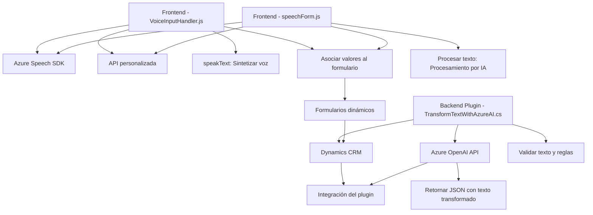

# Resumen Técnico:
Este repositorio implementa soluciones basadas en la integración de voz y texto con Microsoft Azure, específicamente usando el **Azure Speech SDK** y **Azure OpenAI**. Está estructurado en diferentes archivos que abordan el frontend, lógica de integración con servicios externos, y plugins de Microsoft Dynamics CRM. 

La solución está orientada a enriquecer la interacción con formularios dinámicos a través de reconocimiento de voz, síntesis de voz, y procesamiento de texto con inteligencia artificial. Está organizada de forma modular y presenta arquitectura basada en capas y servicios externos.

---

# Descripción de la Arquitectura:
1. **Tipo de solución**:  
La solución puede clasificarse como una plataforma que combina **frontend (JavaScript)** y **plugins backend (C#)** para integrarse con APIs como Azure Speech, Dynamics CRM, y Azure OpenAI.  
   - El frontend proporciona funcionalidades como reconocimiento de voz y síntesis de voz.
   - El backend interactúa con servicios externos y maneja transformaciones dinámicas basadas en IA.

2. **Arquitectura empleada**:  
   - **Frontend**: Modular, organizado en capas de funciones orientadas a eventos.  
   - **Backend (CRM Plugin)**: Basado en el **patrón Plugin de Dynamics CRM**, con interacción hacia un servicio **microservicio en la nube (Azure OpenAI)**.  
   - La solución en general sigue una aproximación **orientada a servicios** y **event-driven architecture**, y usa el SDK de Azure para simplificar los flujos. Aunque presenta integración modular, las dependencias externas son esenciales para el correcto funcionamiento, destacando patrones **API-driven integration**.

---

# Tecnologías Usadas:
1. **Frontend (JavaScript)**:
   - **Azure Speech SDK**: Reconocimiento y síntesis de voz.
   - **HTML/JavaScript** para manipulación del DOM y manejo de eventos.
   - **Promise-based** programming para procesos asíncronos.  
2. **Backend Plugin (C#)**:
   - Microsoft Dynamics CRM: Interfaz `IPlugin`.
   - `System.Net.Http` y `System.Text.Json` para consumo de APIs externas.  
   - Azure OpenAI API para generación de texto transformado (JSON).  

3. **Externo**:
   - **Microsoft Azure Speech SDK** y **OpenAI API**.

---

# Diagrama Mermaid:

---

# Conclusión Final:
Este repositorio implementa una plataforma robusta que combina **frontend dinámico**, con reconocimiento y síntesis de voz, e integración de **backend avanzado con Azure OpenAI** para transformar texto según reglas definidas. Es una arquitectura híbrida basada en capas y dependiente de servicios externos como Microsoft Azure SDKs y Dynamics CRM.

El enfoque modular y desacoplado asegura una escalabilidad adecuada, aunque la alta dependencia de servicios específicos de Azure podría limitar su flexibilidad en otros entornos tecnológicos. La utilización de patrones como **event-driven programming**, **plugin architecture**, y **API integration** fortalecen el diseño, y la organización del código favorece su mantenimiento en el tiempo.