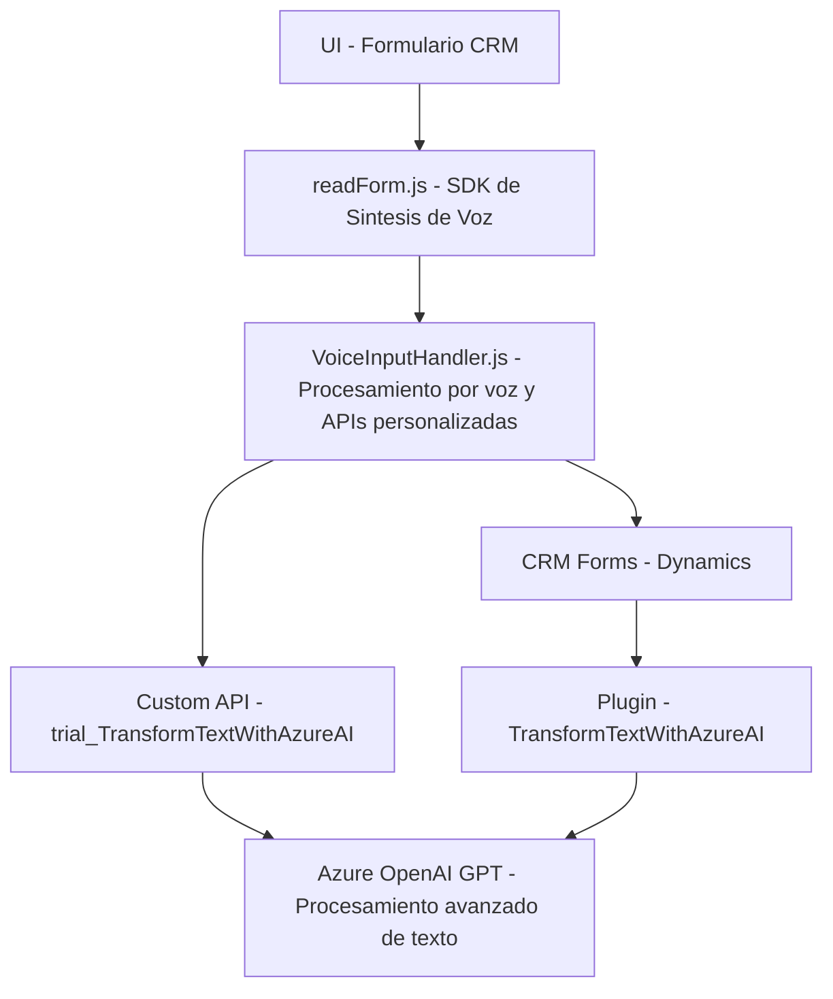

**Breve resumen técnico**:

El repositorio contiene un conjunto de documentos relacionados con la integración de un SDK de reconocimiento y síntesis de voz (Azure Speech SDK), procesamiento de datos de formularios, interacción con APIs personalizadas y la transformación de texto mediante servicios de IA en el contexto de Microsoft Dynamics CRM. La solución articula tres componentes: un frontend para el manejo de interacción por voz, un controlador para la entrada/salida de datos, y un plugin de servidor que se integra con Dynamics CRM y Azure OpenAI.

---

**Descripción de arquitectura**:

La arquitectura puede clasificarse como una combinación de una **n-capas** (frontend, controlador intermedio y backend) junto con un **Modelo Event-Driven** y organizaciones estilo **Service-Oriented Architecture (SOA)**. 
- **Frontend (Voice Input)**: Interacción directa con el usuario por reconocimiento/síntesis de voz. Manipula DOM y datos del formulario CRM.
- **Controller (voiceInputHandler.js)**: Recibe la entrada por voz, procesándola mediante APIs personalizadas y sincronizándola con los campos del formulario.
- **Backend Plugin**: Realiza tareas más complejas, como transformación de datos con Azure OpenAI, usando una implementación estándar del patrón Plugin en Dynamics CRM.

Este diseño fomenta una buena distribución de responsabilidades, separando claramente el frontend, las interacciones con APIs/SDKs, y el procesamiento backend.

---

**Tecnologías usadas:**

1. **Frontend**:
   - **JavaScript**: Lenguaje para manejar el DOM, formularios y lógica de voz.
   - **Azure Speech SDK**: Biblioteca para reconocimiento/síntesis de voz.
   - **Xrm.WebApi**: Herramienta de Microsoft Dynamics para comunicación REST.

2. **Backend**:
   - **C#** (.NET Framework): Código del servidor para crear plugins de Dynamics CRM.
   - **Newtonsoft.Json** / **System.Text.Json**: Formateo y serialización JSON.
   - **Azure OpenAI (GPT-4)**: Procesamiento avanzado de texto.
   - **Dynamics CRM SDK**: Extensión estándar para modificar lógica interna.
   - **HTTP Client**: Compatibilidad con servicios externos.

3. **Patrones**:
   - **Plugin Pattern**: (C#) Implementación estándar en Dynamics CRM.
   - **Integration Pattern**: Uso de SDK como puente entre dinámica de frontend y almacén CRM de backend.
   - **SOA**: Interacción entre frontend, APIs personalizadas y servicios externos (Azure SDK y OpenAI).

---

**Diagrama Mermaid:**

---

**Conclusión final**:

Este repositorio implementa una solución **Voice-to-CRM** con integración avanzada. El frontend utiliza el **Azure Speech SDK** para la síntesis y entrada por voz, mientras que el backend se apoya en *Microsoft Dynamics CRM plugins* y servicios personalizados como Azure OpenAI para procesamiento de texto. La arquitectura es **n-capas** y está optimizada para una integración modular. Considera buenas prácticas en la separación de responsabilidades, uso de servicios externos, y diseño centrado en eventos. La solución es adecuada para casos donde se requiere interacción basada en voz y un manejo integral de CRM con procesamiento de IA.