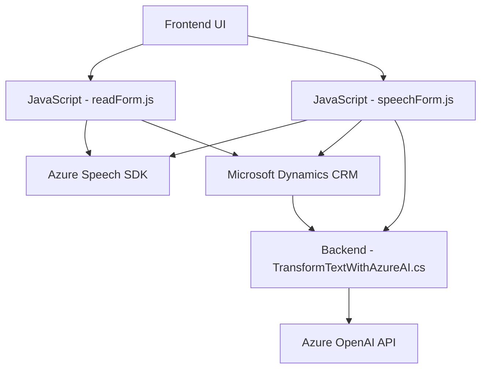

### Breve resumen técnico
El repositorio parece contener software para la integración de servicios de voz y procesamiento de texto basado en Azure Speech SDK y Azure OpenAI con Microsoft Dynamics CRM. Los archivos proporcionados abarcan funcionalidades del frontend, como convertir datos de formularios en texto hablado y reconocimiento de voz, así como un complemento de Dynamics CRM en el backend para transformar texto mediante los servicios de Azure OpenAI.

---

### Descripción de arquitectura
1. **Tipo de solución**:
   - Vista del repositorio y los archivos proporcionados, se trata de una solución **híbrida** que combina un **frontend** basado en JavaScript y un **backend** desarrollado como un **plugin personalizado para Microsoft Dynamics CRM**. Parte del proceso incluye la utilización de APIs externas de **Azure Speech SDK** y **Azure OpenAI**.

2. **Arquitectura identificada**:
   - Aunque el sistema podría ser parte de un entorno más grande, basado en los elementos analizados, el diseño distribuido con integración a servicios externos, tal como Azure OpenAI y Azure Speech SDK, apunta hacia patrones de arquitectura híbridos con características **orientadas a microservicios** o **orientadas a eventos**.
   - El frontend sigue el patrón clásico de **MVC** (Model-View-Controller), mientras que el backend sigue el enfoque modular basado en Plugins.

3. **Capacidades clave**:
   - **Frontend**: Procesamiento de voz para sintetizar texto hablado y reconocimiento de voz.
   - **Backend**: Generación de textos enriquecidos (JSON) mediante servicios de AI/GPT con reglas específicas.

---

### Tecnologías y frameworks usados
1. **Backend**:
   - **C#**: Desarrollo de un plugin mediante .NET Framework.
   - **Microsoft Dynamics CRM SDK**: Interfaz para extender las capacidades de Dynamics CRM con lógica personalizada.
   - **Azure OpenAI API**: Integración para la generación de contenido basado en GPT (usando modelos como GPT-3/4).
   - **HttpClient**: Envío y recepción de datos a través de HTTP para conectarse con APIs externas.

2. **Frontend**:
   - **Vanilla JavaScript**: Implementación de funciones en los scripts de los formularios.
   - **Azure Speech SDK**: Carga dinámica desde un CDN para síntesis de audio y reconocimiento de voz.
   - **Microsoft Dynamics CRM Web API (`Xrm` namespace)**.

3. **Librerías adicionales**:
   - `Newtonsoft.Json` para manipulación de datos JSON.
   - Uso de patrones como callbacks y promesas para gestionar operaciones asíncronas.

---

### Diagrama Mermaid
Este diagrama representa la relación entre los módulos principales, sus funciones, y las dependencias externas.

---

### Conclusión final
La solución consiste en un sistema que conecta un frontend de formularios en Dynamics CRM con funcionalidades avanzadas de AI/ML proporcionadas por Azure, específicamente el reconocimiento y síntesis de voz de Azure Speech SDK y el procesamiento de lenguaje natural de Azure OpenAI API. La solución utiliza un enfoque híbrido que integra software cliente basado en JavaScript con un backend desarrollado en C# y orientado a la arquitectura de plugins de Dynamics CRM.

El diseño modular, el uso de funciones auxiliares para procesar la lógica de negocio y la delegación de tareas complejas al software de terceros indica que la arquitectura está orientada a la reutilización y a la integración de servicios de nube modernos.

