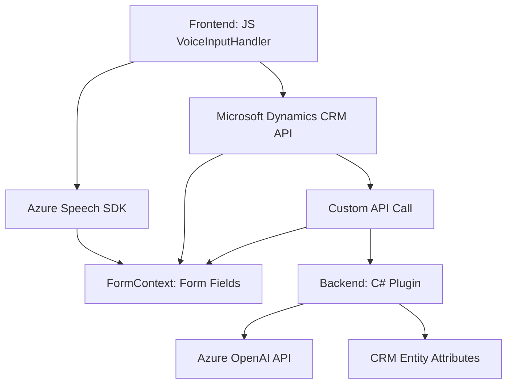

### Breve resumen técnico:
El repositorio describe una solución que integra **entrada y salida de voz** con procesamiento de texto orientado a **Microsoft Dynamics CRM**, utilizando servicios de **Azure Speech SDK** y **Azure OpenAI API**. Se trata de una solución híbrida con componentes frontend en JavaScript y backend en C# mediante plugins de Dynamics CRM.

---

### Descripción de arquitectura:
- **Tipo de solución**: 
  - Principalmente una **solución extendida del CRM** orientada a mejorar la experiencia de usuario con **voz y procesamiento de texto**.
  - Componentes frontend gestionan el reconocimiento y síntesis de voz para interacción con formularios.
  - Backend maneja procesamiento avanzado de texto mediante **plugins personalizados** y **Azure AI**.

- **Arquitectura**: 
  - Mezcla de **n-capas** y **hexagonal**:
    - **Frontend**: Trabaja como capa de presentación integrada con Microsoft Dynamics CRM.
    - **API externa** (Azure SDK): Implementación **port-adapter**, que utiliza servicios externos para conseguir funcionalidades conversacionales.
    - **Backend plugin**: Componente orientado a la aplicación con lógica empresarial estructurada.

---

### Tecnologías usadas:
1. **Frontend**:
   - **JavaScript**: Trabajo directo en el navegador.
   - **Microsoft Dynamics CRM APIs**: Gestión de formularios y atributos.
   - **Azure Speech SDK**: Para entrada y salida de voz.

2. **Backend**:
   - **C#**: Desarrollo de plugins mediante interfaces de `IPlugin`.
   - **Microsoft.Xrm.Sdk**: Manejo del contexto y operaciones de Dynamics CRM.
   - **Azure OpenAI REST API**: Procesamiento avanzado de texto.
   - **Newtonsoft.Json** y **System.Text.Json**: Serialización y análisis de estructuras JSON.

3. **Patrones observados**:
   - **Separación de responsabilidades**: Cada función tiene un propósito específico (p.ej., extracción de datos, síntesis de voz, carga dinámica de SDK, mapeo de atributos).
   - **Integración API externa**: Servicios de Azure están integrados en frontend y backend para potenciar capacidades conversacionales y procesamiento inteligente.
   - **Factory/Mapper**: Utilizado para mapear campos visibles y transcripciones reconocidas.
   - **Plugin-based architecture**: Implementación en C# sigue el modelo de extensibilidad de Microsoft Dynamics CRM.

---

### Dependencias o componentes externos:
1. **Azure Speech SDK**: Para entrada/salida de voz y reconocimiento en tiempo real.
2. **Azure OpenAI API**: Backend realiza transformaciones y procesamiento avanzado de texto mediante prompts.
3. **Microsoft Dynamics CRM APIs**:
   - Para la manipulación programática de formularios y datos.
4. **HTTP APIs y JSON Libraries**:
   - Proveedores como `System.Net.Http` y `Newtonsoft.Json` para llamadas y análisis de datos.
5. **DOM APIs** (carga dinámica): Scripts cargados directamente desde Azure para interoperar con el frontend.

---

### Diagrama Mermaid:

---

### Conclusión final:
La solución se caracteriza por integrar **tecnología de reconocimiento conversacional** avanzada con el ecosistema de **Microsoft Dynamics CRM**, usando servicios de Azure para enriquecer la interacción de usuario. Mediante una arquitectura híbrida de frontend y plugins, fortalece capacidades conversacionales y ofrece extensibilidad para escenarios IA avanzados en CRM.

Se trata de una solución modular, con separación clara de responsabilidades y una arquitectura que apuesta por utilizar servicios externos como Azure, mientras sigue la filosofía de plugins y lógica centralizada en el CRM.