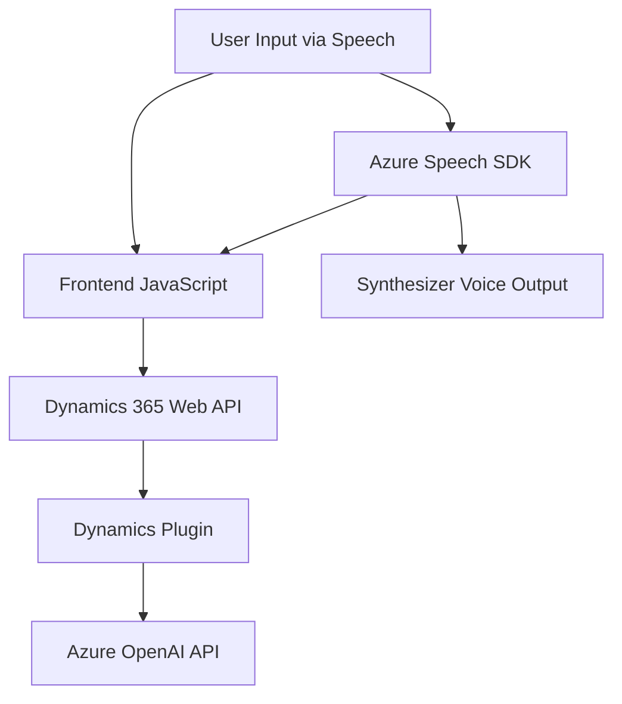

### Breve Resumen Técnico
El repositorio contiene una solución que integra funcionalidades de reconocimiento y síntesis de voz con **Azure Speech SDK**, además de procesamiento de texto a través de **Azure OpenAI API**. Está diseñado para interactuar directamente con formularios en entornos como Dynamics 365, transformando comandos de voz en acciones o datos aplicados a formularios y utilizando procesamiento de inteligencia artificial.

---

### Descripción de Arquitectura
La solución presenta una arquitectura híbrida:
- **Frontend (JavaScript):** Maneja la entrada de voz y la síntesis de texto a voz en el navegador utilizando **Azure Speech SDK**. Funciona como controlador y vista de la interfaz de usuario dinámica.
- **Backend (Dynamics 365 Plugins):** Implementa lógica empresarial avanzada con **Microsoft Dynamics CRM SDK** que conecta con **Azure OpenAI API** para procesar texto y devolver transformaciones contextuales.
- **Patrón Modular de Funciones:** El frontend organiza la lógica en funciones que segregan claramente responsabilidades como procesamiento de entrada de voz, mapeo de campos y actualización de atributos de formularios.
- **Patrón de Plugins en CRM:** El backend utiliza el patrón de plugins de Dynamics CRM para extender la funcionalidad, asegurando un enfoque desacoplado respetando la arquitectura del sistema.

---

### Tecnologías Usadas
1. **Frontend:**
   - **Azure Speech SDK**: Reconocimiento de voz y síntesis TTS en tiempo real.
   - **JavaScript**: Procesamiento de datos en navegador, integración dinámica con SDK y API.
   - **Dynamics Web API**: Comunicación con entidades de formularios y atributos.

2. **Backend:**
   - **Microsoft Dynamics CRM SDK**: Extensiones de lógica mediante el patrón de plugin.
   - **Azure OpenAI API**: Procesamiento de texto avanzado (GPT-4) para transformación de datos profesionales.
   - **.NET Framework**: Desarrollo del plugin, manejo de solicitudes HTTP y serialización JSON.

---

### Diagrama Mermaid

---

### Conclusión Final
La solución está orientada hacia aplicaciones empresariales dinámicas con una arquitectura orientada a servicios distribuidos. Se basa principalmente en la integración de herramientas de Azure como Speech SDK y OpenAI API junto con Dynamics 365. La arquitectura presentada está organizada como **n capas acopladas** donde JavaScript (Frontend) actúa como intermediario entre la interacción del usuario y los procesos de negocio en Dynamics CRM. La solución fomenta modularidad, escalabilidad, y la reutilización de APIs externas, eliminando la dependencia de lógica pesada en el cliente o servidor.