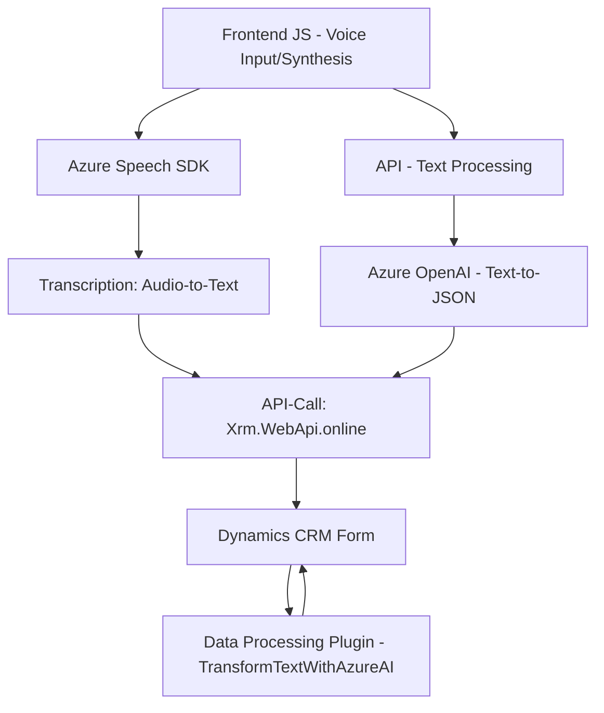

### Breve resumen técnico
El repositorio parece implementar una solución que combina los servicios de Azure Speech SDK y Azure OpenAI para interactuar con formularios en Dynamics CRM. Su funcionalidad principal incluye la entrada de voz, síntesis de texto, análisis de datos obtenidos, y transformación de texto mediante inteligencia artificial.

---

### Descripción de arquitectura
La solución utiliza una arquitectura basada en capas, con interacción entre tres principales componentes:
1. **Frontend** (JavaScript): Captura la entrada de voz, transforma datos del formulario y los envía a APIs externas (Azure Speech/JSON API).
2. **Backend** (Plugins y APIs): Procesa datos de entrada mediante servicios externos como Azure OpenAI y gestiona el almacenamiento en Dynamics CRM.
3. **Azure Services Integration**: Actúa como el proveedor principal del SDK de reconocimiento de voz y el modelo de AI para transformar texto.

La arquitectura de **n capas** está presente, donde el frontend maneja la interfaz de usuario, las APIs como middleware y el backend realiza el trabajo pesado de procesamiento y almacenamiento dinámico en el sistema CRM.

---

### Tecnologías usadas
1. **Frontend (Espacios `/JS/`):**
   - **JavaScript**: Lenguaje base para implementar la funcionalidad.
   - **Microsoft Azure Speech SDK**: Utilizado para análisis de voz, síntesis y transcripción.
   - **Dynamics CRM SDK (`Xrm.WebApi`)**: Para gestionar formularios y realizar operaciones sobre las entidades de CRM.

2. **Backend (Espacios `/Plugins`):**
   - **C#**: Lenguaje de implementación principal.
   - **Microsoft.Xrm.Sdk**: Framework para integración directa con Dynamics CRM.
   - **Dynamics CRM plugins**: Modelo de extensibilidad de Microsoft Dynamics CRM.
   - **Azure OpenAI Service**: Utilizado para la transformación avanzada del texto en JSON estructurado.

3. **Patrones usados:**
   - **Single Responsibility**: Cada método se restringe a realizar una sola tarea.
   - **Dynamic Loader**: Para cargar Azure SDK dinámicamente en el frontend.
   - **Factory Method**: Para crear configuraciones de SDK y realizar llamadas a APIs externas.
   - **Plugin Pattern**: Para la incorporación modular de funcionalidades en sistemas CRM.
   - **N capas**: Separación lógica entre frontend, APIs externas y procesamiento en el backend (CRM + AI).

---

### Dependencias o componentes externos presentes
1. **Azure Speech SDK**: Captura y análisis de voz y texto.
2. **Azure OpenAI (`gpt-4`)**: Procesamiento avanzado de texto.
3. **Dynamics CRM APIs**:
   - `Xrm.WebApi.online.execute`: Permite interactuar con datos del sistema CRM.
   - Plugins CRM para manipulación de formularios y mapeo de valores dinámicos.
4. **Librerías externas**:
   - `Newtonsoft.Json` y `System.Text.Json`: Procesamiento JSON.
   - `System.Net.Http`: Para realizar llamadas HTTP a APIs externas.

---

### Diagrama Mermaid válido para GitHub

---

### Conclusión final
La solución utiliza una combinación de tecnologías modernas, especialmente integraciones con servicios en la nube (Azure Speech SDK y OpenAI). El sistema funciona mediante capas bien diferenciadas, permitiendo que el frontend capture datos de usuarios vía voz, los transforme con AI y actualice formularios interactivos en Dynamics CRM. Aunque la arquitectura y los patrones son adecuados, el manejo de claves API (especialmente en el plugin) podría mejorarse utilizando configuraciones más seguras y centralizadas.

Dicho enfoque combina eficientemente la capacidad de interacción UX avanzada y el procesamiento backend, lo que lo convierte en una solución sólida para entornos CRM dinámicos.