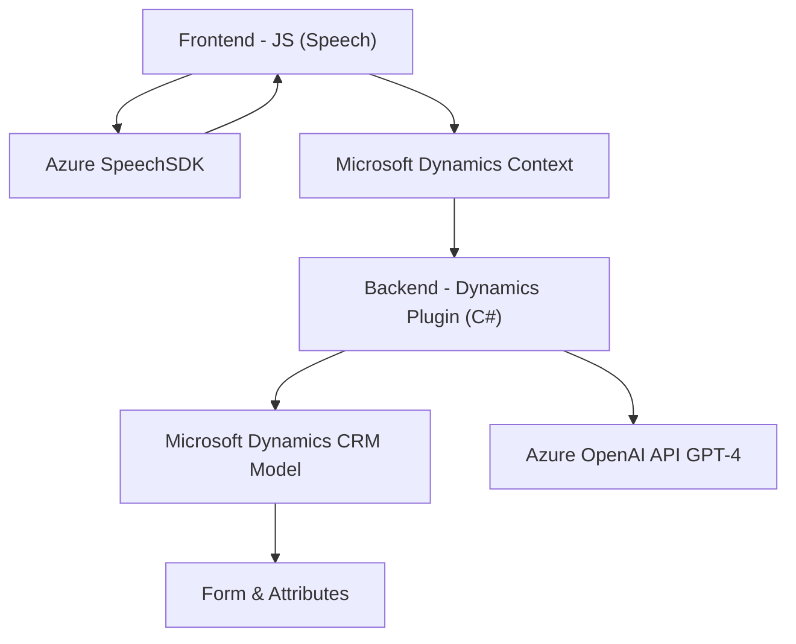

### Breve resumen técnico
Este repositorio contiene una solución que integra y utiliza tecnologías de Azure (Speech SDK y OpenAI API) dentro de diferentes componentes: un frontend basado en JavaScript y un plugin para Microsoft Dynamics CRM. Se centra en la accesibilidad y automatización mediante reconocimiento de voz y síntesis de voz, con procesamiento de datos del formulario y transformación de texto.

### Descripción de arquitectura
La arquitectura está orientada al desarrollo de una **Service-Oriented Architecture (SOA)** con integración de servicios externos para el reconocimiento de voz y procesamiento con IA mediante Azure APIs. Está estructurada en dos capas:
1. **Frontend (JavaScript):** Utiliza tecnologías de cliente para capturar la entrada e interactuar con el usuario.
2. **Backend (Dynamics CRM):** Utiliza plugins para procesar la lógica del negocio, transformando datos y enviando solicitudes a Azure OpenAI API.

### Tecnologías usadas
1. **Frontend:**
   - **JavaScript**: Para implementar la lógica de la interfaz con el formulario y los servicios de voz.
   - **Azure Speech SDK**: Para convertir texto a voz y realizar reconocimiento de voz.
   - **Microsoft Dynamics Context (`Xrm.WebApi`)**: Para interactuar con los modelos de datos y campos del formulario en Dynamics.
   
2. **Backend Plugin:**
   - **C#**: Desarrollo del plugin.
   - **Microsoft.Xrm.Sdk**: Gestión e interacción con las entidades de Dynamics CRM.
   - **Azure OpenAI API (GPT-4)**: Para transformar texto ingresado por el usuario en un formato JSON estructurado.
   - **Newtonsoft.Json**: Manejo de estructuras JSON.
   - **System.Net.Http**: Para realizar llamadas HTTP a la API externa.

### Dependencias o componentes externos
1. **Azure Speech SDK**: Para reconocimiento y síntesis de voz en el frontend.
2. **Azure OpenAI API (GPT-4)**: Modelos avanzados de IA para transformar texto.
3. **Xrm.WebApi**: Para comunicación con el backend de Dynamics CRM.
4. **Microsoft Dynamics CRM**: Modelo central donde se realizan la mayoría de las operaciones en entornos de negocio.
5. **Newtonsoft.Json**: Manejo de objetos JSON.
6. **System.Net.Http**: Para las solicitudes al servicio externo de OpenAI.

### Diagrama Mermaid

### Conclusión final
La solución se define como un servicio accesible para capturar inputs desde formularios de Dynamics CRM y procesarlos mediante voz e inteligencia artificial. Utiliza una arquitectura basada en servicios (SOA) donde se separan los roles del frontend y backend, integrando además APIs externas de Azure para la síntesis de voz y procesamiento de texto con IA. A través de una estructura modular y patrones como Event-Driven Programming y Service-Oriented Architecture, el proyecto cumple con requisitos de integración y escalabilidad. Sin embargo, la alta dependencia en servicios externos de Azure hace que una interrupción en cualquiera de estos pueda afectar el funcionamiento completo.