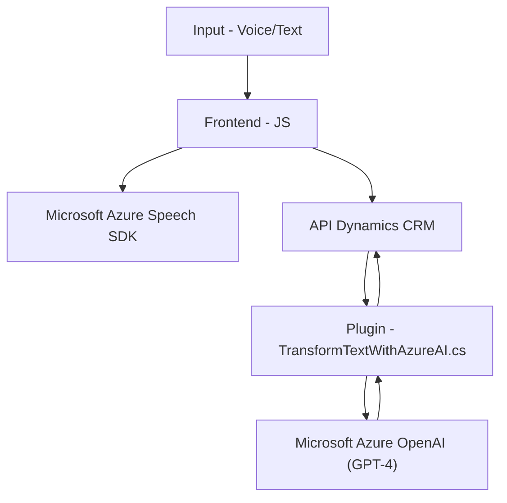

### Breve resumen técnico
El repositorio analizado implementa una solución de integración entre Microsoft Dynamics CRM y servicios externos de Microsoft Azure, especialmente el Azure Speech SDK y Azure OpenAI. La funcionalidad principal gira en torno a la entrada de voz, la síntesis de texto en voz y el procesamiento de texto con inteligencia artificial. Está dividido en dos partes principales:

1. **Frontend (en JS):** Procesa entradas de voz, convierte texto en voz, y después interactúa con APIs externas en Dynamics CRM utilizando servicios en Azure.
2. **Backend Plugin (en C#):** Implementa lógica basada en el procesamiento de texto utilizando modelos GPT-4 a través de Azure OpenAI dentro de Dynamics CRM.

---

### Descripción de arquitectura
La solución utiliza una arquitectura híbrida con elementos de diseño modular y una integración entre sistemas cliente/servidor. En términos de diseño, incluye:
- **Event-driven architecture:** Utiliza callbacks y promesas en el frontend para coordinar el flujo de los eventos, sincronizando la carga dinámica de servicios externos.
- **N capas:** La solución sigue una estructura típica de tres capas (presentación, lógica de negocio y persistencia) basada en necesidades de Microsoft Dynamics.
- **Integración con SDKs y APIs externas:** El sistema emplea servicios externos como el Azure Speech SDK y Azure OpenAI para ampliación de capacidades (entrada de voz, síntesis de voz, procesamiento avanzado de texto por IA).
- **Plugin-based architecture para el backend:** Utiliza el patrón de plugin de Microsoft Dynamics para incorporar lógicas específicas al CRM mediante el servicio `Microsoft.Xrm.Sdk`.

---

### Tecnologías usadas
1. **Frontend:**
   - JavaScript.
   - SDK de Microsoft Dynamics para manipular formularios y atributos.
   - **Azure Speech SDK**: Utilizado para entrada y síntesis de voz.
   - Promesas y callbacks para manejo de flujos de datos/eventos asincrónicos.

2. **Backend Plugin:**
   - C# (.NET).
   - **Microsoft.Xrm.Sdk** para interactuar con Dynamics CRM.
   - **Azure OpenAI API (GPT-4)** para procesamiento semántico avanzado de texto.
   - **Newtonsoft.Json** y `System.Text.Json` para manipulación de datos JSON.
   - **HttpClient** de .NET para interactuar con APIs externas (Azure).

---

### Diagrama Mermaid

---

### Conclusión final
La solución presentada es una implementación integrada entre Dynamics CRM y los servicios de Microsoft Azure para voz y procesamiento inteligente de textos. En el **frontend**, se procesan entradas de usuario en forma de voz y texto, utilizando el Speech SDK de Azure. Luego, los datos generados pasan al **backend** como parte de una API consumida por Dynamics CRM, donde un plugin interactúa con Azure OpenAI para realizar transformaciones en los datos propios del formulario. 

La arquitectura general sigue principios separados de modularización para maximizar la reutilización y escalabilidad, mientras que su enfoque híbrido combina servicios locales y externos. Es un diseño adecuado para la automatización de interacción hombre-máquina en plataformas CRM.