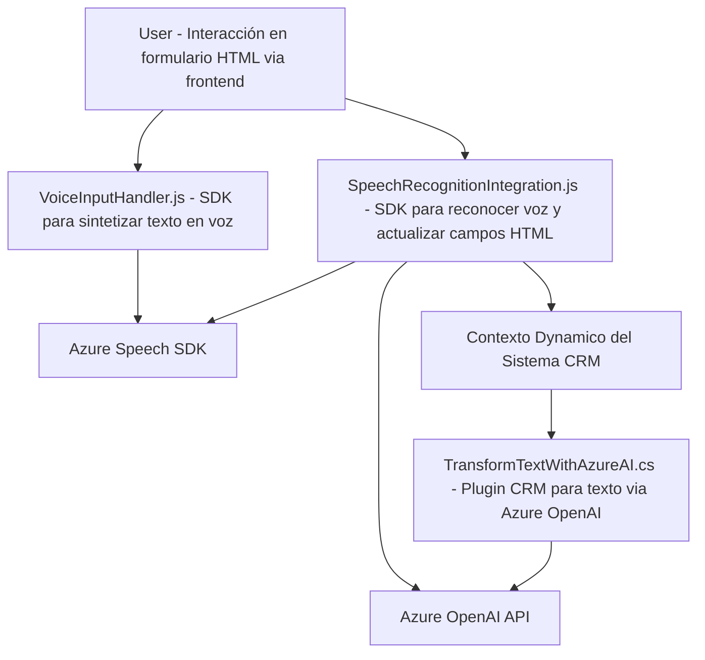

### Breve resumen técnico
El repositorio GitHub analiza tres componentes principales relacionados con la interacción de sistemas CRM: procesamiento de datos desde formularios, reconocimiento y generación de voz mediante el SDK Azure Speech, y transformación textual avanzada usando Azure OpenAI en un plugin como microservicio. Estos tres están conectados y parecen contribuir a mejorar la interacción con usuarios a través de interfaces CRM dinámicas, integrándose con servicios externos.

---

### Descripción de arquitectura
La solución es una **arquitectura híbrida** que combina características de un sistema modular y, por extensión, una aproximación orientada a microservicios. Aunque no es estrictamente desacoplada, cada módulo ejecuta tareas funcionalmente independientes:
1. **Frontend**: Scripts en JavaScript procesan captura de datos (formulario), interacción con SDK y generación de texto o audio en el navegador.
2. **Backend**: Plugins en .NET, integrados con Microsoft Dynamics CRM, amplían la funcionalidad del CRM utilizando servicios de Azure OpenAI.

En términos de patrones arquitectónicos:
- **Patrón Plugin**: Implementación típica de Dynamics CRM para extender su funcionalidad.
- **Integración de servicios externos**: Conexión directa al SDK Speech de Azure para síntesis/reconocimiento de voz y el servicio OpenAI de Azure para procesamiento textual.
- Podría evolucionar hacia **arquitectura de microservicios**, dado que cada componente tiene independencia funcional y puede ser desacoplado y ejecutado en entornos más distribuidos.

---

### Tecnologías usadas
- **Frontend (JavaScript)**:
  - Azure Speech SDK para reconocimiento y síntesis de voz.
  - Manipulación del DOM para procesamiento de formularios dinámicos.
  - Interacción con APIs externas (posiblemente vía HTTP/XML).
- **Backend (C#)**:
  - Microsoft Dynamics CRM SDK (plugin architecture).
  - Azure OpenAI para procesamiento de texto avanzado.
  - Dependencias: `Newtonsoft.Json`, `System.Net.Http`, `System.Text.Json`.
- **Servicios externos**:
  - Azure Speech SDK.
  - Azure OpenAI API (GPT).

Patterns observados:
- **Singleton**: Utilización de un flujo único para gestionar la carga del SDK.
- **API Gateway**: Parámetros procesados y enviados a servicios externos para transformar el contenido.
- **Modularidad y separación de responsabilidades**: Cada archivo cumple funciones bien delimitadas.

---

### Diagrama Mermaid

---

### Conclusión final
Este repositorio representa un sistema semi-integrado desarrollado para extender la funcionalidad de un CRM mediante tecnologías modernas de reconocimiento/síntesis de voz y transformación de texto con inteligencia artificial. Aunque actualmente utiliza una arquitectura híbrida con una fuerte dependencia de servicios externos (Azure Speech SDK y OpenAI API), está diseñado de manera modular, permitiendo una posible expansión hacia una arquitectura basada en microservicios. Esto lo hace adecuado para aplicaciones dinámicas, como CRM mejorados con IA y voz activa. Sin embargo, hay lugar para refinar el desacoplamiento entre módulos y mejorar la flexibilidad general del sistema.