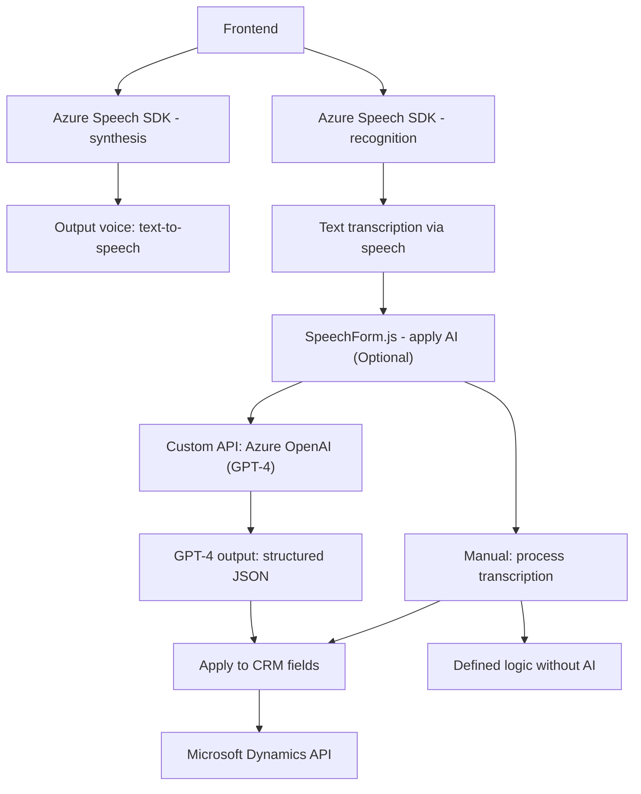

### Resumen técnico:
El repositorio en cuestión implementa una solución tecnológica que combina un **frontend** basado en JavaScript con un **plugin de Dynamics CRM en .NET**. Además, utiliza **servicios de Azure** como Speech SDK y OpenAI para desarrollar funcionalidades de accesibilidad y asistencia mediante reconocimiento de voz y procesamiento de lenguaje natural (PLN).

---

### Descripción de arquitectura:
La solución parece estar basada en una **arquitectura de capas** con componentes que implementan patrones como **SDK/plugin design** y **servicio orientado a API**. Cada archivo identificado cumple una responsabilidad específica:
1. **Frontend/JS/readForm.js**: Gestiona la lectura de datos del formulario y utiliza Azure Speech SDK para procesar datos mediante síntesis de voz (texto a voz).
2. **Frontend/JS/speechForm.js**: Implementa el reconocimiento de voz para transcribir y procesar datos audibles y para interactuar con el CRM.
3. **Plugins/TransformTextWithAzureAI.cs**: Extiende la funcionalidad del CRM con un plugin que comunica con Azure OpenAI API para transformar texto en un formato estructurado.

---

### Tecnologías usadas:
1. **Frontend (JavaScript):**
   - **Azure Speech SDK:** Todos los servicios de síntesis y reconocimiento de voz.
   - **DOM API** y **Browser API**: Para la manipulación de elementos HTML y ejecución de scripts.
   - **Promesas y callbacks:** Gestión de sincronización y procesos asíncronos.
   - **Microsoft Dynamics API**: Para interactuar con los formularios del CRM.

2. **Backend (.NET Plugin):**
   - **Microsoft Dynamics CRM SDK:** Para ejecutar lógica personalizada dentro del CRM.
   - **Azure OpenAI API:** Para procesar texto con modelos avanzados de lenguaje (GPT-4).
   - Librerías esenciales: `System.Linq`, `System.Text.RegularExpressions`, `System.Net.Http`, `System.Text.Json`.
   - Diseño: Plugin architecture, con separación de responsabilidades y ayuda de funciones estáticas.

---

### Dependencias o componentes externos:
1. **SDK y APIs Externos:**
   - Azure Speech SDK.
   - Azure Cognitive Services (OpenAI GPT-4).
   - Microsoft Dynamics CRM API.
2. **Servicios HTTP/REST:** Uso de servidor externo (Azure) para interactuar con modelos de PLN mediante solicitudes HTTP POST.

3. **Frontend/Browser dependencies:**
   - Manipulación de DOM
   - Carga dinámica de SDK (JavaScript)

4. **CRM Plugins:**
   - CRM trabaja extendido mediante el plugin `TransformTextWithAzureAI.cs`, conectado a eventos del sistema.

---

### Diagrama Mermaid válido para GitHub:

---

### Conclusión final:
El repositorio presenta una **modular solución de software** enfocada en la integración de **servicios de inteligencia artificial** con formularios web y **sistemas de gestión empresarial (CRM)**. La arquitectura es una combinación de **estilo basado en capas**, complementando la estructura del CRM mediante un **plugin extensible** y utilizando servicios externos como **Azure Speech SDK** y **OpenAI GPT-4** para potenciar la accesibilidad y el reconocimiento de patrones de lenguaje en tiempo real.

Los patrones de diseño son sólidos, con funciones que respetan el principio de **responsabilidad única**, incluso en los servicios externos y plugins. Podrían mejorarse algunos aspectos de seguridad y la gestión de claves de las APIs con herramientas como **Azure Key Vault**, pero la solución presenta un diseño profesional y adaptable para propósitos empresariales y de interacción avanzada.