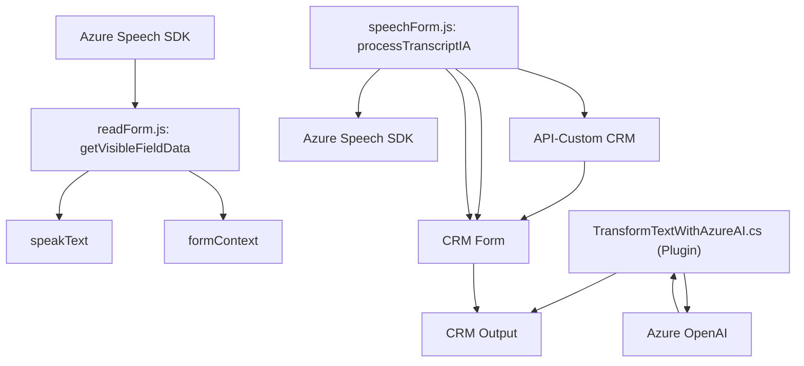

### Breve resumen técnico
El repositorio contiene tres archivos enfocados en proporcionar integraciones entre formularios CRM, SDKs externos y servicios de Azure. Combina funcionalidades de reconocimiento de voz, síntesis de voz, procesamiento de JSON y manipulación de datos en formularios. Es ideal para soluciones digitales que giran alrededor de plataformas como Dynamics CRM, servicios API y procesamiento avanzado de texto.

---

### Descripción de arquitectura
1. **Tipo de solución**: Es una integración que trabaja con APIs externas (Azure Speech SDK y Azure OpenAI), conectores para formularios de CRM (probablemente Dynamics 365), y un backend para lógica empresarial personalizada. Es, por tanto, una arquitectura híbrida orientada a servicios (SOA) y eventos.

2. **Tipo de arquitectura:** 
   - La aplicación global utiliza una arquitectura **orientada a servicios** (SOA), debido a la existencia de plugins para CRM y la interacción con servicios externos.
   - El frontend sigue un modelo **Modular**, manteniendo las funcionalidades desacopladas (por ejemplo, lectura de formulario y síntesis de voz).
   - El backend está estructurado como un sistema de **capa de plugins**, lo que lo convierte en una arquitectura extensible y adaptable a la plataforma de CRM.

---

### Tecnologías usadas
1. **Azure Speech SDK (Reconocimiento/Síntesis de Voz):**
   - Para reconocimiento de voz y conversión de texto en audio.
   - Usado en los archivos `readForm.js` y `speechForm.js`.

2. **Azure OpenAI (GPT-4 API):**
   - Utilizado para procesar entradas usando modelos avanzados de generación de texto y producir JSON basado en normas definidas.
   - Usado en el plugin `TransformTextWithAzureAI.cs`.

3. **Microsoft Dynamics CRM SDK (Xrm.WebApi.online):**
   - Para realizar llamadas a las entidades y manipular datos en el contexto CRM.

4. **JavaScript:** Gestión del frontend, manipulación del DOM y configuración del SDK de Azure Speech.

5. **C#:** Desarrollo de plugins en la capa de backend para el CRM.

6. **HTTP & JSON:** Para toda la comunicación con servicios externos como Azure OpenAI.

---

### Dependencias o componentes externos
1. **SDKs externos:**
   - Azure Speech SDK.
   - Microsoft Dynamics CRM SDK.

2. **APIs externas:**
   - Azure OpenAI GPT-4 para transformación de texto con normas específicas.
   - APIs personalizadas del entorno CRM.

3. **Librerías de JavaScript:**
   - Métodos del navegador como `Window` API.
   - Potencial uso de ciertas librerías adicionales en JavaScript si el código está embebido en un entorno de frontend más grande.

4. **HTTP Client en C#**:
   - Para manejar solicitudes HTTP al servicio de Azure OpenAI.

---

### Diagrama Mermaid

---

### Conclusión final
La solución está bien definida para proporcionar una funcionalidad avanzada de interacción entre formularios, voz y procesamiento de texto en un ecosistema de CRM empresarial que utiliza los servicios de Azure. Se observa un diseño orientado a servicios, modularidad en la capa frontend para la carga dinámica del SDK de Azure, y el uso de plugins para extender las funcionalidades del CRM en el backend. Este diseño asegura la escalabilidad y la extensibilidad en entornos corporativos modernos.