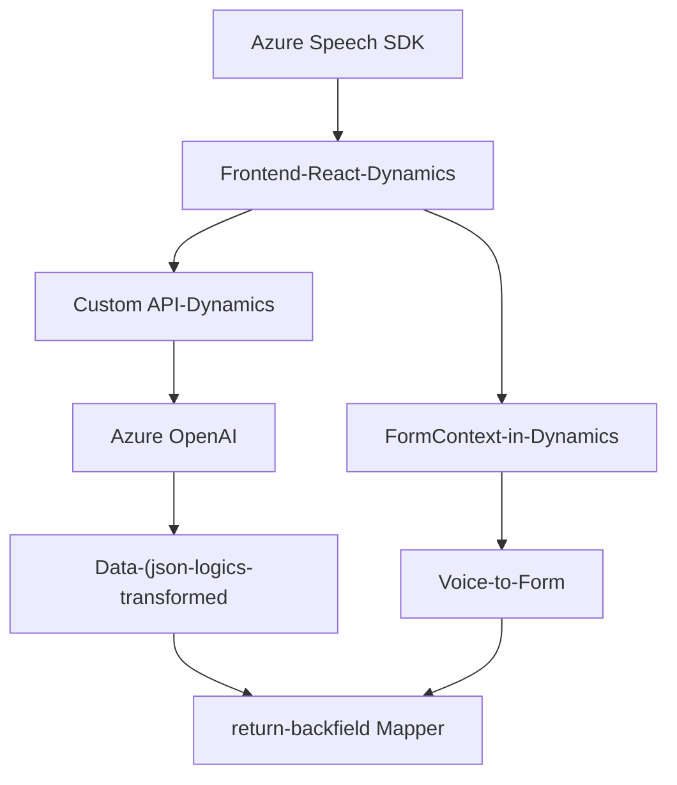

### Breve resumen técnico

El repositorio presenta una solución que incluye funcionalidades para un sistema CRM (Customer Relationship Management), implementando interacción entre formularios frontend basados en Dynamics CRM, reconocimiento de voz mediante el Azure Speech SDK, y procesamiento avanzado de texto usando Azure OpenAI. Las piezas independientes se integran para optimizar la entrada y salida de datos en un contexto empresarial, con un fuerte enfoque en inteligencia artificial y automatización.

### Descripción de arquitectura

La solución está organizada bajo un modelo híbrido, donde:

1. **Plugins y API externas**: Estos actúan como componentes modulares que extienden la funcionalidad del CRM usando patrones **hexagonales** y de microservicios. El plugin (.cs) sirve como un adaptador que interactúa con el servicio Azure OpenAI.
2. **Frontend en JavaScript**: Se basa en un modelo de **web cliente directa**, diseñado para gestionar eventos del usuario en Dynamics CRM. Las interacciones con el SDK de Azure y APIs de Dynamics forman parte de un enfoque desacoplado.

Aunque la solución no aplica estrictamente microservicios, se puede percibir un acercamiento hacia un diseño basado en servicios y adaptación modular.

### Tecnologías usadas

1. **Frontend**
   - JavaScript (Vanilla) para funcionalidad en los formularios de Dynamics CRM.
   - Azure Speech SDK para sintetizar y transcribir voz en tiempo real.
   - Dynamics CRM APIs (`Xrm.WebApi`) para manipulación del modelo de datos en el CRM.

2. **Backend Plugin**
   - Lenguaje y Framework: C# (.NET Framework o .NET Core).
   - Microsoft Dynamics SDK: Para extender la funcionalidad del CRM mediante plugins.
   - Azure OpenAI API → Procesamiento y transformación de texto basada en IA.
   - HTTP API para conectar con OpenAI.
   - Frameworks adicionales: **Newtonsoft.Json** y **System.Text.Json** para manejar el JSON estructurado.

### Dependencias o componentes externos

1. **Azure Speech SDK**: Para reconocimiento y síntesis de voz.
2. **Azure OpenAI API**: Para procesamiento avanzado de texto.
3. **Dynamics CRM SDK**: Manejo y manipulación de datos dentro de la estructura del CRM.
4. **JavaScript DOM y Event Handling**: Para interacción con formularios y usuarios en el frontend.
5. **Net libraries**:
   - `System.Net.Http`: Comunicación con API externas.
   - `Newtonsoft.Json`: Manejo dinámico de JSON estructurado.

### Diagrama Mermaid

En Conclusión final'=>"Ecosistema .**)