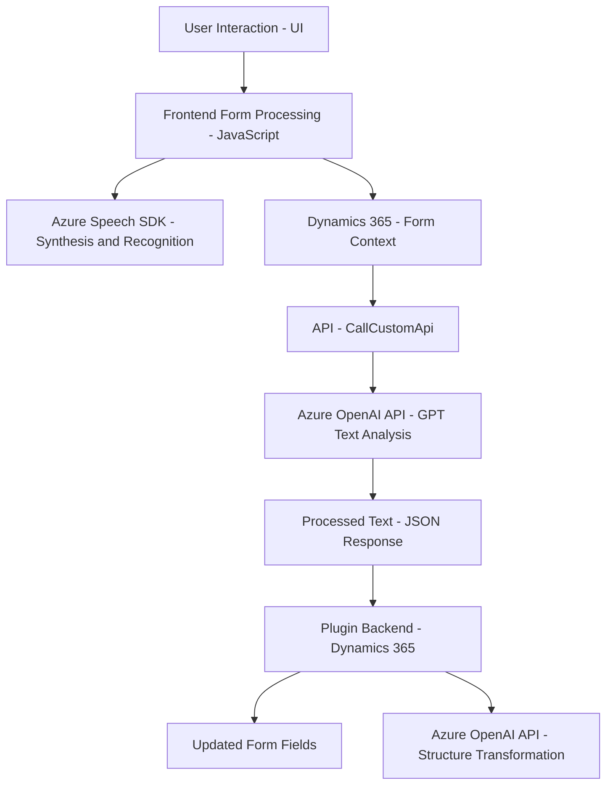

### Resumen Técnico
El repositorio tiene tres bloques funcionales distintos:
1. **Frontend (JS)**: Implementa funcionalidades específicas para la interacción con Dynamics 365 y Azure Speech SDK utilizando JavaScript. Se enfoca en síntesis y reconocimiento de voz.
2. **Backend (C# Plugin)**: Define un plugin para Dynamics CRM que integra Azure OpenAI para transformar texto y devolver estructuras JSON como respuesta.

### Descripción de la Arquitectura
La solución sigue una arquitectura **n-capas**:
- **Frontend/UI**: Maneja la interacción de usuario. Implementa el procesamiento de formularios y la interacción con APIs externas (Speech SDK) y los sistemas internos de Dynamics 365.
- **Dynamic Plugins/Backend**: La lógica empresarial está parcialmente implementada como un plugin que aprovecha los servicios externos de Azure OpenAI para realizar transformaciones avanzadas sobre datos.

Las capas están acopladas mediante una **API personalizada** que permite que el frontend ejecute operaciones como procesamiento de transcripciones mediante el backend de Dynamics.

### Tecnologías Usadas
1. **JavaScript (Frontend)**:
   - Frameworks: Sin dependencia de frameworks explícitos; lógica escrita de manera modular utilizando funciones.
   - Bibliotecas: Azure Speech SDK para reconocimiento y síntesis de voz.
   - APIs externas: Uso de una API personalizada sobre Dynamics 365.
   - Patrones: Encapsulación de lógica funcional, modularización relacionada con el contexto del formulario (MVP-like), y enfoque event-driven.

2. **C# (Backend Plugin)**:
   - Framework: Microsoft Dynamics CRM SDK.
   - Bibliotecas:
     - Microsoft.Xrm.Sdk para acceso/actualización del contexto CRM.
     - Newtonsoft.Json.Linq para manipulación JSON.
     - System.Net.Http para integraciones API externas.
   - APIs externas: Azure OpenAI API (GPT-4).
   - Patrones: Plugin Design Pattern y External API Integration.

### Dependencias o Componentes Externos
- **Azure Speech SDK**: Facilitación de síntesis y reconocimiento de voz (SDK cargado dinámicamente desde CDN).
- **Azure OpenAI**: Uso de modelos GPT para estructuración avanzada de texto.
- **Dynamics 365 WebApi**: Actualización y consulta de formularios y registros dinámicos en el CRM.
- API personalizada en Dynamics 365 conectada para análisis y procesamiento de datos de formularios.

### Diagrama Mermaid válido para GitHub

### Conclusión Final
La solución adoptada utiliza una **n-capas** para integrar frontend, plugins, y servicios externos en una plataforma dinámica como Dynamics CRM. Utilizando tecnologías modernas como Azure Speech SDK y Azure OpenAI, el sistema ofrece funcionalidad avanzada de reconocimiento y síntesis de voz, además de procesamiento de datos estructurado. 

Este diseño es ideal para escenarios de negocio que dependen de extensiones personalizadas sobre Dynamics, servicios accesibles desde el frontend y una integración fluida de inteligencia artificial. Sin embargo, la modularidad podría mejorarse con una integración más robusta de patrones como **Clean Architecture**, especialmente para separar aún más preocupaciones dentro del backend y el frontend.