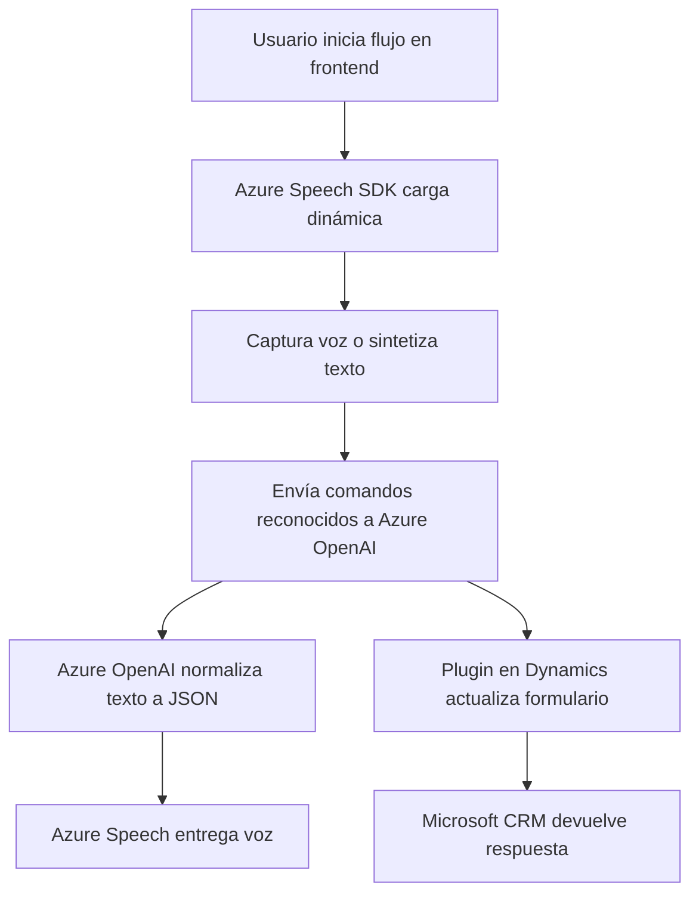

### Breve Resumen Técnico
Este repositorio integra funcionalidades relacionadas con el procesamiento de voz, formularios dinámicos y transformación de textos mediante APIs de inteligencia artificial como Azure Speech y Azure OpenAI. Los scripts presentados muestran una solución orientada al cliente (frontend) y una extensión basada en plugins para Microsoft Dynamics CRM que interactúan con servicios externos de Microsoft Azure.

---

### Descripción de Arquitectura
La solución está basada en una **arquitectura de cliente-servidor** bajo enfoques modulares. La lógica implementada en los archivos del frontend sigue principios de separación de responsabilidades y modularización funcional, mientras que el plugin de Dynamics CRM se inserta en un flujo orientado a eventos, procesando texto mediante API externas y retornando un output estructurado (JSON) al contexto del sistema.

Arquitecturalmente:
1. **Frontend:** Es un sistema de integración modular con tecnologías como HTML/JS, que se conecta dinámicamente a servicios externos. Gracias a la modularidad de los archivos, puede encajar en una arquitectura como **microfrontends**.
2. **Backend/plugin:** Usa un diseño **monolítico orientado a eventos** siguiendo estándares de Dynamics CRM, con integración de servicios remotos (API de Azure OpenAI) que podría evolucionar hacia una capa de servicios más distribuida, como **microservicios**, para independizar la lógica de procesamiento.

---

### Tecnologías Usadas
1. **Frontend:**
   - **Frameworks y SDK:** Azure Speech SDK, probablemente JSON API para comunicación.
   - **JavaScript:** Para manejar eventos, flujos asincrónicos (callbacks) y procesos en el navegador (voz, manipulación de formularios).
   - **Client-side integration:** Manejo de servicios externos mediante SDK.

2. **Backend (Plugin):**
   - **Microsoft Dynamics CRM:** Extensión basada en plugins (IPlugin).
   - **Azure OpenAI API:** Integración mediante solicitudes HTTP POST.
   - **C#:** Implementación estándar de plugins utilizando patrones funcionales.
   - **JSON Processing:** Frameworks como `System.Text.Json` y `Newtonsoft.Json`.

---

### Dependencias y Componentes Externos
1. **Externos:**
   - **Azure Speech SDK (Frontend):** Herramienta clave para reconocer y sintetizar voz.
   - **Azure OpenAI API (Backend):** Procesa texto y retorna JSON estructurado basado en IA.
   - **Microsoft Dynamics Web API (Frontend):** Posiblemente incluida para realizar operaciones sobre formularios.

2. **Internos:**
   - Métodos auxiliares para procesar formularios y manejar eventos en el frontend.
   - Contextos de plugins de Dynamics CRM (`IPluginExecutionContext`, etc.).
   - Mapeos dinámicos de atributos internos de formularios.

---

### Diagrama Mermaid Compatible con GitHub Markdown

---

### Conclusión Final
El diseño del repositorio muestra una solución que conecta módulos frontend con servicios en la nube (Azure Speech y OpenAI) y plugins backend. Si bien la implementación es separada y modular, el sistema tiende a un modelo híbrido entre monolito y microservicios. Con mejoras en la independencia del plugin y separación de funciones críticas, podría evolucionar hacia una arquitectura basada en microservicios, especialmente si sus piezas se expanden hacia entornos distribuidos. Esto es clave para manejar escalabilidad y robustez en sistemas complejos.