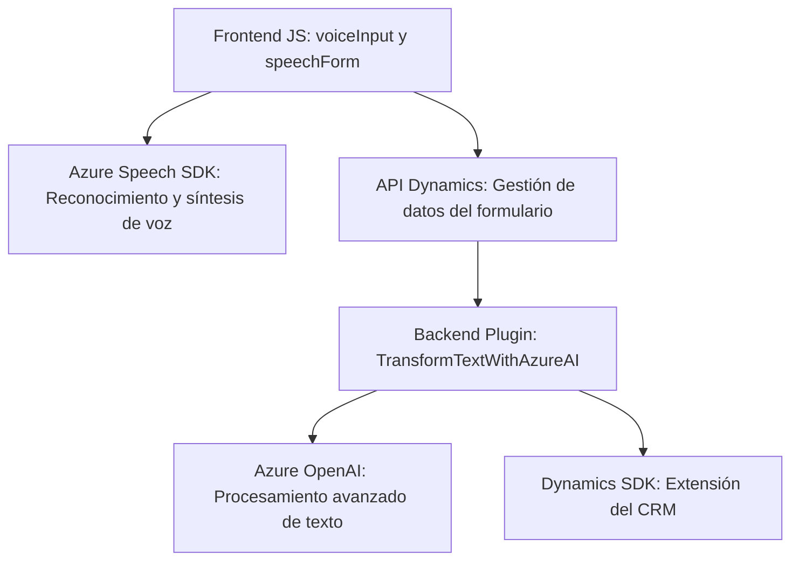

### Breve resumen técnico:
El repositorio presenta una solución orientada al cliente con tres componentes principales: un frontend basado en JavaScript, un backend en forma de un plugin para Microsoft Dynamics CRM, y la integración con servicios externos como Azure Speech Services y Azure OpenAI. La funcionalidad central incluye captura y síntesis de voz, así como procesamiento de texto mediante IA.

---

### Descripción de arquitectura:
La solución tiene una arquitectura cliente-servidor híbrida con integración directa a servicios externos. Se divide en componentes:
- **Frontend**: JavaScript que interactúa con servicios de voz (Azure Speech SDK) y usuarios (formularios dinámicos).
- **Backend**: Plugin para Dynamics CRM que integra Azure OpenAI para procesamiento avanzado de texto.
- **Servicios Externos**: Conexiones a Azure Speech Services y OpenAI.

La estructura sugiere un modelo de arquitectura **n-capas**:
1. **Capa de presentación**: Administrada por los scripts del frontend que reciben datos y envían síntesis de voz.
2. **Capa de negocio en backend**: Implementada en el plugin que centraliza la lógica y realiza transformaciones.
3. **Servicios externos**: Como APIs de Dynamics y Azure.

---

### Tecnologías usadas:
1. **Frontend**:
   - Lenguaje: JavaScript.
   - Tecnologías:
     - Azure Speech SDK: Para síntesis y reconocimiento de voz.
     - API de Dynamics CRM: Para datos del formulario.
2. **Backend**:
   - Lenguaje: C#.
   - Tecnologías:
     - Dynamics SDK: Framework de extensiones.
     - Azure OpenAI: Procesamiento de lenguaje natural.
     - `Newtonsoft.Json` para manejo de JSON.
3. **Servicios externos**:
   - Azure Speech Services y OpenAI para enriquecimiento de datos.

---

### Diagrama Mermaid:

---

### Conclusión final:
La solución es una implementación híbrida basada en la interacción entre frontend, backend y servicios externos. Se centra en la accesibilidad y la automatización de procesos mediante voz e IA. La arquitectura modular y basada en servicios externos es adecuada para escenarios dinámicos y de integración rápida en entornos empresariales como Dynamics CRM, pero depende fuertemente de Azure como plataforma nodo para inteligencia artificial y servicios de voz. Esto puede generar dependencias críticas que deben gestionarse adecuadamente.