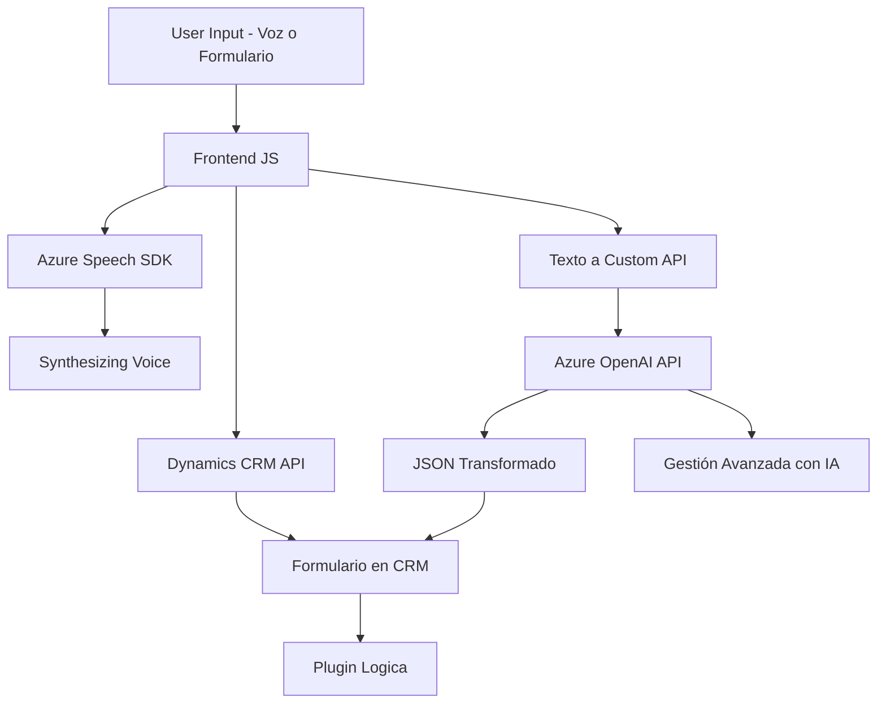

### Breve resumen técnico:

El repositorio implementa funcionalidades que integran diversas tecnologías para recoger datos de formularios (via voz o texto), transformarlos y generar contenido con accesibilidad (texto a voz y transcripciones). Todo esto está diseñado para ser compatible con Dynamics CRM, aprovechando servicios avanzados como Azure Speech SDK y Azure OpenAI. Los archivos están orientados hacia una solución que parece ser parte de una interfaz y un sistema conectado con CRM.

### Descripción de arquitectura:

La arquitectura general combina elementos de **MVC/MVVM** para gestionar datos entre la vista (formularios dinámicos en el cliente) y el controlador (interacción a través del código JavaScript y Dynamics CRM), con una **arquitectura por capas** implementada en el Plugin. También utiliza **microservicios externos** para extender las capacidades con Azure Speech y Azure OpenAI API. Los módulos están aislados pero altamente integrados.

---

### Tecnologías utilizadas:

#### Frontend:
- **Javascript ES6+:** Para lógica del cliente, interacción con el DOM y gestión de eventos.
- **Azure Speech SDK:**
  - Función: Capturar entrada de voz, transcribir texto y sintetizar voz.
  - Carga dinámica del SDK desde la nube.
- **Dynamics CRM Web API:** Para integrarse con formularios y servicios del CRM.
- **HTML y DOM Manipulation:** Formularios de interacción y campos visibles actualizables.

#### Backend (Plugin en C#):
- **Microsoft Dynamics SDK:** Para definir plugins con lógica personalizada.
- **C#:** Lógica compacta para gestionar transformación de texto.
- **Azure OpenAI API:**
  - Conexión a Azure para procesar texto con IA y devolver salida JSON estructurada.
- **Newtonsoft.Json y System.Net.Http:** Manipulación y conexión para trabajar con JSON y realizar peticiones a servicios web.

---

### Diagrama Mermaid válido para GitHub Markdown:

---

### Conclusión final:

El análisis revela que este repositorio forma parte de una **solución CRM integrada con capacidades de IA y accesibilidad**. Está diseñado para mejorar la interacción con formularios mediante voz y texto, apoyado en servicios modernos como **Azure Speech SDK** y **Azure OpenAI API**. La arquitectura es modular, permitiendo integrar APIs externas mediante microservicios, mientras que el backend tiene una estructura de capas clásicas que se adapta al ambiente de Dynamics CRM.

A pesar del diseño bien definido, algunas áreas podrían mejorarse:
1. **Desacoplar lógica dependiendo estrictamente de SDKs en el frontend.** Esto podría facilitar pruebas y escalabilidad.
2. **Estética en el manejo del plugin:** Introducción de validaciones más robustas y encapsulación del servicio externo.
3. Uso de patrones como **Service Wrappers** para estandarizar las llamadas a APIs externas.

Esta implementación apunta a ampliar la funcionalidad del CRM con accesibilidad mejorada y capacidades modernas de inteligencia artificial.