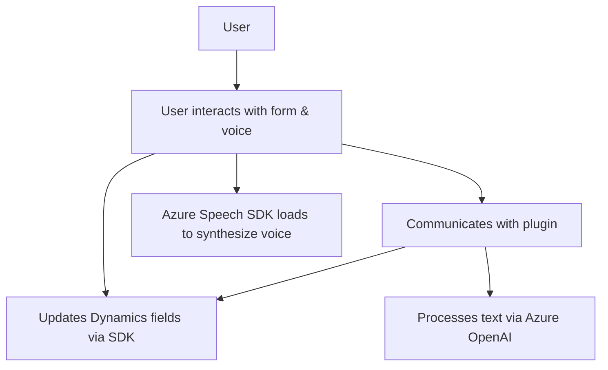

### Análisis técnico

#### Breve resumen técnico
El repositorio contiene un conjunto de archivos que implementan funcionalidades relacionadas con integración de voz, procesamiento de texto y extensiones para formularios en Dynamics 365 utilizando servicios externos como **Azure Speech SDK** y **Azure OpenAI**. Los archivos combinan una solución frontend modular (JavaScript) y componentes backend (C# plugins). La arquitectura general está orientada a integrar servicios externos en un contexto de Dynamics, asistiendo al usuario en la interacción y automatización de datos con voz e inteligencia artificial.

---

#### Descripción de arquitectura
La solución sigue una arquitectura de **n capas**, donde:
- **Frontend (JavaScript)** realiza la interacción directa con el usuario, desde capturar/leer voz hasta aplicar transformaciones en formularios mediante servicios como **Azure Speech SDK**.
- **Backend (C# plugins)** gestiona la integración con Dynamics 365 y utiliza **Azure OpenAI** para procesar texto y devolver respuestas personalizadas.
- **Servicios externos**: Dependencias a **Azure Speech SDK** y **Dynamics Web API** en el frontend, y **Azure OpenAI** en el plugin backend completan una arquitectura orientada a la integración de servicios externos.

#### Tecnologías usadas
1. **Frontend (JavaScript)**:
   - **Azure Speech SDK**: Para síntesis y reconocimiento de voz.
   - **REST API**: Comunicación con APIs externas desde Dynamics y Azure Speech.
   - Modularidad: Las funciones se dividen por funcionalidades específicas con parámetros y retornos consistentes.

2. **Backend (C# Plugins)**:
   - **Dynamics CRM SDK**: Estructura basada en la interfaz `IPlugin` para extender funciones nativas.
   - **Azure OpenAI API**: Comunicación mediante un cliente REST (HttpClient) para realizar transformaciones de texto.
   - **JSON Parsing**: Uso de `System.Text.Json` y `Newtonsoft.Json` para interactuar con estructuras JSON.

3. **Patrones arquitectónicos destacados**:
   - Modularidad.
   - Asynchronous Handling mediante Promises y callbacks.
   - Patrón orientado a eventos en Dynamics por medio del plugin.
   - **Separación de responsabilidades** por funciones bien definidas.

#### Dependencias/Componentes externos
1. **Frontend**:
   - Carga dinámica del script de Azure Speech SDK (`https://aka.ms/csspeech/jsbrowserpackageraw`).
   - **Azure Speech**: Proporciona servicios de síntesis y reconocimiento de voz.

2. **Backend**:
   - **Azure OpenAI API**: Relaciones dinámicas con modelos GPT-4 específicos.
   - **Dynamics CRM SDK**: Comunicación con el sistema CRM de Microsoft.

---

#### Diagrama Mermaid

---

#### Conclusión final
Este repositorio implementa una solución **n capas**, donde cada componente se encuentra especialmente optimizado para su función. El frontend maneja la interacción con voz y formularios, apoyándose en **Azure Speech SDK**. El backend procesa texto con la ayuda de **Azure OpenAI**, enviando resultados estructurados hacia Dynamics 365 mediante sus APIs.

El diseño exhibe modularidad, reutilización de código y patrones orientados a eventos y servicios externos. Los puntos de mejora incluyen la seguridad de las claves de API (almacenar en entornos seguros) y proporcionar configuraciones adicionales para prevenir acoplamiento directo entre las dependencias externas y los componentes del repositorio.