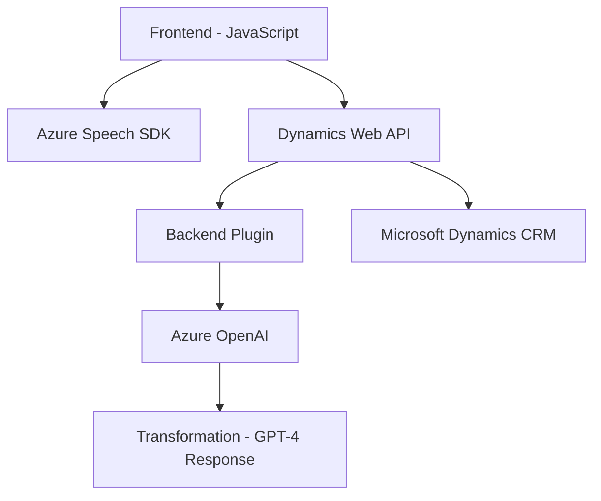

### Breve resumen técnico:
El repositorio alberga diversas funcionalidades integradas con **Microsoft Dynamics 365** (CRM) que mejoran la interacción mediante voz, inteligencia artificial y manipulación avanzada de formularios. Usa APIs externas como **Azure Speech SDK** y **Azure OpenAI** para reconocimiento y transformación de texto, y plugins para la lógica de negocio en el CRM.

---

### Descripción de arquitectura:
1. **Modelo predominante**: **Arquitectura de capas n**.
   - El diseño está basado en distintas capas:
     - **Frontend**: Manejo de voz, datos de formularios y eventos del usuario.
     - **Backend/plataforma**: Plugins en **Dynamics CRM** y APIs externas (Azure).
   - Existe acoplamiento entre el front y el backend mediante Dynamics Web API y HTTP requests.
   - Los plugins presentan una adaptación del **Plugin Architecture** para la extensibilidad del CRM.
   - Los servicios externos de texto y voz están desacoplados mediante HTTP APIs y un patrón de integración.

2. **Patrones utilizados**:
   - **Modularidad**: Los scripts son altamente modulares, con funciones categorizadas claramente según el propósito.
   - **Facade Pattern**: Para encapsular la complejidad de las interacciones con Azure, logrando una interfaz simple de uso.
   - **Event-Driven Architecture**: Usa eventos tanto en el frontend para iniciar flujos (mediante la voz/formulario), como en el plugin para ejecutar la transformación de texto.
   - **Service Integration**: Uso de servicios externos (Azure Speech SDK, Azure OpenAI).

3. **Integración**:
   - Principalmente se integra con **Dynamics Web API** para la manipulación de formularios y ejecución de operaciones en la plataforma CRM. 
   - Uso de **Azure Speech SDK** para habilitar el reconocimiento y síntesis de voz.
   - **Azure OpenAI GPT-4** es llamado mediante HTTP API desde el plugin para transformar texto con reglas específicas.

---

### Tecnologías usadas:
1. **Frontend**:
   - **JavaScript**: Lógica del cliente para recogida de datos, procesamiento y síntesis de voz/salida en un entorno de formularios interactivos.
   - **Azure Speech SDK**: Para reconocimiento de voz, síntesis de audio y procesamiento multimodal en tiempo real.
   - **HTML y Microsoft Dynamics Control API**: Para manipulación de formularios interactivos.
   
2. **Backend/Plugins**:
   - **C# (.NET Framework)**: Desarrollo de plugins en Dynamics CRM.
   - **Microsoft.Xrm.Sdk**: Interfaz estándar para integrarse con el sistema CRM.
   - **Azure OpenAI GPT-4**: Integración externa para procesamiento de texto.

3. **Otros**:
   - **Newtonsoft.Json y System.Text.Json**: Gestión y manipulación de objetos JSON para API externas.
   - **System.Net.Http**: Interfaz HTTP para comunicarse con APIs externas (Azure OpenAI).

---

### Diagrama Mermaid válido para GitHub Markdown:

---

### Conclusión final:
El repositorio combina soluciones frontend y backend integradas dentro de una **arquitectura n capas**. La funcionalidad está altamente orientada a la interacción con formularios dinámicos en **Microsoft Dynamics CRM**, mejorando la experiencia de usuarios a través de servicios de voz y procesamiento avanzado de lenguaje por IA. La integración con servicios externos (Azure Speech SDK y OpenAI) asegura extensibilidad, mientras que los patrones aplicados (modularidad y event-driven) promueven cohesión y adaptabilidad a diferentes entornos.

La solución es adecuada para manejar entornos empresariales complejos que necesitan combinar datos de CRM con tecnologías inteligentes de voz y lenguaje natural.