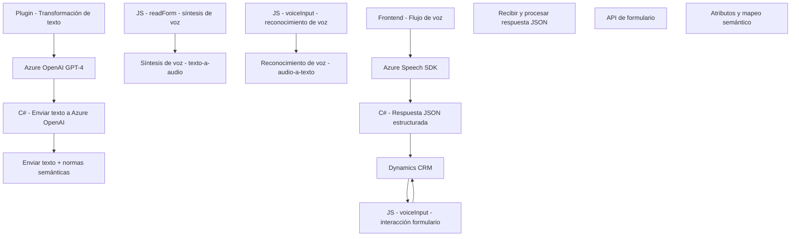

# Análisis y evaluación técnica del repositorio

## Breve resumen técnico:
Este repositorio tiene componentes escritos en **JavaScript (readForm.js y voiceInput.js)** y **C# (TransformTextWithAzureAI.cs)**. Los archivos tienen una funcionalidad centrada en la integración de servicios de procesamiento de voz y texto basado en inteligencia artificial. Es una solución orientada a *Dynamics CRM*, utilizando **Azure’s Speech SDK** para interacción por voz y **Azure OpenAI GPT-4** para transformación avanzada de texto. Estos elementos apuntan a una integración de inteligencia artificial como una capa adicional en el manejo y procesamiento de formularios CRM.

---

## Descripción de arquitectura:
La solución sigue una arquitectura modular. Cada archivo aborda una funcionalidad específica:
1. **readForm.js:** Generación de audio (síntesis de voz) para representación verbal de datos en un formulario.
2. **voiceInput.js:** Reconocimiento de entrada de voz mediante el SDK de Azure Speech, con mapeo semántico para manipular formularios CRM en tiempo real.
3. **TransformTextWithAzureAI.cs:** Plugin encargado de procesar texto utilizando **Azure OpenAI GPT-4** y aplicar salida JSON a los objetos CRM.

Aunque al menos uno de los componentes (plugin C#) forma parte de un sistema de eventos de Dynamics CRM, los archivos presentan una dependencia de acciones basadas en formularios y servicios de voz para interacción con usuarios, lo que sugiere una arquitectura de integración en **Dynamics 365**, bajo un modelo ampliamente modular.

### Arquitectura:
- **Estilo:** Modular, orientada principalmente a servicios distribuibles y reutilizables en sistemas CRM.
- **Patrones:**
  - Modularidad con funciones encapsuladas.
  - **Separación de responsabilidades:** Cada archivo maneja una función específica del manejo de voz o texto.
  - **Integración de SDKs externos:** Uso de Azure Speech SDK para procesamiento de voz y Azure OpenAI para transformación semántica de texto.
  - **Plugin pattern:** Implementación mediante `IPlugin` para comunicación directa con Dynamics CRM.
  - **Evento inicializador:** Uso de una capa de inicialización para cargar SDKs.
  - **Arquitectura orientada a eventos:** Ejecución del plugin en respuesta a eventos del workflow de Dynamics CRM.

---

## Tecnologías usadas:
1. **Lenguajes de programación:**
   - **JavaScript:** Para la interacción cliente (interfaz web).
   - **C#:** Para la implementación de plugins y lógica de negocio del backend.
2. **Frameworks y SDKs:**
   - **Azure Speech SDK:** Para la síntesis y reconocimiento de voz.
   - **Azure OpenAI GPT-4:** Integración de inteligencia artificial que estructura y contextualiza texto para Dynamics CRM.
   - **Dynamics CRM SDK:** Modelo de datos de CRM y plataforma extensible mediante plugins (i.e., `Microsoft.Xrm.Sdk`).
3. **Otras dependencias:**
   - `Newtonsoft.Json` y `System.Text.Json` para manejo de JSON.
   - `System.Net.Http` para comunicaciones HTTP/REST.
   - `Xrm.WebApi` para manejo de datos dentro de Dynamics 365.
   
---

## Dependencias y componentes externos:
1. **Azure Speech SDK:** Usado para interacción de síntesis y reconocimiento de voz en **readForm.js** y **voiceInput.js**.
2. **Azure OpenAI GPT-4:** Servicio de transformación de texto en el plugin C# para integración con funciones semánticas y de inteligencia artificial.
3. **Xrm.WebApi:** Framework propiedad de Microsoft para interactuar directamente con datos de Dynamics CRM.
4. **HTTP Client:** Interacción con servicios REST como `Azure OpenAI API`.
5. **Browser Environment:** Los scripts frontend (JavaScript) dependen del contexto del navegador web para cargar dinámicamente SDKs y trabajar con formularios de usuario.

---

## Diagrama **Mermaid**:

---

## Conclusión final:
Este repositorio demuestra ser una solución modular bien diseñada para integración de voz y procesamiento semántico de texto en el contexto de Dynamics 365 CRM. Las tecnologías seleccionadas están bien alineadas para cumplir los objetivos funcionales: Azure Speech SDK para interacción de voz y Azure OpenAI GPT-4 para aplicar inteligencia artificial. La arquitectura modular refuerza la adaptabilidad y separación de responsabilidades, lo que facilita la escalabilidad y mantenimiento. Aunque se trata de un sistema integrado principalmente a Dynamics CRM, la reutilización del plugin en otros sistemas basados en eventos también sería posible.