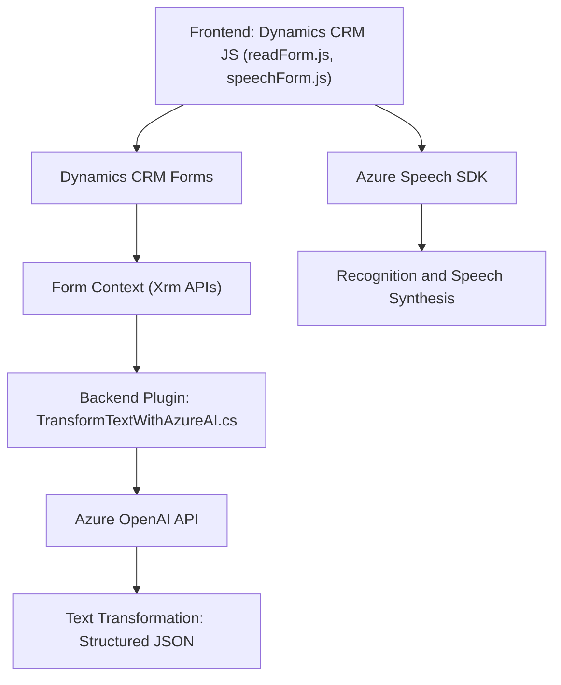

### Breve resumen técnico

El repositorio contiene tres archivos representativos de una solución que incluye frontend en JavaScript ejecutándose sobre Dynamics CRM, y un plugin en C# que conecta con la API de Azure OpenAI. La funcionalidad se centra en la integración de reconocimiento y síntesis de voz (Azure Speech SDK) y en la transformación avanzada de texto con inteligencia artificial (Azure OpenAI). Este diseño combina procesamiento en el cliente y lógica del servidor para modificar dinámicamente formularios en Dynamics CRM, basándose en comandos de voz y servicios inteligentes.

---

### Descripción de arquitectura

La solución sigue una arquitectura **híbrida de capas interactuando en un modelo cliente-servidor**. En el frontend, las funciones de JavaScript manejan la interactividad del usuario, integrándose con Dynamics CRM y Azure Speech SDK. El backend, en C#, utiliza un plugin estándar de Dynamics CRM para conectar con Azure OpenAI y transformar estructuras de texto mediante lógica de IA.

Aunque no utiliza patrones avanzados como arquitectura hexagonal o microservicios, sí está separada en capas funcionales: 
1. **Frontend dinámico** para voz y formularios.
2. **Backend como plugin** para procesamiento avanzado con OpenAI.

---

### Tecnologías usadas

1. **Frontend** 
   - **JavaScript**:
     - Modular design: funciones específicas para responsabilidad única.
     - Promises para programación asíncrona.
   - **Azure Speech SDK**: Servicios de transformación de texto a voz y reconocimiento de comandos de voz.
   - Integración dinámica con **Dynamics CRM**, aprovechando `Xrm` para interactuar con formularios.

2. **Backend**
   - **C# con Microsoft Dynamics CRM SDK**:
     - Interfaz `IPlugin` para lógica empresarial personalizada.
   - Consumo de APIs HTTP externas:
     - **Newtonsoft.Json.Linq** para manipulación de JSON.
     - **Azure OpenAI API (GPT-4)** para transformación de texto.
   - Patrón **Plugin Execution** estándar para Dynamics.

---

### Dependencias o componentes externos

1. **Azure Speech SDK** (en frontend, vía cliente web).  
2. **Azure OpenAI API** (backend en el plugin).  
3. **Dynamics CRM Web SDK**: `Xrm.WebApi.online.execute` y manipulación de formularios CRM.
4. **Librerías C#**: `Newtonsoft.Json`, `HttpClient` para integración API.  

---

### Diagrama **Mermaid** válido para GitHub

---

### Conclusión final

Este repositorio implementa una solución híbrida para procesamiento avanzado de datos en un entorno cliente-servidor, interactuando principalmente con Dynamics CRM y los servicios de Azure (Speech y OpenAI). El diseño modular facilita el mantenimiento y la escalabilidad, mientras que la integración de SDKs dinámicos y procesamiento de IA permiten funcionalidades de última generación como la interacción por voz y transformación de texto. Sin embargo, si se requiere mayor extensibilidad en el futuro, podría beneficiarse de aplicar patrones de arquitectura como hexagonal o microservicios.