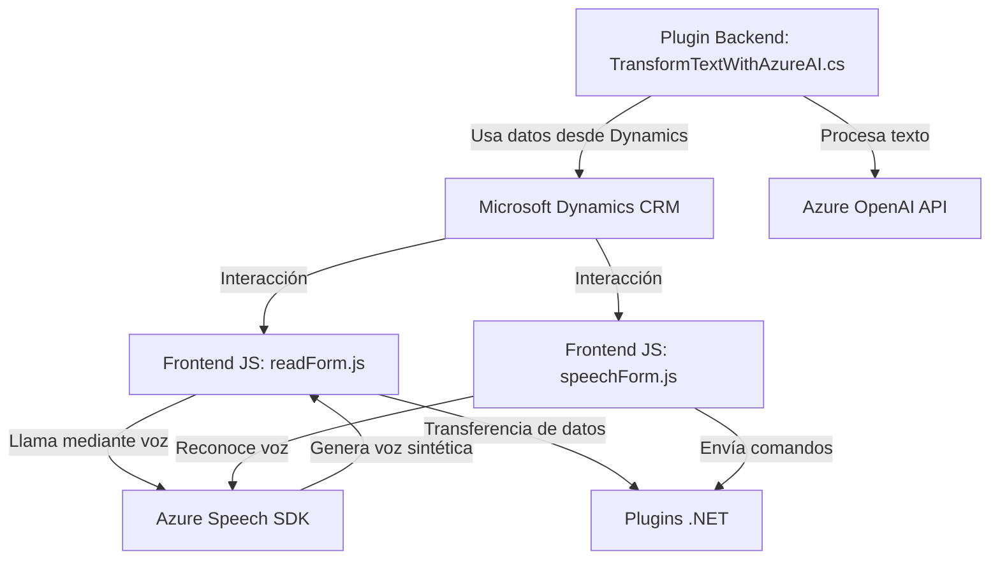

## Análisis Técnico

### Breve Resumen
El repositorio integra una solución para procesamiento de entrada y salida de datos de voz/texto utilizando Azure Speech SDK, Azure OpenAI API y Microsoft Dynamics CRM. Es una solución híbrida que mezcla componentes frontend y plugins backend con integración en Dynamics CRM, permitiendo un flujo interactivo entre datos del formulario y servicios de inteligencia artificial.

---

### Descripción de Arquitectura
La solución adopta una arquitectura distribuida dividida en al menos dos capas:
1. **Frontend:** Scripts JavaScript orientados al navegador (browser-based) que interactúan directamente con formularios de Dynamics CRM.
2. **Plugins Backend:** Código .NET registrado como extensiones dentro del contexto de Dynamics CRM, que realiza procesamiento en el servidor y gestiona las transformaciones de datos mediante Azure OpenAI.

El frontend sigue una estructura modular con funciones independientes y patrón de composición para dividir tareas y responsabilidades. Se integra directamente con el SDK de Dynamics y consume el Azure Speech SDK para manejar datos de voz. 

El backend utiliza un **plugin pattern** propio de Dynamics y delega el procesamiento de texto a un servicio externo soportado por Azure OpenAI.

### Tecnologías usadas
- **JavaScript:** Base de los scripts del frontend.
- **Azure Speech SDK:** Manejo de síntesis y reconocimiento de voz.
- **Azure OpenAI API (GPT-4):** Procesamiento avanzado de texto mediante inteligencia artificial.
- **C# (.NET Framework):** Desarrollo de plugins en Dynamics CRM.
- **Microsoft Dynamics SDK:** Manipula datos y formularios CRM.
- **JSON Libraries:** `System.Text.Json` y `Newtonsoft.Json` para serialización de datos y manejo de estructuras JSON.
- **HTTP Client Libraries:** Realización de POST requests hacia Azure OpenAI API.

### Patrones de diseño identificados
1. **Facade Pattern:** Se observa en la organización modular del frontend que simplifica la interacción front-to-service.
2. **Plugin Pattern:** En el backend, asegurando la cohesión en la implementación de extensiones dentro del contexto Dynamics.
3. **Modular Composition:** En las funciones del frontend, segmentando tareas en pequeñas unidades reutilizables.
4. **RPC y Client-Server:** Presente en las llamadas remotas a Azure APIs desde las capas frontend y backend.

---

### Dependencias y Componentes Externos
1. **Azure Speech SDK y OpenAI (GPT-4):** Servicios cloud para manejo de voz y procesamiento de texto.
2. **Microsoft Dynamics SDK (`Xrm.WebApi`):** Manipulación de datos CRM.
3. **Navegador:** Ambiente de ejecución del código frontend.
4. **HTTP Libraries:** En backend, para consumir APIs externas.

---

### Diagrama Mermaid válido para GitHub Markdown

---

### Conclusión Final
La solución combina funcionalidades avanzadas de síntesis y procesamiento de voz con integración seamless en formularios de Microsoft Dynamics CRM. Su arquitectura modular y distribuida permite manejar datos en tiempo real desde el navegador (frontend) y ejecutar lógica avanzada de AI en el backend mediante plugins bien estructurados. Este diseño es adecuado para sistemas orientados al cliente y puede escalar incorporando más funcionalidades por parte de Azure OpenAI y Speech.