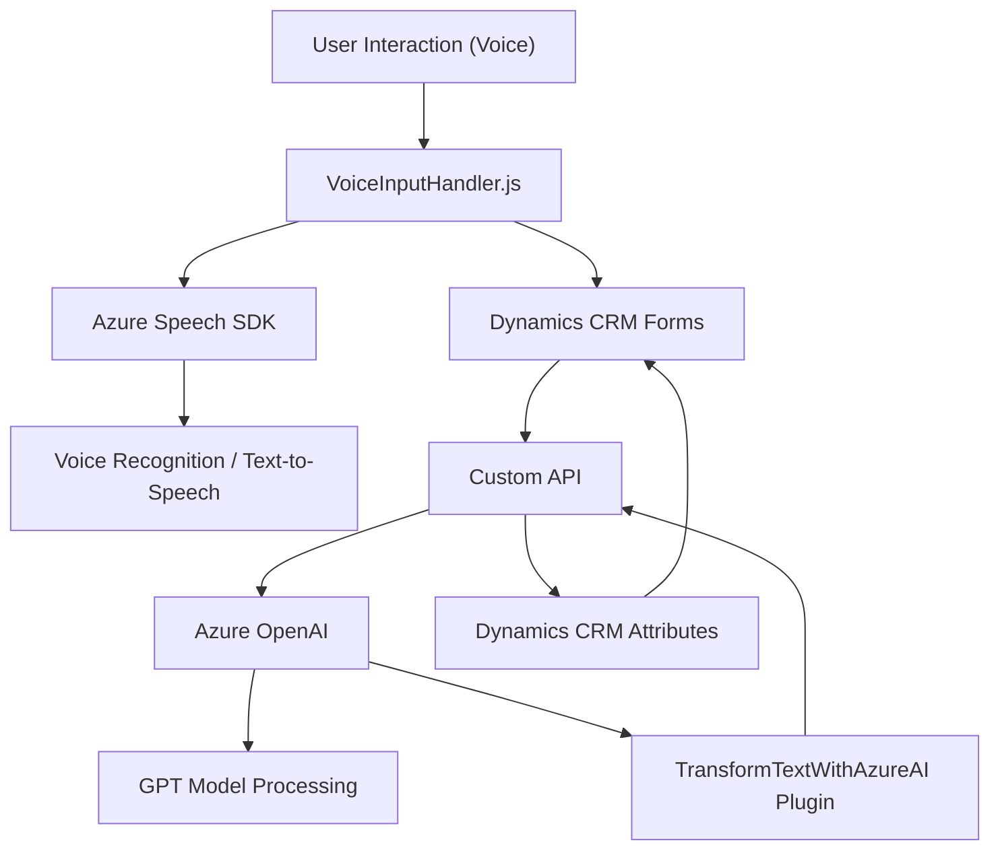

### Breve resumen técnico

El sistema descrito en el repositorio implementa dos funcionalidades principales: síntesis y reconocimiento de voz mediante el **Azure Speech SDK** y el procesamiento de texto con **Azure OpenAI** en integración con Microsoft Dynamics 365 CRM. Las implementaciones están distribuidas en tres componentes:

1. **Frontend JavaScript**: Proporciona integración con el navegador y captura de datos del formulario CRM.
2. **API personalizada (Plugins)**: Expone funcionalidades específicas para transformar texto mediante reglas definidas usando Azure OpenAI y Dynamics CRM.
3. **Dynamics CRM Plugins**: Extiende las funcionalidades del CRM para procesar texto y aplicar datos utilizando servicios externos.

---

### Descripción de arquitectura

**Tipo de solución**: Es un sistema modular orientado a integrar funcionalidades de IA (Azure Speech y Azure OpenAI) y reconocimiento de voz en una plataforma empresarial como Dynamics 365 CRM. 

**Tipo de arquitectura**:
- La base de la solución es una **arquitectura de n capas**:
  - **Frontend** (JavaScript), que sirve como capa de presentación y recibe entrada del usuario con soporte de voz.
  - **API extendida** (Plugins para Dynamics CRM), que es una capa intermedia entre la plataforma CRM y los servicios de IA en Azure.
  - **Backends externos** (Azure Speech SDK y OpenAI), que actúan como servicios y procesamiento especializados.
  
- Utiliza patrones de **Service-Oriented Architecture (SOA)**, delegando funcionalidades a servicios externos.

---

### Tecnologías usadas
1. **Frontend (JavaScript)**:
   - **Azure Speech SDK**: Para síntesis y captura de voz.
   - **Dynamics 365 CRM JavaScript SDK (`Xrm`)**: Para interacción con formularios CRM.

2. **Backend - Plugins (C#)**:
   - **Microsoft Dynamics CRM SDK**: Para integración nativa con Dynamics.
   - **Azure OpenAI API**: Para procesamiento avanzado de lenguaje.
   - **Newtonsoft JSON**: Para manejo de datos en formato JSON.
   - **HttpClient**: Para hacer solicitudes HTTP hacia servicios externos.

3. **Patrones utilizados**:
   - **Modularidad**: Cada archivo agrupa funciones o clases con responsabilidades específicas y enfocadas.
   - **Adapter Pattern**: El mapeo entre entrada de voz/transcripción y los campos del formulario.
   - **Ciclo de vida dinámico**: Asegura la carga de componentes (SDK y dependencias externas) antes de la ejecución.
   - **Service-Oriented Architecture (SOA)**: Uso de servicios externos como Azure APIs para extender la capacidad del sistema.
   - **Plugin Architecture**: Usada para integrar con Dynamics CRM.
   - **Asynchronous Programming**: Escalabilidad mediante llamadas asíncronas a APIs y SDKs externos.

---

### Dependencias o componentes externos
1. **Azure Speech SDK**: Interacción con el servicio de síntesis y reconocimiento de voz.
2. **Dynamics CRM API**: Uso de `Xrm.WebApi` para manipular datos de formularios y registros CRM.
3. **Custom API para procesamiento con IA**: Una API específica creada para interactuar con el backend y Azure OpenAI.
4. **Azure OpenAI Service**: Utilizado para transformar texto con modelos como GPT.
5. **HttpClient** y librerías relacionadas (`Newtonsoft.Json.Linq`, `System.Net.Http`): Creadoras de solicitudes HTTP y manejadoras de JSON.

---

### Diagrama Mermaid válido para GitHub

---

### Conclusión final

Este sistema está diseñado para optimizar la interacción humana con sistemas empresariales como Dynamics CRM, apoyándose en servicios de inteligencia artificial de Azure para habilitar reconocimiento de voz, síntesis de texto hablado y procesamiento avanzado de texto mediante modelos de OpenAI. La arquitectura modular, basada en plugins y patrones integradores, permite una mayor escalabilidad y adaptabilidad. Además, hace uso de servicios externos con un enfoque de **Service-Oriented Architecture**, lo que facilita una actualización independiente de los módulos internos.