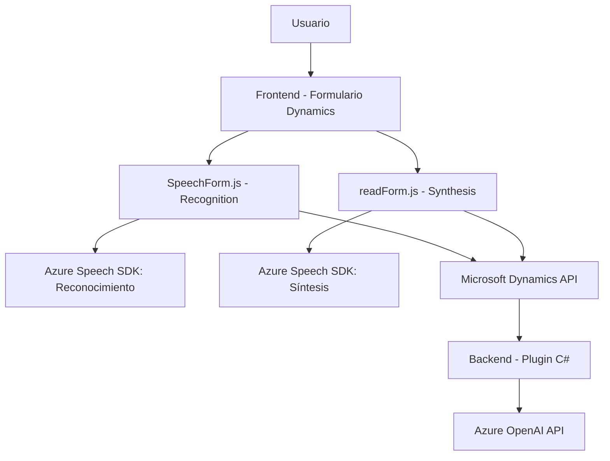

### Breve resumen técnico
El repositorio analizado contiene una solución híbrida que implementa funcionalidad tanto para la capa de frontend como para plugins backend en las plataformas Dynamics CRM y Azure. Su propósito principal es integrar reconocimiento de voz, síntesis de voz y procesamiento avanzado de texto empleando APIs y servicios de Microsoft Azure Speech y OpenAI.

---

### Descripción de arquitectura
La solución tiene una arquitectura **n-capas** con integración de servicios externos. Los archivos ubicados en la carpeta `FRONTEND/JS` forman parte de una capa de presentación dentro del entorno del navegador, mientras que los plugins (`TransformTextWithAzureAI.cs`) corresponden a la capa de negocio en el backend de Dynamics CRM. Aunque la solución no está completamente desacoplada como en una arquitectura hexagonal, integra componentes externos siguiendo patrones modulares, haciendo uso de capas bien definidas:
1. **Nivel de presentación**: Scripts en frontend manejan la interacción con el usuario.
2. **Nivel de dominio/lógica de negocio**: Plugins en CRM gestionan las reglas de transformación de texto.
3. **Nivel de datos y servicios**: APIs externas (Azure OpenAI y Speech SDK) para operaciones especializadas.

---

### Tecnologías usadas
#### Frontend:
1. **JavaScript**:
   - Manipulación dinámica de DOM y formularios.
   - Comunicación asincrónica mediante callbacks/promesas.
2. **Azure Speech SDK**:
   - Reconocimiento de voz y síntesis de voz.
   - Integración vía `speech.js` cargado dinámicamente por URL.
3. **Microsoft Dynamics CRM APIs**:
   - Manejo de formularios y campos (JavasScript API como `execute`, `retrieveMultipleRecords`).

#### Backend:
1. **C# (.NET Framework)**:
   - Desarrollo enfocado en el entorno de Dynamics CRM con plugins.
2. **Azure OpenAI**:
   - Procesamiento de texto avanzado mediante servicios IA externos.
3. **HTTP Client**:
   - Interacciones RESTful para consumir APIs externas.
4. **Newtonsoft.Json**:
   - Manipulación de datos JSON estructurados.

#### Otros patrones observados:
- **Facade Pattern**: Encapsulación simplificada de servicios externos.
- **Dynamic Integration**: Carga condicional de SDKs mediante scripts dinámicos.
- **Plugin Pattern**: Integración modular dentro de Dynamics CRM.

---

### Diagrama Mermaid válido para GitHub

---

### Conclusión final
La solución combina capacidades avanzadas de procesamiento de voz y texto con integración directa en formularios de Dynamics CRM mediante una arquitectura **n-capas** con servicios externos. Este enfoque modular proporciona una experiencia fluida para el usuario, pero podría beneficiarse de mayor desacoplamiento y seguridad (e.g., parametrización de claves API). La elección de tecnologías como Azure Speech SDK y OpenAI permite escalar funcionalidades de IA complejas, mientras el diseño facilita su interacción y mantenimiento en sistemas CRM empresariales.