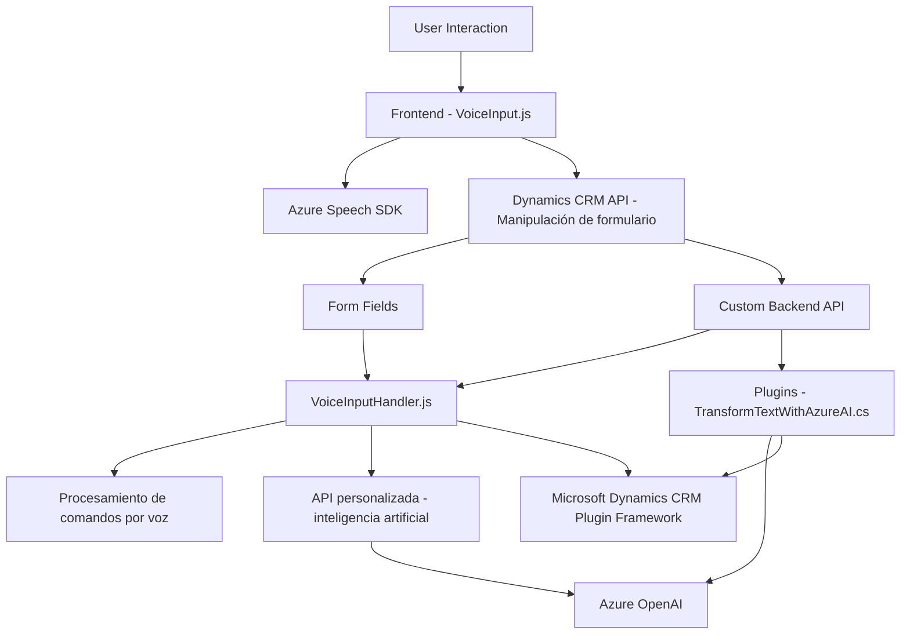

### Breve resumen técnico

El repositorio contiene archivos con funcionalidades centradas en:
1. **Frontend**: Uso de JavaScript para la lectura y transcripción de datos desde formularios con **Azure Speech SDK**.
2. **Backend/Plugins**: Uso de un Plugin escrito en C# para procesar datos textuales mediante **Azure OpenAI Service** en una instancia de **Microsoft Dynamics CRM**.

La solución en conjunto se encuentra interconectada y utiliza tecnologías de reconocimiento y síntesis de voz, procesamiento de API, y dinámicas de integración frontend-backend.

---

### Descripción de arquitectura

La arquitectura parece encajar en un modelo **n-capas** debido a la separación lógica entre:
1. **Frontend**: Interacción entre el usuario y los formularios, componiendo la capa de presentación.
2. **Backend**: Procesamiento de datos y ejecución de reglas empresariales mediante plugins, correspondiente a las capas de negocio y datos.

Además, hay un fuerte uso de integración con servicios externos, como SDKs y APIs, lo que aporta características de una arquitectura con enfoque modular.

---

### Tecnologías usadas

1. **Frontend**:
   - JavaScript.
   - **Azure Speech SDK** (uso de síntesis y reconocimiento de voz).
   - API de Dynamics CRM para manipulación de formularios.

2. **Backend**:
   - C#.
   - **Microsoft Dynamics CRM API**.
   - **Azure OpenAI Service** para procesamiento de texto avanzado.
   - Librerías como `System.Text.Json` y `Newtonsoft.Json` para manipulación de datos.

3. Patrones:
   - Modularidad del código.
   - Integración de servicios externos (SDK y API).
   - Event-driven (callbacks y promesas).
   - Separación lógica por capas (frontend/backend/plugins).

---

### Diagrama Mermaid válido para GitHub

---

### Conclusión final

El repositorio implementa una solución basada en una arquitectura **n-capas** con interacción intensa entre frontend y backend. Hay un enfoque fuerte en la integración de servicios externos, como **Azure Speech SDK** y **Azure OpenAI**, aplicando patrones de integración modular y separación funcional. Estas capas conectan los usuarios (voz y formularios) con servicios avanzados de inteligencia artificial y reconocimiento de voz, lo que asegura procesamientos eficientes y dinámicos en el contexto de **Microsoft Dynamics CRM**.