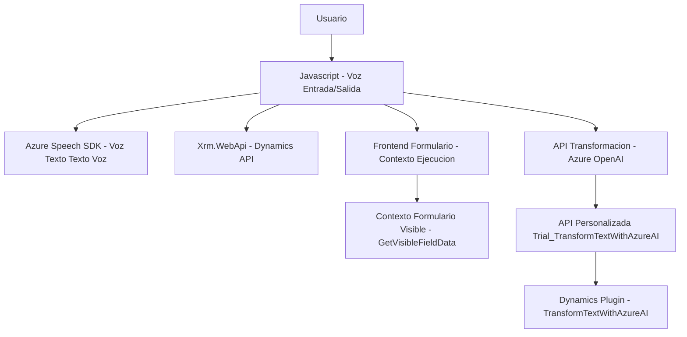

### Breve resumen técnico:
El repositorio presenta una solución orientada al desarrollo de funcionalidades relacionadas con la interacción avanzada entre formularios dinámicos, voz y una inteligencia artificial basada en Azure OpenAI. Incluye un frontend en JavaScript que maneja la lógica de entrada de voz, lectura de formularios en voz alta y procesamiento de voz a texto, complementada por un plugin en Microsoft Dynamics CRM para transformar texto según reglas específicas usando la API de Azure OpenAI.

---

### Descripción de arquitectura:
La solución refleja una arquitectura **Cliente-Servidor** con un diseño de **n capas**, donde las capas son:
1. **Frontend**: Logística para leer y procesar voz en aplicaciones web dinámicas, gestionando comunicación con APIs externas (Azure Speech SDK y APIs personalizadas).
2. **Backend/Plugins**: Business logic implementada directamente como un plugin en la capa de servidor (Dynamics CRM). Este plugin aloja la lógica de comunicación con Azure OpenAI y sirve como un punto para ejecutar transformaciones avanzadas en el texto recibido.

Desde el diseño, se observa un uso consciente de patrones como:
- **Modularidad**: Funciones separadas por área de responsabilidad (extracción de datos, síntesis y reconocimiento de habla, procesamiento de texto).
- **Callback pattern**: Sistema de eventos y funciones de callback para manejar la carga tardía de SDK.
- **Integration pattern**: Uso de APIs externas como parte del flujo de trabajo.
- **Plug-in pattern**: Integración específica dentro de eventos del CRM.

La arquitectura puede evolucionar hacia algo más robusto, como hexagonal, si las dependencias externas son encapsuladas y otros componentes son desacoplados.

---

### Tecnologías usadas:
1. **Frontend**:
   - **JavaScript/ES6+**: Base para implementar la lógica de voz y entrada en interacción con formularios dinámicos.
   - **Azure Speech SDK**: Para reconocimiento de voz y conversión texto a voz.
   - **Xrm.WebApi**: Manipulación de datos en Dynamics 365.

2. **Backend**:
   - **Microsoft Dynamics CRM SDK**: Framework principal para crear y gestionar plugins en Dynamics CRM.
   - **Azure OpenAI API**: Modelo inteligente para transformar texto según reglas específicas.

3. **Dependencias adicionales**:
   - **Newtonsoft.Json.Linq**: Manejo de JSON (especialmente para los datos transformados por IA).
   - **System.Net.Http**: Utilizada para enviar solicitudes a APIs externas.
   - **System.Text.Json**: Codificación y decodificación de JSON.

---

### Diagrama Mermaid:

---

### Conclusión final:
Esta solución se construye como un ecosistema híbrido entre cliente (frontend) y servidor (plugin de Dynamics), combinando servicios de Microsoft y Azure para ofrecer funcionalidades avanzadas. En el frontend, tecnologías como JavaScript, Azure Speech SDK, y Xrm.WebApi soportan la interacción dinámica entre voz y formularios. El backend implementa un plugin que delega la lógica de procesamiento más compleja a una API de Azure OpenAI. Aunque modular y extensible, podría mejorar su resiliencia y seguridad, especialmente en el manejo de las claves de API y en la estructura de manejo de errores.