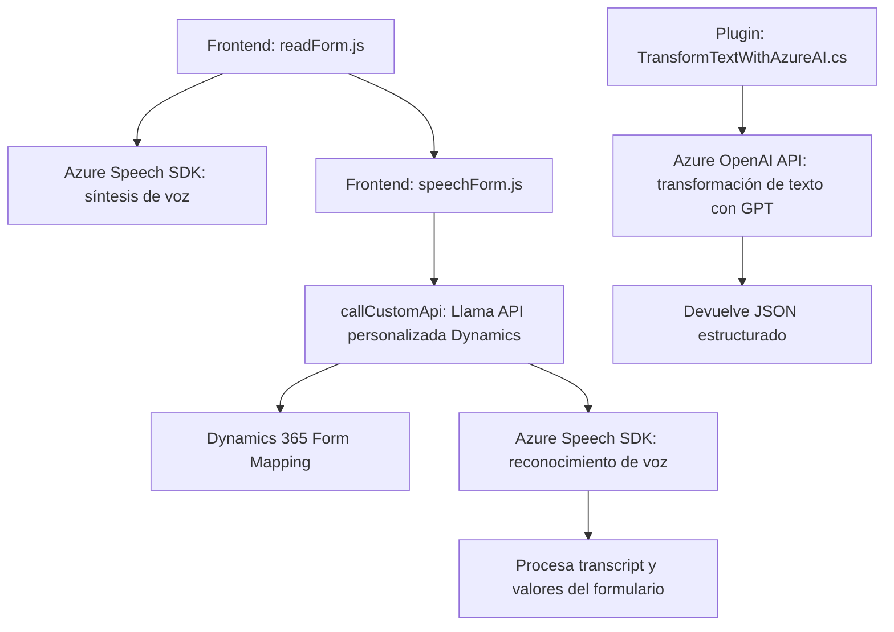

### Resumen Técnico:
Este repositorio incluye archivos relacionados con la integración de tecnologías de reconocimiento de voz, accesibilidad y generación de texto basado en IA en aplicaciones empresariales de Dynamics 365. Los scripts y plugins tienen objetivos complementarios: facilitar la interacción de usuarios con formularios mediante el habla y manipular datos utilizando la API de Azure OpenAI para transformación automatizada y reconocimiento de voz.

---

### Descripción de la Arquitectura:
El proyecto sigue una **arquitectura híbrida**:
- **Cliente / servidor:** La capa frontend (archivos JavaScript) interactúa directamente con el usuario y también con las aplicaciones de Dynamics 365.
- **Capas lógicas separadas:** En los archivos de JavaScript y C#, se observa una separación entre capa lógica (procesamiento de datos) y servicios de integración (SDK y API externas).
- **Service-Oriented Architecture (SOA):** Aprovecha SDKs y APIs de Microsoft para la síntesis de voz, reconocimiento de habla y generación de texto, delegando funcionalidades específicas a servicios externos.
- **Dynamic Loading:** Uso dinámico de componentes como el **Speech SDK** de Azure (carga en tiempo de ejecución). Esto introduce modularidad y un enfoque adaptativo.

---

### Tecnologías Usadas:
- **Lenguajes**: JavaScript (frontend) y C# (.NET para CRM Plugins).
- **Frameworks/SDKS**:
  - **Azure Speech SDK**: Integración para reconocimiento y síntesis de voz.
  - **Azure OpenAI API**: Transformaciones basadas en IA con modelos GPT.
  - **Dynamics CRM SDK**: Interacción con sistemas y formularios en Dynamics.
- **Librerías externas**:
  - **Newtonsoft.Json / System.Text.Json**: Serialización y manejo de estructuras JSON.
  - **System.Net.Http**: Manejo de HTTP requests para APIs externas.
- **Entorno de destino**: Aplicaciones empresariales sobre Dynamics 365.
- **Patrones de diseño**:
  - **Service-Oriented Architecture (SOA):** Integración con servicios externos como Azure Speech y OpenAI.
  - **Dynamic Dependency Loading:** Uso de funciones como `ensureSpeechSDKLoaded` para cargar el SDK en tiempo de ejecución.
  - **Modularidad:** Clases y funciones autónomas con interacciones definidas.

---

### Dependencias o Componentes Externos:
- **Azure Speech SDK**: Para reconocimiento y síntesis de voz.
- **Azure OpenAI API**: Para generación personalizada de texto.
- **Dynamics 365 WebAPI**: Para manipulación de formularios y datos dentro de Dynamics.
- **JSON Libraries**: Manejo y transformación de datos JSON dentro y fuera del sistema.
- Posibles servicios adicionales requeridos:
  - Gestión de claves y configuraciones seguras para Azure (API Key, región).

---

### Diagrama Mermaid:

---

### Conclusión Final:
El repositorio es una solución orientada a integrar accesibilidad y procesamiento de IA en aplicaciones empresariales sobre Dynamics 365. La arquitectura combina un enfoque modular, patrones SOA, y cargado dinámico para facilitar escalabilidad y flexibilidad. A pesar de su robustez, podría beneficiarse de un mecanismo seguro para manejar credenciales API y componentes clave sensibles.