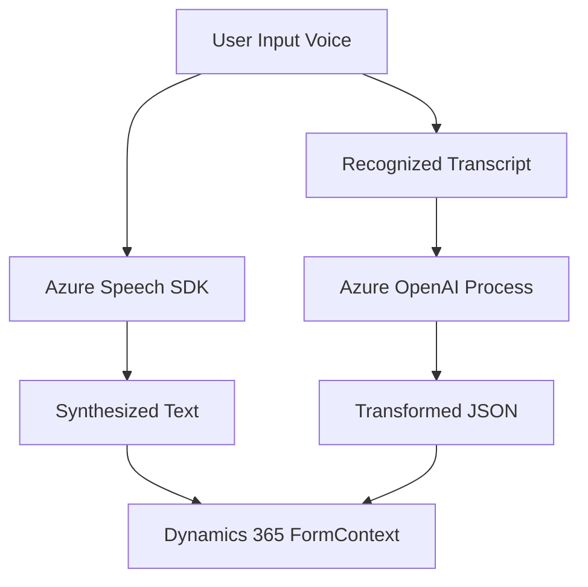

### Breve resumen técnico
El repositorio incluye tres componentes principales:
1. **Frontend/JS/readForm.js** y **Frontend/JS/speechForm.js**: Archivos de JavaScript que integran el reconocimiento y síntesis de voz mediante Azure Speech SDK para interactuar con formularios de Dynamics 365.
2. **Plugins/TransformTextWithAzureAI.cs**: Plugin para Microsoft Dynamics CRM que transforma texto utilizando Azure OpenAI y devuelve resultados en formato JSON.

La solución combina tecnologías frontend y backend con fuerte integración en servicios externos como Azure Speech SDK y Azure OpenAI.

---

### Descripción de arquitectura
La arquitectura muestra rasgos de n-capas y enfoque modular:
1. **Frontend (JS)**: Componentes para interacción del usuario y captura de entrada de voz, que interactúan con formularios de Dynamics 365.
2. **Backend (C#)**: Plugin de Dynamics CRM para transformación avanzada de datos mediante AI, desacoplado de la lógica de la capa de presentación.
3. **Servicios Externos**: Uso de Azure Speech SDK para procesamiento de voz y Azure OpenAI para transformación textual.
4. **Integración API**: Se basa en eventos y llamadas a APIs externas y del sistema (Dynamics 365) para gestión eficiente de datos.

---

### Tecnologías usadas
1. **Frontend**:
   - **JavaScript** (ES5/ES6): Lógica de interacción con el usuario.
   - **Azure Speech SDK**: Reconocimiento y síntesis de voz.
   - **Dynamics 365 FormContext API**: Gestión de formularios CRM.

2. **Backend**:
   - **C#**: Lenguaje principal para el desarrollo del plugin.
   - **Azure OpenAI API**: Servicio externo para transformación de texto mediante IA.
   - **Dynamics CRM Plugin Framework**: Extensión para workflows y lógica personalizada.
   - **Newtonsoft.Json** y **System.Text.Json**: Manejo de JSON.

3. **Patrones y Principios**:
   - **Modularidad y separación de responsabilidades**.
   - **Evento-Controlador** en procesamientos frontend.
   - **Plugin-Based Architecture** en Dynamics CRM.
   - **Desacoplamiento lógico** con integración de microservicios externos.

---

### Dependencias o componentes externos
1. **Azure Speech SDK**:
   - Reconocimiento y síntesis de voz.
   - Clave y región configuradas dinámicamente.
2. **Azure OpenAI**:
   - Modelo de transformación textual JSON.
3. **Dynamics 365 API**:
   - Acceso e interacción con los formularios y entidades del sistema.
4. **JSON Handling Libraries**:
   - `Newtonsoft.Json` y `System.Text.Json`.

---

### Diagrama Mermaid válido para GitHub

---

### Conclusión final
La solución integra reconocimiento de voz con Azure Speech SDK, procesamiento avanzado mediante Azure OpenAI y gestión de datos con Dynamics 365. Utiliza una arquitectura modular basada en n-capas, donde el frontend interactúa con formularios CRM y los plugins desacoplados manejan tareas específicas. Es extensible y aprovecha servicios externos para resolver problemas avanzados como síntesis, reconocimiento de voz y transformación textual mediante IA.

Este diseño es adecuado para aplicaciones empresariales, priorizando el uso eficiente de APIs y servicios integrados, mientras mantiene un patrón lógico estructurado.