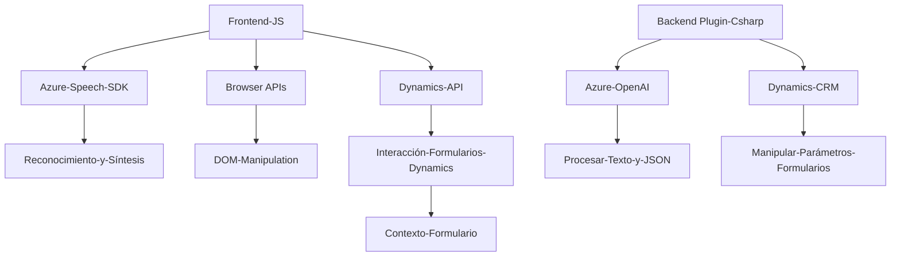

### Breve resumen técnico
El repositorio tiene una estructura que sugiere diversas soluciones relacionadas con Dynamics CRM, que implementan interacción entre formularios del CRM (frontend), síntesis de voz (Azure Speech SDK) y procesamiento avanzado de texto utilizando Azure OpenAI (backend plugin). Es una combinación de arquitecturas frontend y plugin backend diseñadas para integrarse como una solución extendida a Dynamics CRM.

---

### Descripción de arquitectura
1. **Tipo de solución**:  
   La solución combina elementos de **frontend web** (scripts en JavaScript para interacción, Cargar SDK) y un plugin desarrollado en C# que actúa en el backend de Dynamics CRM.  
   Su propósito principal es automatizar formularios con interacción por voz/comandos y análisis de datos mediante servicios de IA.

2. **Tipo de arquitectura**:  
   - En frontend: Arquitectura modular basada en patrones como *Facade* (simplificando procesos como carga de SDK y llamadas asíncronas).  
   - En backend: Arquitectura centrada en **Plugins de Dynamics CRM** con una separación entre configuración CRM y procesamiento externo (Azure OpenAI).  
   Esta combinación tiene influencia de **arquitectura de servicios** y **multi-capa**.

---

### Tecnologías usadas
1. **Frontend**:  
   - JavaScript/ES6: Scripts del navegador.
   - **Azure Speech SDK**: Modulación para síntesis/reconocimiento de voz.
   - Dynamics API (`Xrm.WebApi`) para integrar con el entorno CRM.
   - Browser APIs (DOM Manipulation, async/await).
   - Modularización de funciones según la lógica específica.

2. **Backend Plugin** (C#):  
   - .NET Framework (Microsoft.Xrm.Sdk).
   - **Azure OpenAI API**: Procesamiento avanzado y creación de JSON estructurados mediante IA.
   - `Newtonsoft.Json` y `System.Text.Json` para trabajar con datos JSON.
   - HTTP Client para comunicación RESTful.

3. **Servicios Externos**:  
   - Azure Speech para interacción por voz en frontend.  
   - Azure OpenAI para generación de textos más allá de las capacidades del SDK.  

4. **Patrones usados**:
   - **Facade Pattern** (frontend): Facilita el inicio integrado de múltiples procesos (carga SDK, procesamiento por voz).  
   - **Integración RESTful**: Azure Speech/OpenAI utilizan modelos REST con manejo de eventos asíncronos.  
   - **Plugin Pattern**: Backend en Dynamics utiliza programación extensible.  

---

### Dependencias o componentes externos
1. **Frontend**:  
   - Azure Speech SDK (reconocimiento/síntesis de voz).
   - Dependencia de Dynamics CRM para trabajar con contexto `executionContext`.

2. **Backend Plugin**:  
   - Dynamics CRM Plugin SDK (Microsoft.Xrm.Sdk).  
   - Azure OpenAI API como servicio externo para análisis de texto y generación de JSON estructurados.  
   - Externalización de configuración como API keys y URL de endpoints.

---

### Diagrama Mermaid
El siguiente diagrama muestra las relaciones clave entre los componentes y tecnologías de la solución.

---

### Conclusión final
El repositorio define una solución integrada con **Dynamics CRM**, que mejora la experiencia del usuario mediante reconocimiento/síntesis de voz y análisis inteligente en formularios. Utiliza una arquitectura mixta con enfoque **modular y dependiente de servicios externos**, destacando Azure Speech SDK y OpenAI. Si bien la solución es técnica y extensible, depende significativamente de plataformas externas, lo que implica desafíos en disponibilidad, configuración y costos asociados a los servicios de Azure.