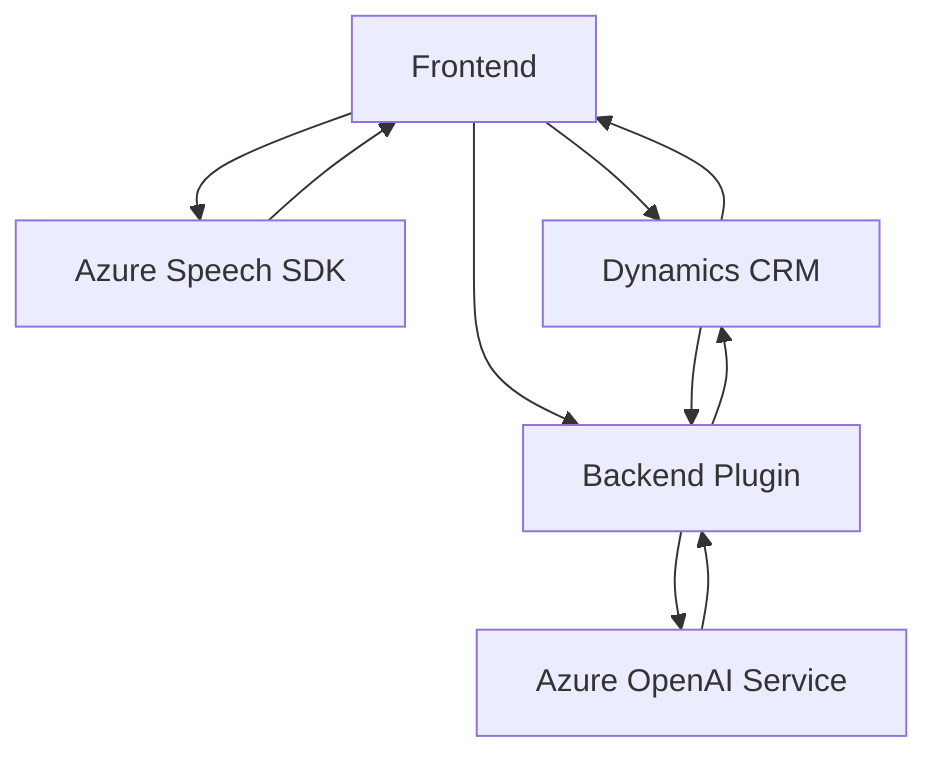

## Análisis técnico

### Breve resumen técnico
El repositorio contiene una solución híbrida que utiliza un frontend en JavaScript para interacción con formularios y voz, y un backend basado en Dynamics CRM plugins (C#) que integra APIs externas (Azure Speech SDK y Azure OpenAI). La arquitectura combina elementos de una aplicación monolítica con componentes externos para IA y reconocimiento de voz. Las tecnologías clave incluyen JavaScript para el frontend, plugins en C# para el backend, y servicios externos en Azure.

---

### Descripción de arquitectura
La solución tiene componentes interrelacionados que sugieren una **arquitectura de múltiples capas (n capas)**:
1. **Frontend**: Modularizado en funciones con integración con Azure Speech SDK para captura de voz y síntesis.
2. **Backend**: Plugins de Dynamics CRM que manejan transformaciones de datos y lógica empresarial mediante el servicio Azure OpenAI.
3. **API externa**: Consumo de servicios en la nube para reconocimiento de voz (Azure Speech SDK) y procesamiento de texto (Azure OpenAI).
   
La arquitectura no es microservicios ni completamente hexagonal, pero destaca por la separación funcional del manejo de voz, formularios y procesamiento de IA.

---

### Tecnologías usadas
1. **Frontend:**
   - **Lenguaje:** JavaScript.
   - **Framework y servicios:** Azure Speech SDK para reconocimiento y síntesis de voz.
   - **Entorno:** Dynamics CRM (formulario).
   - **Patrones:** Carga dinámica de dependencias, modularización, integración API.

2. **Backend:**
   - **Lenguaje:** C#.
   - **Framework:** Dynamics CRM Plugin Framework.
   - **Servicios externos:** Azure OpenAI Service (GPT).
   - **Patrones:** Plugin Pattern, External API Integration.

---

### Dependencias y componentes externos
1. **Azure Speech SDK:** Usado en el frontend para captura, síntesis y procesamiento de voz.
2. **Azure OpenAI Service:** Utilizado en el backend para procesamiento de texto avanzado con el modelo GPT.
3. **Dynamics CRM SDK:** Usado en plugins para manejar lógica relacionada con el ciclo de vida de datos en CRM.
4. **HTTP Client (System.Net.Http):** Para realizar solicitudes a las plataformas en Azure.

---

### Diagrama Mermaid válido para GitHub

---

### Conclusión final
La solución analizada es una arquitectura de **n capas** que integra tres componentes clave: un frontend para capturar y procesar voz, un backend plug-in en Dynamics CRM para procesamiento avanzado de texto, y API externas (Azure Speech SDK y OpenAI). Aunque la solución no aplica patrones avanzados como microservicios o arquitectura hexagonal, evidencia una buena separación de responsabilidades en sus módulos y aprovecha tecnologías modernas como servicios de inteligencia artificial en la nube para ampliar la capacidad funcional. Se podría optimizar la arquitectura aplicando principios de desacoplamiento como la inyección de dependencias para una mayor flexibilidad frente al crecimiento de la solución.