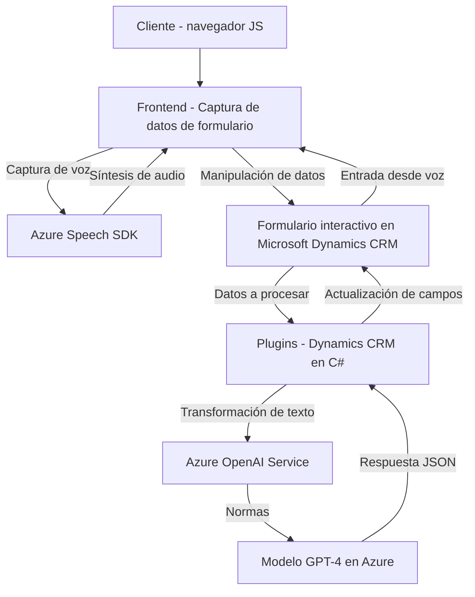

### Breve resumen técnico
El repositorio define una solución que integra formularios interactivos mediante funcionalidades de reconocimiento de voz, síntesis de texto en audio y manipulación de datos en una aplicación CRM, utilizando tecnologías como **Azure Speech SDK** y otras APIs de servicios externos. Además, utiliza plugins para realizar transformaciones de texto con el servicio Azure OpenAI.

---

### Descripción de arquitectura
La arquitectura combina múltiples componentes:
1. **Frontend interactivo (JavaScript):** Permite capturar datos visibles de formularios, convertirlos en texto/audio y procesar comandos de voz por Azure Speech SDK.
2. **Plugin backend (C#):** Proporciona la capacidad de transformar texto mediante APIs de Azure OpenAI y extender las funcionalidades específicas de CRM mediante una arquitectura **pluggable**.
3. **Integración modular:** Componentes aislados que interactúan mediante APIs y servicios externos, aplicando un enfoque que podría concebirse como "multicapas", donde:
   - Capa de presentación maneja interacción con el usuario (input/output).
   - Capa lógica realiza el procesamiento asincrónico y gestión de eventos/formularios.
   - Capa de servicio externo realiza las transformaciones y sintetización de voz/texto.

---

### Tecnologías usadas
1. **Frontend:**
   - Lenguaje: **JavaScript (ES6+)**
   - SDK: **Azure Speech SDK**
   - APIs: Manejo dinámico de formularios para Microsoft Dynamics CRM.
   - HTTP Requests: Acceso a APIs externas.

2. **Backend (C# Plugin):**
   - Lenguaje: **C# (.NET Framework)**
   - Frameworks/librerías: **Dynamics CRM SDK**, **Newtonsoft.Json**, **System.Net.Http**.
   - APIs: Conexión a **Azure OpenAI** mediante HTTP POST.

3. **Patrones de desarrollo:**
   - **Modularidad**: Cada archivo está diseñado para realizar un conjunto específico de funciones.
   - **Pluggable architecture**: En el backend para extender capacidades de Dynamics CRM.
   - **Service Integration**: Casi todo el repositorio se basa en consumir APIs y SDKs externos (Azure Services).
   - **Asynchronous Execution**: Utilización de promesas/callbacks en JavaScript y asincronía en C#.

---

### Diagrama Mermaid válido para GitHub

---

### Conclusión final
La solución está claramente orientada hacia la integración de tecnologías avanzadas para mejorar la interacción entre usuarios y formularios de Microsoft Dynamics CRM. Utiliza un enfoque modular y centrado en la integración de servicios de Azure, lo que lo hace flexible y adecuado para entornos empresariales modernos. Se emplean patrones de arquitectura como integración de servicio, modularidad y arquitectura conectable.

- **Arquitectura:** La solución combina características de arquitecturas **n-capas** (frontend, lógica, servicios) con elementos de **micro-frontends** y plugins en el backend.  
- **Componentes externos:** La dependencia de SDKs como Azure Speech y Azure OpenAI refuerza la idea de integración con servicios externos en la nube.
- **Robustez:** A través de asincronía y separación de responsabilidades, el sistema exhibe una buena modularidad y escalabilidad.