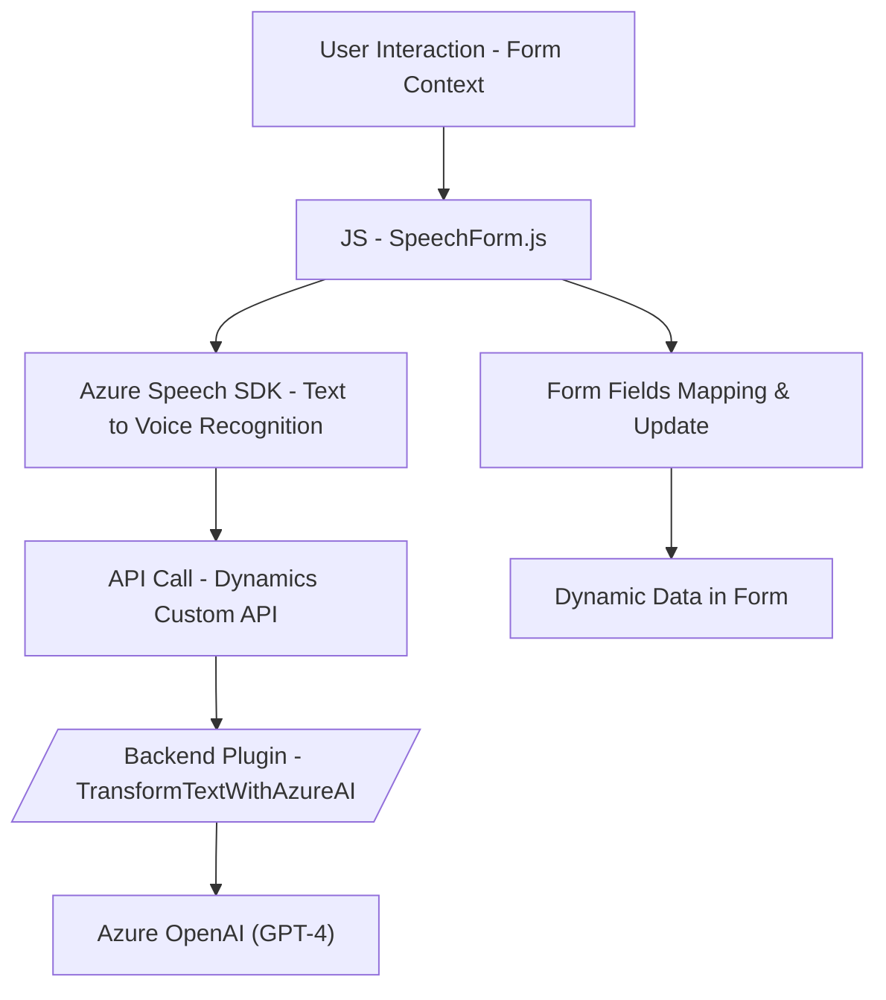

**Breve resumen técnico:**  
El repositorio contiene una solución enfocada en la integración de servicios de interacción mediante voz y procesamiento avanzado de texto utilizando tecnologías como Azure Speech SDK y Azure OpenAI (GPT). Funciona como una interfaz entre formularios dinámicos en Dynamics 365 y servicios externos de procesamiento de datos. 

---

**Descripción de arquitectura:**  
La arquitectura es híbrida, con patrones de **cliente-servicio** y **microservicios**. El frontend (JavaScript) interactúa directamente con formularios y servicios como Azure Speech para reconocimiento de voz y texto a voz, mientras que el plugin en C# actúa como intermediario backend para procesar datos con Azure OpenAI.  

**Características arquitectónicas:**  
1. El frontend usa **funciones modulares** para carga dinámica de SDK, procesamiento de datos y delegación de operaciones hacia APIs.  
2. En el backend existe un **plugin de Dynamics 365**, que sigue el **Plugin Design Pattern**.  
3. Comunicación asincrónica basada en **Promesas** en el frontend y llamadas HTTP desde el backend.  
4. Dependencia explícita de servicios externos como **Azure Speech SDK** y **Azure OpenAI API**, fomentando una arquitectura desacoplada.  

---  

**Tecnologías usadas:**  
- **Frontend:**  
  - *JavaScript / Azure Speech SDK*.
  - Client-side modularización para manejo de formularios y síntesis de voz.  
- **Backend:**  
  - *C#* con Dynamics 365 SDK.  
  - *HttpClient* para interacción con Azure OpenAI.  
  - Biblioteca *Newtonsoft.Json* para manejo de JSON.  

Patrones:  
- Modularización funcional (Frontend).  
- Plugin Design Pattern (Backend).  
- Desacoplamiento con adaptadores de datos para configurar reconocimiento de voz y campos dinámicos.  
- Procesamiento asincrónico (Promesas en JS y HTTP en C#).  

---

**Diagrama Mermaid:**  

---

**Conclusión final:**  
La solución implementada en este repositorio tiene una orientación mixta entre cliente y backend, destacándose por sus integraciones con servicios externos como Azure OpenAI y Speech SDK. Su arquitectura modular permite una alta escalabilidad y adaptabilidad, favoreciendo el uso en sistemas complejos como Microsoft Dynamics 365. Aunque efectivamente aprovecha patrones modernos como el manejo de servicios asincrónicos y microservicios en backend, algunas configuraciones críticas como claves API podrían mejorarse adoptando mejores prácticas de seguridad.  