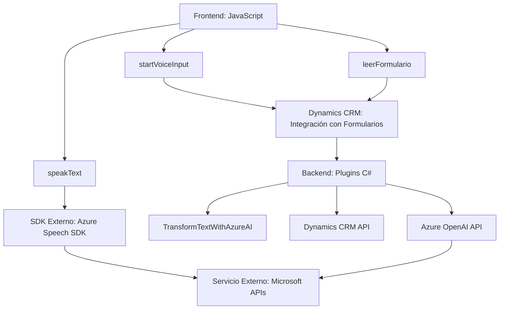

### Breve Resumen Técnico
El repositorio exhibe la construcción de una solución híbrida centrada en la interacción entre un frontend accesible basado en JavaScript y plugins para la plataforma Dynamics 365. La funcionalidad crítica es realizar la entrada y síntesis de voz a texto, transformaciones avanzadas mediante Azure AI, y su integración con formularios dentro de Dynamics CRM.

---

### Descripción de Arquitectura
La arquitectura combina **n capas** con **componente cliente-servidor**:
1. **Frontend (JavaScript):** Modulares en su diseño, las funciones permiten interactuar con formularios en Dynamics y consumir servicios de Azure Speech SDK para síntesis y reconocimiento de voz.
2. **Backend (Plugins en Dynamics CRM):** Utiliza Dynamics CRM plugins implementados en .NET para realizar procesamiento adicional (e.g., transformación de texto) mediante Azure OpenAI API.

Los componentes están distribuidos en:
- **Capa Cliente:** Gestión de voz y formularios en JavaScript.
- **Capa de Servicios:** Plugins que utilizan las APIs de Dynamics CRM y Azure para realizar operaciones en el servidor.

Adopta principios de **SOA** (Service-Oriented Architecture) al consumir servicios como Azure Speech y Azure OpenAI, desacoplando las funcionalidades entre cliente, servidor, y APIs externas.

---

### Tecnologías Usadas
1. **Frontend:**  
   - **JavaScript** como lenguaje base.
   - **Azure Speech SDK** para síntesis y reconocimiento de voz.
   - **Dynamics 365 Context API** para interacción con formularios en Dynamics CRM.

2. **Backend:**  
   - **C#/.NET Framework** para construcción de plugins en Dynamics CRM.
   - **Azure OpenAI API** para transformación avanzada de texto.
   - Paquetes de manejo de datos, como `Newtonsoft.Json` y `System.Text.Json`.

3. **Patrones:**  
   - **Modularidad:** Funciones bien segmentadas para alta cohesión y bajo acoplamiento.
   - **Plugin Architecture:** Backend basado en el patrón oficial de extensibilidad en Dynamics.
   - **Cliente-Servidor:** Flujo de información a través de fronteras de cliente y servicio (SDK en frontend, plugins en backend).
   - **Integración API:** Llamadas directas a APIs externas (Azure Speech y OpenAI).

---

### Diagrama Mermaid Válido para GitHub

---

### Conclusión Final
La solución presentada muestra un enfoque robusto hacia la integración de tecnologías accesibles y avanzadas (voz y AI) dentro de plataformas empresariales como Dynamics 365. Con una arquitectura de **n capas**, mantiene la modularidad y escalabilidad al desacoplar responsabilidades entre frontend (interacción del usuario), SDK externos (Azure Speech), y plugins dinámicos (procesamiento con Azure AI). Sin embargo, algunas áreas requieren mejora como la gestión de claves API para eliminar riesgos de seguridad.