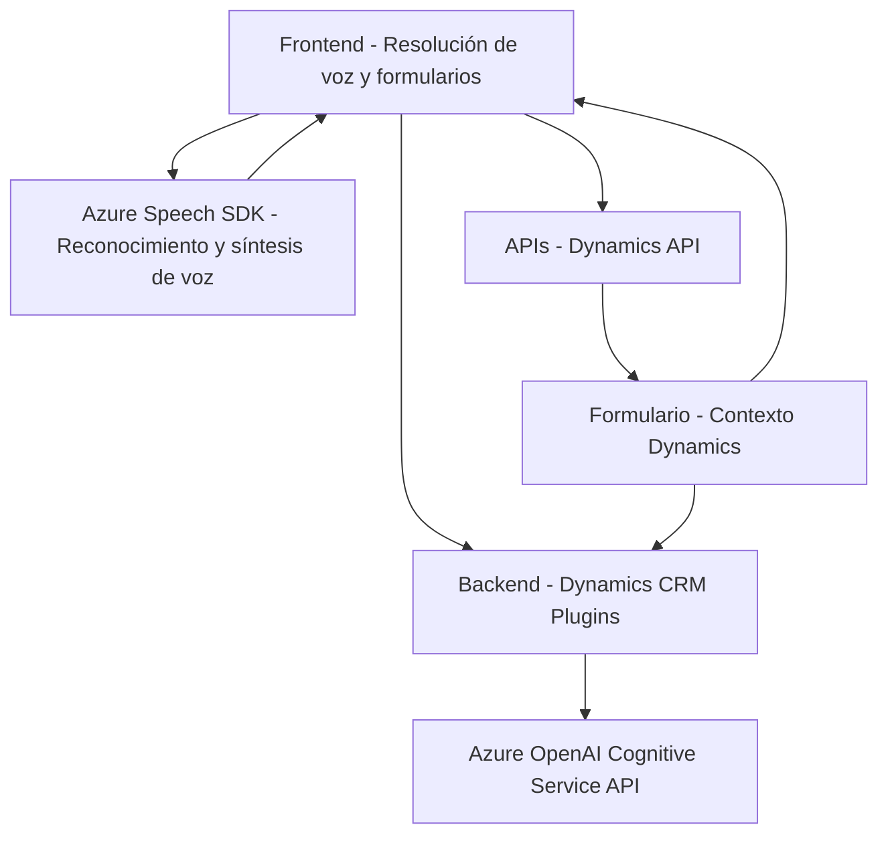

# Breve Resumen Técnico
La solución presentada es un sistema híbrido diseñado para formularios interactivos en Dynamics CRM, utilizando el SDK de Azure Speech y el servicio Azure OpenAI. Su enfoque principal incluye la síntesis de voz, la transcripción de comandos de voz, y su procesamiento para manipular datos del formulario en Dynamics.

---

# Descripción de Arquitectura
Este sistema sigue una **arquitectura de capas**, en la cual cada capa tiene una responsabilidad específica:
1. **Frontend:** Implementa módulos en JavaScript para interactuar con formularios de Dynamics, procesarlos, y transformar respuestas de voz.
2. **Backend:** Un plugin para Dynamics CRM que interactúa con Azure OpenAI para transformar texto y devolver JSON estructurado que facilita la interacción.
3. **Servicios Externos:** Dependencias en servicios como Azure Speech SDK y Azure OpenAI para reconocimiento de voz y procesamiento de lenguaje natural (NLP).

Las responsabilidades están claramente separadas: el frontend maneja la interacción y visualización, el backend procesa y estructura datos, y los servicios externos proveen capacidades avanzadas como síntesis de voz y transformación del lenguaje.

---

# Tecnologías Usadas
1. **Frontend:**
   - Azure Speech SDK para reconocimiento y síntesis de voz.
   - Dinámica del entorno de Microsoft Dynamics CRM.
   - API de Dynamics (`Xrm.WebApi`) para manipulación de datos del formulario.

2. **Backend:**
   - Microsoft Dynamics Plugin Framework (`IPlugin`).
   - `System.Net.Http` para realización de peticiones al servicio Azure OpenAI.

3. **Servicios Externos:**
   - **Azure Speech SDK:** Procesa y sintetiza comandos de voz.
   - **Azure OpenAI Cognitive Services:** Realiza transformaciones dinámicas de texto en JSON estructurado.

4. **Librerías:** 
   - `System.Text.Json` y `Newtonsoft.Json` para manipulación de JSON en el backend.

---

# Diagrama Mermaid Válido para GitHub Markdown

---

# Conclusión Final
La solución es una arquitectura híbrida de capas diseñada para integrar servicios avanzados en un contexto monolítico, con apoyo de servicios en la nube como Azure Speech SDK y OpenAI. En el frontend, se usa JavaScript para interactuar con el Dynamics CRM, mientras que en el backend, los plugins proporcionan capacidades adicionales conectándose con Azure OpenAI. Toda la solución sigue patrones recomendados como separación de responsabilidades, uso de repositorios para API, y modularidad funcional.