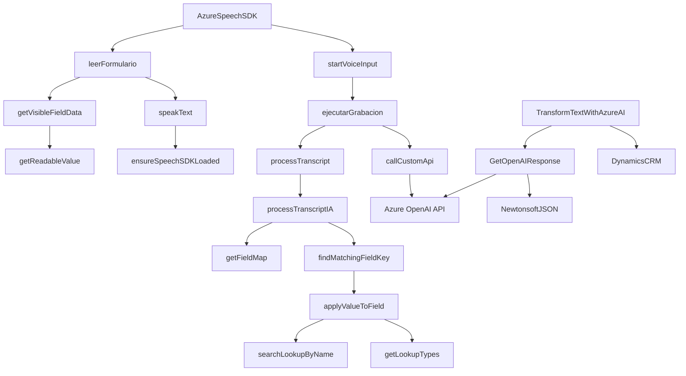

### Breve Resumen Técnico

El repositorio consta de tres archivos que implementan funcionalidades relacionadas con la manipulación de formularios y el uso de accesibilidad y AI para procesar datos. Los archivos utilizan **Azure Speech SDK**, **Azure OpenAI API**, y funcionalidades específicas del CRM Dynamics, integrando servicios externos y adaptando la interacción con datos de formularios.

---

### Descripción de la Arquitectura

La arquitectura del repositorio combina varias capas:
1. **Frontend funcional** con módulos en JavaScript que implementan accesibilidad mediante síntesis de voz (de texto a audio) y entrada conversacional (de audio a texto) usando `Azure Speech SDK`.
2. **Integración con CRM Dynamics** que adapta datos procesados por voz o AI al modelo de datos CRM mediante `formContext`.
3. **Backend como Plugin** para Dynamics CRM, que extiende las capacidades del CRM con transformación de texto en JSON estructurado mediante **Azure OpenAI API**.

Arquetipos predominantes:
- **Arquitectura multicapa**: Separación de responsabilidades (frontend, lógica CRUD en CRM, integración con AI).
- **Integración con servicios externos**: Uso de Azure Speech SDK y Azure OpenAI API.
- **Estructura modular**: Cada archivo tiene funciones específicas y reutilizables.

---

### Tecnologías Usadas

1. **Frontend:**
   - Lenguaje: JavaScript.
   - Framework: No se aprecia un framework explícito (como React o Angular); las funciones están estructuradas en módulos independientes.
   - SDK de Azure Speech: Permite reconocimiento de voz, síntesis de texto en audio y entrada conversacional.

2. **Backend para CRM Dynamics:**
   - Lenguaje: C#.
   - SDK de Dynamics CRM:
     - `Microsoft.Xrm.Sdk`: Gestión y ejecución dentro del entorno CRM.
     - `Microsoft.Xrm.Sdk.Query`: Consultas específicas en datos CRM.
   - APIs:
     - **Azure OpenAI API:** Transformación de texto en JSON estructurado.
   - Librerías auxiliares:
     - `Newtonsoft.Json` y `System.Text.Json`: Manejo avanzado de JSON.

3. **Patrones observados:**
   - **Carga dinámica** en frontend: Optimización mediante descarga solo cuando se necesita el SDK.
   - **Microservicio funcional**: Las funciones se focalizan en realizar tareas específicas para integrar accesibilidad y AI en el contexto de formularios CRM.
   - **Plugin extensible**: Arquitectura basada en la extensibilidad de Dynamics CRM.

---

### Diagrama Mermaid

---

### Conclusión Final

El repositorio implementa una solución orientada a mejorar la accesibilidad y la interacción con formularios en Dynamics CRM mediante síntesis de voz, entrada conversacional, y transformación de contenido con inteligencia artificial. La arquitectura es modular, con una clara separación de preocupaciones entre frontend (JavaScript), backend CRM, y API externa (Azure). Las tecnologías utilizadas, como Azure Speech SDK, Dynamics CRM SDK, y Azure OpenAI API, garantizan escalabilidad, integración eficiente y una experiencia enriquecida para el usuario final.