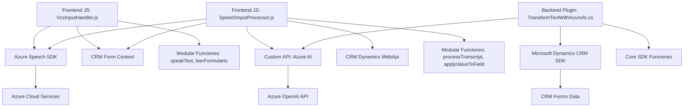

### Breve resumen técnico
El repositorio combina funcionalidades de frontend (JavaScript) y backend (.NET) para interactuar con formularios en sistemas CRM (Dynamics 365), utilizando Azure Speech SDK y OpenAI. El objetivo central es permitir entrada y salida de voz, transformar texto con IA y aplicar cambios en el contexto del formulario.

---

### Descripción de la arquitectura
La solución implementa una arquitectura **n capas híbrida**. Las capas principales identificadas son:
1. **Frontend interactivo**: Utiliza JavaScript para integrar con formularios CRM, cargando dinámicamente SDKs externos como Azure Speech.
2. **Backend modular**: Los plugins implementados en .NET (Dynamics CRM) actúan como extensiones para incluir IA de texto usando Azure OpenAI.
3. **Integración de servicios externos**: Utiliza servicios API (Azure Speech y OpenAI).

La solución utiliza principios de separación de responsabilidades y desacoplamiento mediante módulos altamente especializados:
- Event-driven en el frontend para capturar entrada y procesar voz.
- SOA en el plugin de backend para transformar contenido textual con servicios externos.

---

### Tecnologías usadas
1. **Frontend**:
   - **JavaScript**: Implementación de lógica para entrada/salida de voz y datos.
   - **Azure Speech SDK**: Cargado dinámicamente para funcionalidades de transcripción y síntesis de voz.

2. **Backend/Plugins**:
   - **.NET Framework**: Extendiendo funcionalidades de Dynamics CRM.
   - **Azure OpenAI (GPT-4)**: Procesamiento de texto basado en IA.
   - **Microsoft Dynamics CRM SDK**: Interacción directa con datos de formularios Dynamics 365.

3. **Patrones clave**:
   - Evento dirigido: Llamadas asíncronas para manejar voz/transcripciones.
   - Plugin Pattern: Extensiones en Dynamics con integración de servicios externos.
   - API-Driven: Interacción con Azure Speech y OpenAI para funcionalidades avanzadas.

---

### Diagrama Mermaid válido para GitHub

---

### Conclusión final
La solución está diseñada con una arquitectura **n capas** que combina lógica en frontend y backend mientras interactúa con APIs y servicios externos. Con componentes modulares y event-driven, se busca aprovechar las capacidades de tecnologías como Azure Speech SDK y OpenAI para integrar funcionalidades modernas en sistemas CRM, optimizando la experiencia del usuario en entornos de formulación complejos. Aún así, hay aspectos como la seguridad en la gestión de claves y posibles mejoras en la modularidad que pueden ser ajustados.
