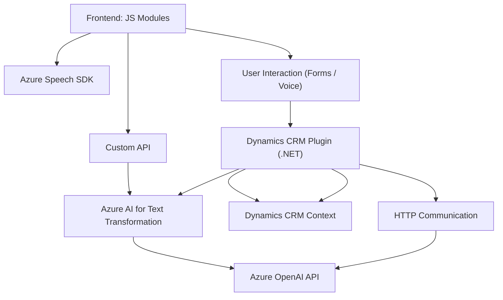

### Breve Resumen Técnico

El repositorio contiene funcionalidades relacionadas con la integración de **Azure Speech SDK** y **Azure OpenAI API** en sistemas dinámicos CRM (aparentemente Dynamics 365). Los módulos incluidos permiten:
- **Frontend**: Realizar procesamiento de formularios (entrada y salida por voz), aplicando datos visibles del usuario y transcripción de audio a texto.
- **Plugin**: Transformar texto mediante reglas específicas usando **Azure OpenAI** y devolver respuestas estructuradas en JSON.

Se identifica una relación entre el frontend y los plugins para potenciar capacidades de accesibilidad e inteligencia artificial aplicadas a formularios dinámicos.

---

### Descripción de Arquitectura

El sistema sigue una arquitectura **modular en capas**:
1. **Capa de Presentación** (Frontend):
   - Gestiona la interacción del usuario mediante formularios y voz, integrándose con Azure Speech SDK y APIs del sistema.
   - Estructura funcional basada en componentes JavaScript que separan lógica de negocio y datos de presentación.
2. **Capa de Lógica de Negocio** (Backend):
   - Implementa un plugin a través de Dynamics CRM utilizando **Azure OpenAI API** para procesar texto según reglas específicas.
   - Arquitectura basada en eventos (trigger) que se dispara en contexto de CRM, ofreciendo extensibilidad.
3. **Capa de Servicios Externos**:
   - Integra servicios basados en arquitecturas REST, como el SDK speech para voz y OpenAI para IA.

Esta arquitectura destaca por un enfoque segmentado para reutilización de servicios (SDK), separación de lógica y accesibilidad basada en voz.

---

### Tecnologías Usadas
1. **Frontend**:
   - **Vanilla JavaScript**: Estructuras funcionales en módulos JS para la interacción y síntesis/transcripción de voz.
   - **Azure Speech SDK**: Reconocimiento, síntesis y reproducción de voz.
   - **Azure Custom APIs**: Integración con APIs personalizadas para lógica avanzada.
2. **Backend**:
   - **Dynamics CRM SDK (Microsoft.Xrm.Sdk)**: Extensión de plugins en Dynamics.
   - **Azure OpenAI API**: Procesamiento avanzado de texto (mejorado con IA).
   - **.NET Framework**: Implementación del plugin y la integración lógica.
   - **HttpClient y JSON Libraries (.NET)**: Comunicación RESTful y manipulación de datos JSON.

**Patrones Arquitectónicos**:
- Carga dinámica de dependencias.
- Modularización funcional.
- Procesamiento centrado en eventos.
- Enfoque API Gateway para acceso a servicios externos.

---

### Diagrama Mermaid

---

### Conclusión Final

Este repositorio implementa una solución híbrida que involucra tanto frontend como backend para interactuar con tecnologías de accesibilidad e inteligencia artificial basadas en servicios de **Azure**. La arquitectura es modular y segmentada, adoptando elementos de **n capas** mientras se enfoca en la reutilización de servicios externos (SDK, APIs).

El sistema es especialmente útil para plataformas CRM que necesitan un nivel avanzado de personalización para accesibilidad y análisis, utilizando voz y transformación de texto como elementos centrales. La calidad y organización del código demuestran un enfoque bien estructurado hacia el desarrollo modular y escalable.