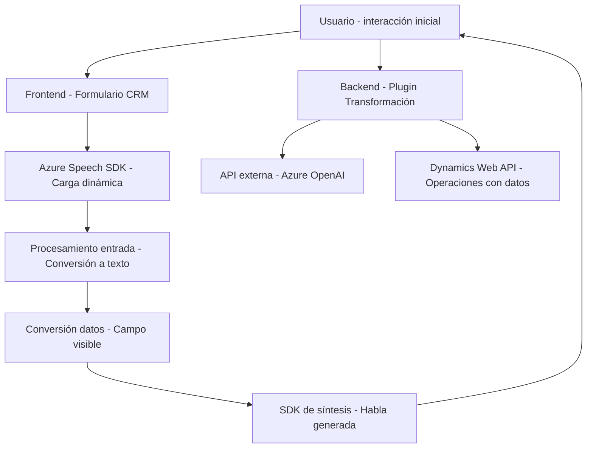

### Breve Resumen Técnico

El repositorio analizado implementa una solución híbrida orientada al manejo de datos en sistemas **CRM** (Dynamics 365) mediante interacción con **servicios Azure**, como **Azure Speech SDK** y **Azure OpenAI**. Se compone de:
1. Archivos de frontend para entrada y conversión de datos de formularios.
2. Plugins backend para integraciones avanzadas que procesan datos usando inteligencia artificial.
3. Carga dinámica de dependencias externas (Azure SDKs, APIs).

### Descripción de Arquitectura

La solución sigue un enfoque de arquitectura modular, dividida en capas para el manejo de datos y la integración dinámica. Utiliza un modelo híbrido:
- **Frontend**: Funcionalidad cliente para captación, conversión y síntesis de datos.
- **Backend**: Componentes de plugin en Azure/Dynamics que interactúan con APIs externas para procesamiento de datos.
- **Service Integration**: Azure Speech SDK es el núcleo del reconocimiento de voz y síntesis.
- **Plugin Architecture**: Componentes backend diseñados como extensiones de Dynamics 365.

Este diseño en capas se aproxima a una **arquitectura hexagonal** con interacción entre las capas de aplicación y servicios externos, pero también se acopla al paradigma clásico de múltiples capas en aplicaciones CRM.

### Tecnologías Usadas

- **Frontend**:
  - JavaScript.
  - Azure Speech SDK: para síntesis y reconocimiento de voz.
  - Dynamics CRM APIs.
- **Backend**:
  - C# (.NET Framework): para desarrollo de plugins en Dynamics 365.
  - Azure OpenAI: procesamiento de texto.
  - Dynamics CRM SDK.

### Diagrama Mermaid

### Conclusión Final

La solución presentada es una integración avanzada para mejorar la funcionalidad de CRM mediante tecnologías modernas de inteligencia artificial y capacidades de voz. Su enfoque modular permite una fácil escalabilidad, agregando extensiones tanto en frontend como en el backend. Aunque parcialmente tiene características de una arquitectura hexagonal, los acoples con CRM y servicios externos destacan elementos de una arquitectura en capas. Esto lo convierte en una solución eficiente para procesos interactivos con inteligencia artificial orientados a la mejora de productividad en entornos CRM empresariales.