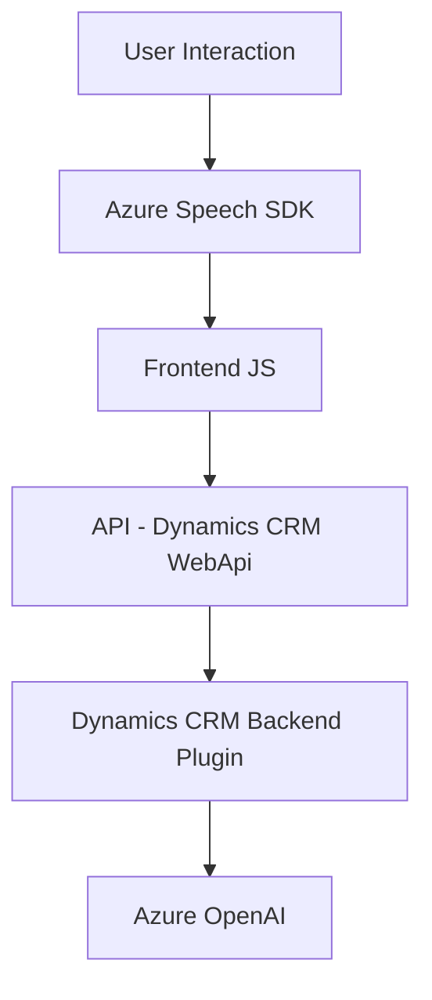

### Breve resumen técnico:

El repositorio tiene una estructura que combina frontend con lógica en JavaScript y backend orientado a plugins de CRM mediante .NET. Se integran servicios de reconocimiento y síntesis de voz a través del Azure Speech SDK en el frontend, mientras que el backend aprovecha servicios de inteligencia artificial de Azure OpenAI para el procesamiento de textos en el contexto de Dynamics CRM.

---

### Descripción de arquitectura:

#### Frontend:
- Modularidad: La lógica basada en funciones separadas permite reutilización y testabilidad.
- Interacción dinámica: Uso de eventos y SDKs como Speech SDK.
  
#### Backend:
- Plugin-Based Architecture: Las clases implementan el patrón plugin específico del Dynamics CRM para vincular eventos predefinidos del sistema a la lógica personalizada.  
- Service-oriented Architecture (SOA): Aprovechamiento de Azure OpenAI como un servicio externo para procesamiento de datos, manteniendo una separación clara entre la lógica del CRM y el procesamiento avanzado.

#### Integración Backend-Frontend:
Estos componentes parecen formar parte de una solución más grande que integra los servicios de Dynamics CRM con funcionalidades enriquecidas como síntesis y reconocimiento de voz vía APIs de Azure.

---

### Tecnologías usadas:

#### Frontend:
- **JavaScript**
- **Azure Speech SDK**: Capacidades de reconocimiento y síntesis de voz.
- **Dynamics CRM APIs** (`Xrm.WebApi`).

#### Backend:
- **C#**
- **Dynamics CRM SDK**
- **Azure OpenAI GPT**: Procesamiento de texto avanzado usando inteligencia artificial.
- **Newtonsoft.Json**: Manejo de JSON.
- **System.Net.Http**: Comunicación HTTP con servicios Azure.
- **API Endpoints**:
  - Speech SDK (`https://aka.ms/csspeech/jsbrowserpackageraw`)
  - OpenAI GPT (`https://openai-netcore.openai.azure.com/`).

#### Patrones Arquitectónicos:
- Modularidad y funciones independientes en frontend.
- Plugin-Based Architecture para backend.
- SOA para integración con servicios Azure externos.

---

### Diagrama **Mermaid** (validado para GitHub Markdown):

---

### Conclusión final:

La solución es un sistema híbrido que combina frontend y backend con integración de servicios en la nube (Azure Speech SDK y Azure OpenAI). La arquitectura es modular, aprovechando funcionalidades específicas para interacción dinámica en el frontend y procesamiento avanzado en plugins escalables en el backend. Esto garantiza una experiencia enriquecida para usuarios de Dynamics CRM, automatizando tareas mediante voz y texto con inteligencia artificial.