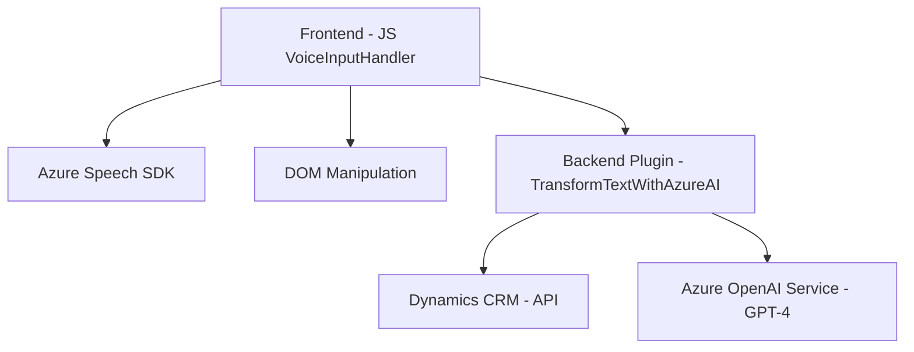

### Análisis técnico del repositorio

#### 1. Resumen técnico:
El proyecto parece ser una solución híbrida orientada a la interacción avanzada con formularios en **Microsoft Dynamics CRM**, integrando reconocimiento de voz, inteligencia artificial (IA) y transformaciones de texto. Incluye:
- **Frontend:** Scripts en JavaScript que usan el **Azure Speech SDK** para capturar y sintetizar voz.
- **Backend/plugin:** Código en C# que implementa un plugin para Dynamics CRM que utiliza **Azure OpenAI** para transformar y estructurar texto.

---

#### 2. Descripción de arquitectura:
La arquitectura del proyecto sigue un enfoque distribuido, en donde se separan las responsabilidades tecnológicas entre:
- **Frontend:** Scripts JavaScript que procesan datos y comunican con APIs externas y servicios de voz (Azure Speech SDK).
- **Backend/plugin:** Código C# que actúa como una extensión de Dynamics CRM para realizar transformaciones con el OpenAI Service.

Esto sugiere una **arquitectura n-capas**, donde cada capa trabaja en su propio contexto:
- Capa de Presentación: Scripts frontend para manejo del DOM, captura de voz y UX dinámico.
- Capa de Aplicación: Gestión de datos del formulario y lógica para llamar servicios externos (Speech o OpenAI).
- Capa de Datos: Gestión y acceso a datos de Dynamics CRM y API externas.

---

#### 3. Tecnologías usadas:
- **Frontend:**
  - **JavaScript:** Para la interacción dinámica con formularios y manejo de datos.
  - **Azure Speech SDK:** Para el reconocimiento de voz y síntesis de audio.
  - **Promesas y asincronismo:** Para trabajar con operaciones no bloqueantes como llamadas a APIs y scripts.

- **Backend/plugin:**
  - **C#:** Lenguaje de programación para el plugin de Dynamics CRM.
  - **Microsoft Dynamics SDK:** Para la integración directa con las APIs de CRM.
  - **Azure OpenAI Service (GPT-4):** Para transformar texto en estructuras JSON.
  - **System.Text.Json:** Para procesamiento de JSON.
  - **HTTP:** Para enviar datos al servicio OpenAI.
  - **LINQ:** Para manipulación y filtrado de datos.

- **General:**
  - **Azure:** Servicios en la nube para el manejo de voz y procesamiento avanzado de texto.
  - **Microsoft Dynamics API:** Gestión de formularios y integración de datos dentro del CRM.

---

#### 4. Dependencias o componentes externos presentes:
- **Azure Speech SDK** (`https://aka.ms/csspeech/jsbrowserpackageraw`): Usado para sintetizar audio y realizar reconocimiento de voz.
- **Azure OpenAI Service**: Utilizado por el plugin para transformar texto.
- **Microsoft Dynamics CRM SDK**: Para acceder, gestionar y operar sobre los datos de los formularios.
- **Custom API:** Probablemente un servicio personalizado (como `trial_TransformTextWithAzureAI`) integrado.

---

#### 5. Diagrama Mermaid válido para GitHub:

---

### Conclusión final:
El repositorio implementa una solución híbrida con una arquitectura **n-capas**, diseñada para interactuar con **Microsoft Dynamics CRM**. El propósito es habilitar capacidades avanzadas de interacción por voz y procesamiento textual mediante servicios de Azure (Speech SDK y OpenAI).

Las tecnologías y patrones utilizados reflejan una integración directa en el ecosistema Dynamics y Azure, incorporando procesamiento asincrónico y servicios distribuidos para lograr experiencias más intuitivas y automatizadas en plataformas empresariales. 

Es una implementación modular que puede crecer mediante la adición de servicios externos o mejoras a nivel de plugin y frontend.